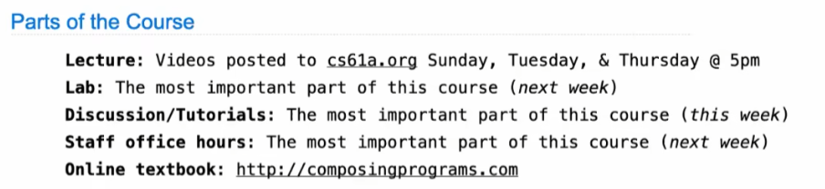
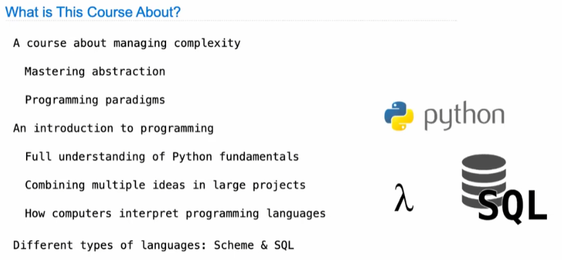

# CS61A: Structure and Interpretation of Computer Programs（Fall 2020)

这是来自 UC 伯克利的计算机本科第一门课。这门课与[神书](https://wangzhe3224.github.io/zhuan-ma/books/ "神书")《Structure and Interpretation of Computer Programs》 同名，当然，这不是巧合。这门课的大部分内容就是根据这本书的内容改编的，相比于阅读原书，这门课配合 了讲义、视频、作业、练习，让学生更加轻松的吸收 SICP 这本书中的精华。SICP 是每一个计算机学生 都应该读的好书。

## “抽象”是这门课的主题！

### Lecture 1. Computer Science

学好计算机科学，对于复杂问题，要学会使用**抽象的概念**进行简化表示求解。

——学习发生在**绞尽脑汁解决不会的问题**！

[Lecture 2. Functions](<Lecture 2. Functions/Lecture 2. Functions.md> "Lecture 2. Functions")

[Lab0.Setup](Lab0.Setup/Lab0.Setup.md "Lab0.Setup")

[Homework 1: Variables & Functions, Control — Passed 4/4](<Homework 1- Variables & Functi/Homework 1- Variables & Functions, Control — Passe.md> "Homework 1: Variables & Functions, Control — Passed 4/4")

[Lecture 3. Control](<Lecture 3. Control/Lecture 3. Control.md> "Lecture 3. Control")

[Lecture 4. Higher-Order Functions](<Lecture 4. Higher-Order Functi/Lecture 4. Higher-Order Functions.md> "Lecture 4. Higher-Order Functions")

[Project 1: The Game of Hog（Spring 2023）](<Project 1- The Game of Hog（Spr/Project 1- The Game of Hog（Spring 2023）.md> "Project 1: The Game of Hog（Spring 2023）")

[Lecture 5. Environments](<Lecture 5. Environments/Lecture 5. Environments.md> "Lecture 5. Environments")

[Lecture 6. Design](<Lecture 6. Design/Lecture 6. Design.md> "Lecture 6. Design")

[Lecture 7. Function Examples](<Lecture 7. Function Examples/Lecture 7. Function Examples.md> "Lecture 7. Function Examples")

[Lecture 8. Recursion](<Lecture 8. Recursion/Lecture 8. Recursion.md> "Lecture 8. Recursion")

[Lecture 9. Tree Recursion](<Lecture 9. Tree Recursion/Lecture 9. Tree Recursion.md> "Lecture 9. Tree Recursion")

[Homework 2: Recursion — Passed 3/5](<Homework 2- Recursion — Passed/Homework 2- Recursion — Passed 3-5.md> "Homework 2: Recursion — Passed 3/5")

[Lecture 10. Containers](<Lecture 10. Containers/Lecture 10. Containers.md> "Lecture 10. Containers")

[Lecture 11. Data Abstraction](<Lecture 11. Data Abstraction/Lecture 11. Data Abstraction.md> "Lecture 11. Data Abstraction")

[Project 2: Cat](<Project 2- Cat/Project 2- Cat.md> "Project 2: Cat")

[Lecture 12. Trees ☆](<Lecture 12. Trees ☆/Lecture 12. Trees ☆.md> "Lecture 12. Trees ☆")

[Lecture 13. Binary Numbers](<Lecture 13. Binary Numbers/Lecture 13. Binary Numbers.md> "Lecture 13. Binary Numbers")

[Lecture 14. Circuits](<Lecture 14. Circuits/Lecture 14. Circuits.md> "Lecture 14. Circuits")

[Lecture 15. Mutable Values](<Lecture 15. Mutable Values/Lecture 15. Mutable Values.md> "Lecture 15. Mutable Values")

[Homework 3: Trees, Data Abstraction — Passed 6/6](<Homework 3- Trees, Data Abstra/Homework 3- Trees, Data Abstraction — Passed 6-6.md> "Homework 3: Trees, Data Abstraction — Passed 6/6")

[Lecture 16. Mutable Functions](<Lecture 16. Mutable Functions/Lecture 16. Mutable Functions.md> "Lecture 16. Mutable Functions")

[Lecture 17. Iterations](<Lecture 17. Iterations/Lecture 17. Iterations.md> "Lecture 17. Iterations")

[Lecture 18. Objects](<Lecture 18. Objects/Lecture 18. Objects.md> "Lecture 18. Objects")

[Homework 4: Nonlocal, Iterators — Passed 3/4](<Homework 4- Nonlocal, Iterator/Homework 4- Nonlocal, Iterators — Passed 3-4.md> "Homework 4: Nonlocal, Iterators — Passed 3/4")

[Lecture 19. Inheritance](<Lecture 19. Inheritance/Lecture 19. Inheritance.md> "Lecture 19. Inheritance")

[Project 3: Ant](<Project 3- Ant/Project 3- Ant.md> "Project 3: Ant")

[Lecture 20. Representation](<Lecture 20. Representation/Lecture 20. Representation.md> "Lecture 20. Representation")

[Lecture 21. Composition](<Lecture 21. Composition/Lecture 21. Composition.md> "Lecture 21. Composition")

[Homework 5: Object-Oriented Programming, Linked Lists, Trees — Passed 2/3](<Homework 5- Object-Oriented Pr/Homework 5- Object-Oriented Programming, Linked Li.md> "Homework 5: Object-Oriented Programming, Linked Lists, Trees — Passed 2/3")

[Lecture 22. Efficiency](<Lecture 22. Efficiency/Lecture 22. Efficiency.md> "Lecture 22. Efficiency")

[Lecture 23. Decomposition](<Lecture 23. Decomposition/Lecture 23. Decomposition.md> "Lecture 23. Decomposition")

[Lecture 24. Data Examples](<Lecture 24. Data Examples/Lecture 24. Data Examples.md> "Lecture 24. Data Examples")

[Lecture 25. Users](<Lecture 25. Users/Lecture 25. Users.md> "Lecture 25. Users")

[Lecture 26. Ethical AI and Data](<Lecture 26. Ethical AI and Dat/Lecture 26. Ethical AI and Data.md> "Lecture 26. Ethical AI and Data")

[Lecture 27. Scheme](<Lecture 27. Scheme/Lecture 27. Scheme.md> "Lecture 27. Scheme")

[Homework 6: Scheme 3/3](<Homework 6- Scheme 3-3/Homework 6- Scheme 3-3.md> "Homework 6: Scheme 3/3")

[Lecture 28. Exceptions](<Lecture 28. Exceptions/Lecture 28. Exceptions.md> "Lecture 28. Exceptions")

[Lecture 29. Calculater](<Lecture 29. Calculater/Lecture 29. Calculater.md> "Lecture 29. Calculater")

[Project 4: Scheme Interpreter](<Project 4- Scheme Interpreter/Project 4- Scheme Interpreter.md> "Project 4: Scheme Interpreter")

[Homework 7: Scheme List 4/4](<Homework 7- Scheme List 4-4/Homework 7- Scheme List 4-4.md> "Homework 7: Scheme List 4/4")

[Lecture 30. Interpreters](<Lecture 30. Interpreters/Lecture 30. Interpreters.md> "Lecture 30. Interpreters")

[Lecture 31. Declarative Programming](<Lecture 31. Declarative Progra/Lecture 31. Declarative Programming.md> "Lecture 31. Declarative Programming")

[Homework 8: More Scheme 4/4](<Homework 8- More Scheme 4-4/Homework 8- More Scheme 4-4.md> "Homework 8: More Scheme 4/4")

[Lecture 32. Tables](<Lecture 32. Tables/Lecture 32. Tables.md> "Lecture 32. Tables")

[Lecture 33. Aggregation](<Lecture 33. Aggregation/Lecture 33. Aggregation.md> "Lecture 33. Aggregation")

[Lecture 34. Database](<Lecture 34. Database/Lecture 34. Database.md> "Lecture 34. Database")

[Homework 9: SQL 0/3](<Homework 9- SQL 0-3/Homework 9- SQL 0-3.md> "Homework 9: SQL 0/3")

[Lecture 35. Tail Calls](<Lecture 35. Tail Calls/Lecture 35. Tail Calls.md> "Lecture 35. Tail Calls")

[Lecture 36. Macros](<Lecture 36. Macros/Lecture 36. Macros.md> "Lecture 36. Macros")

[Lecture 37. Final Example](<Lecture 37. Final Example/Lecture 37. Final Example.md> "Lecture 37. Final Example")

[Lecture 38. Conclusion](<Lecture 38. Conclusion/Lecture 38. Conclusion.md> "Lecture 38. Conclusion")
