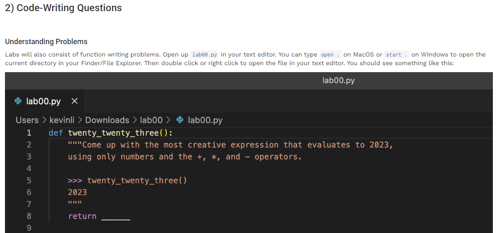
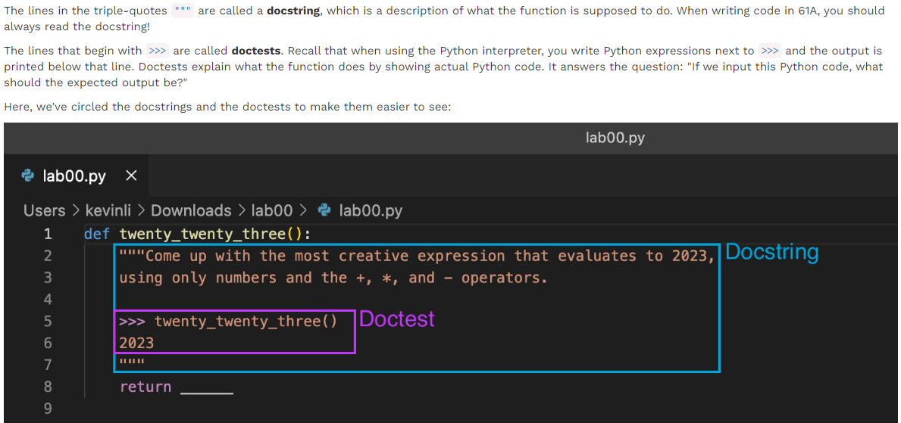
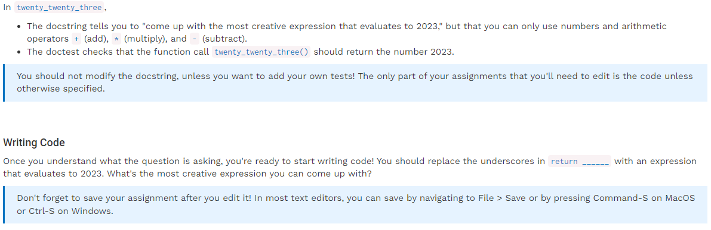
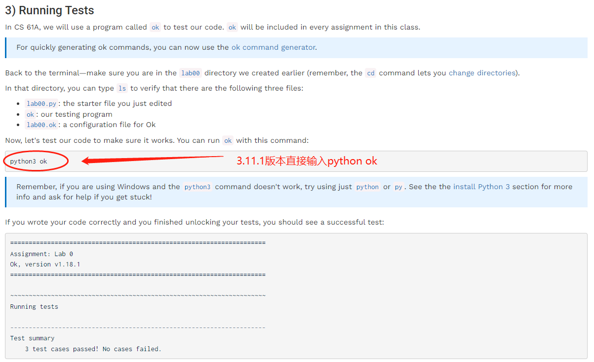
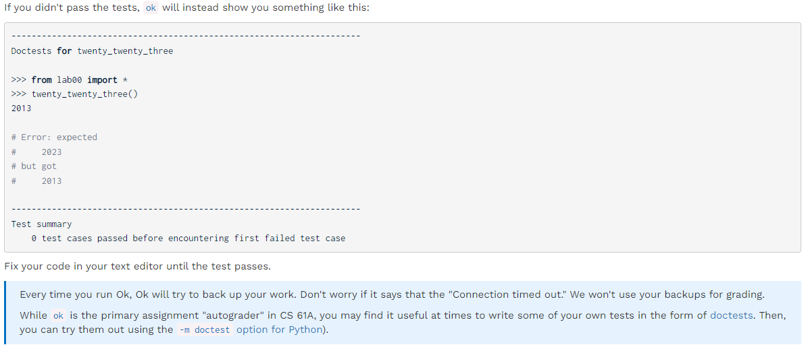
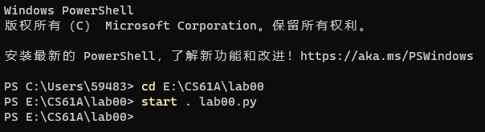
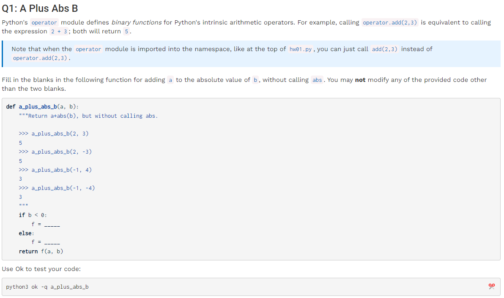
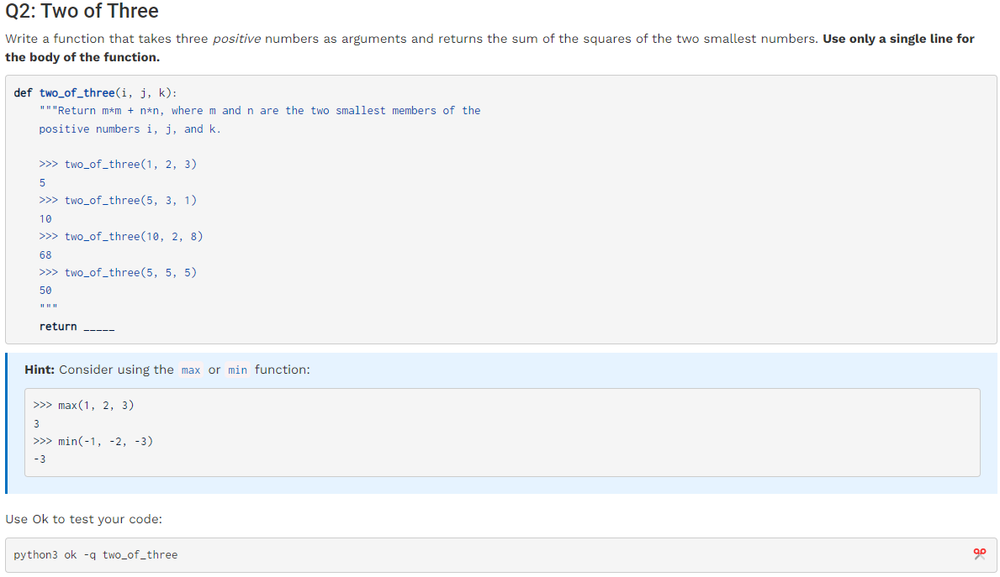
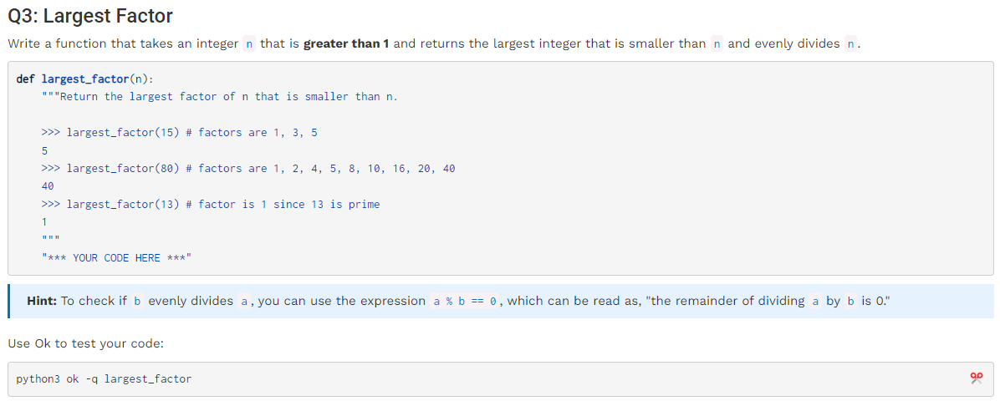
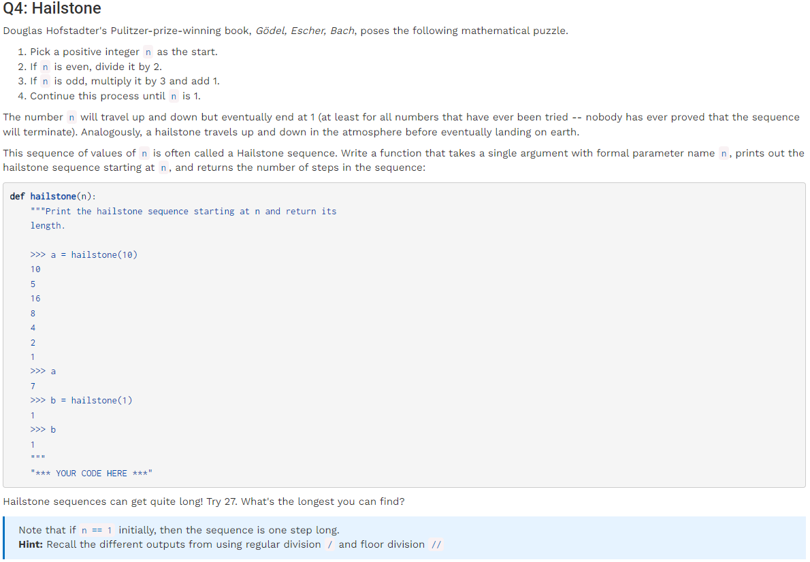

# Homework 1: Variables & Functions, Control — Passed 4/4

## **前言：** 作业说明及自动批改系统使用方法。

# **常用目录位置代码：**

&#x20;cd E:\CS61A\\+文件夹名，如要进入lab00文件夹读取其中文件，则输入cd E:\CS61A\lab00；随后输入start . lab00.py可快速打开代码所在位置文件夹。

重点需要用到循环、判断语句。

## hw01

✅ 重点在于输出f是个函数，故定义时也直接定义为函数

✅

✅ python中对while语句的使用——迭代循环；同时python中注意对齐行，return语句和while对齐则表明跳出循环后再进行输出

✅ 值得注意的是python3.8输出的数值都是整值，可以使用int()函数将要输出的数转化为整值
