# Homework 3: Trees, Data Abstraction — Passed 6/6

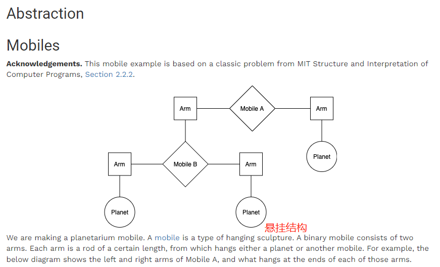

&#x20;a planetarium mobile 天文用机器人

-   [ ] **机体**必须有左臂和右臂；
-   [ ] **手臂**有长度（正值），且必须连接一个机体或星球；
-   [ ] **星球**有大小，其下不再连接物体。

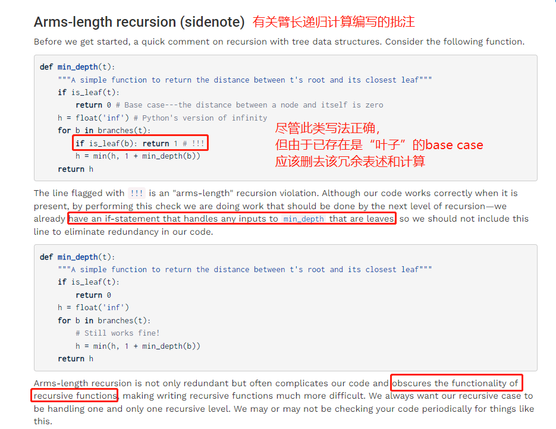

注意在写递归时base case与后续递归时丢弃冗余表述，防止复杂程序、模糊递归函数功能

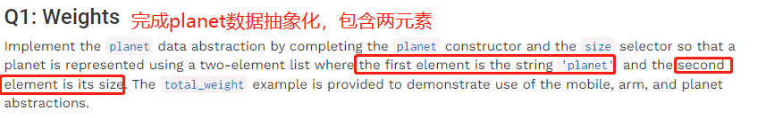

✅

✅

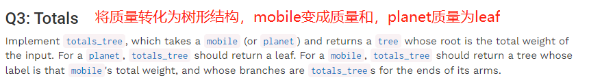

✅

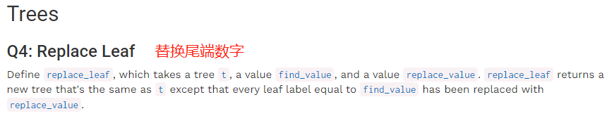

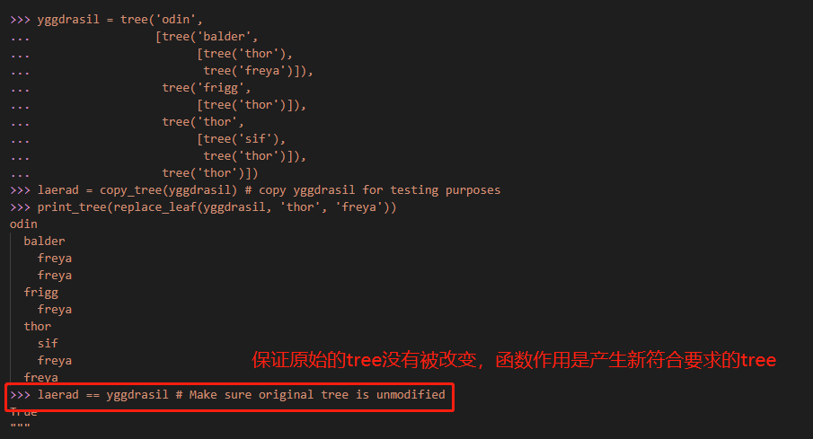

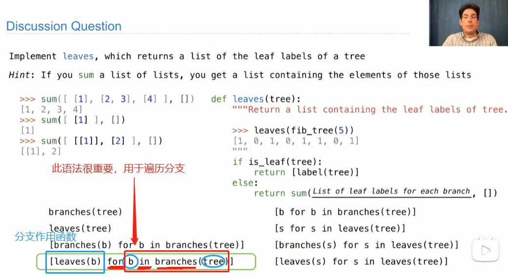

✅

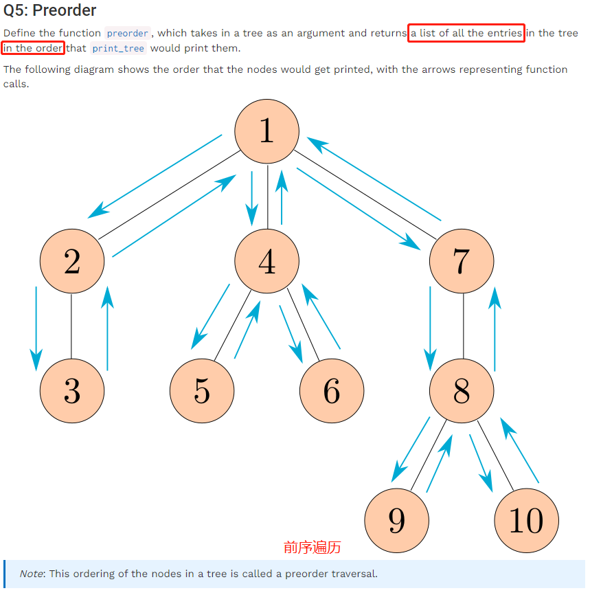

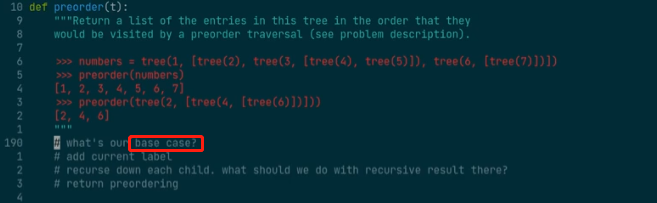

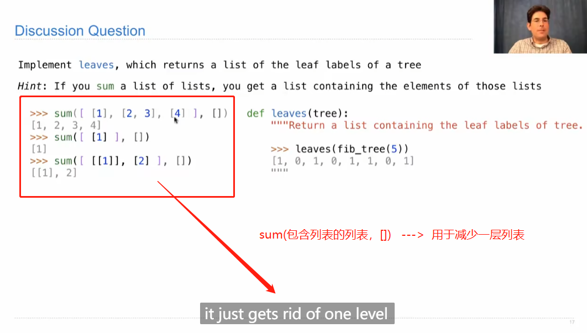

✅

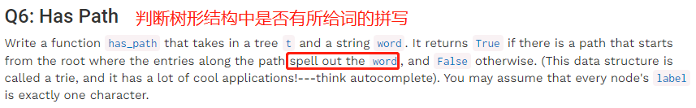

trie 单词查找树

感觉：一条路选到底？同一层结构没有对应字母即反馈False

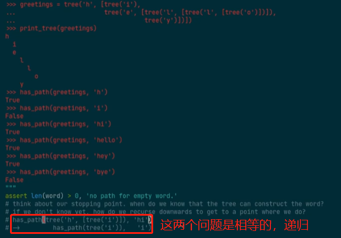

✅
