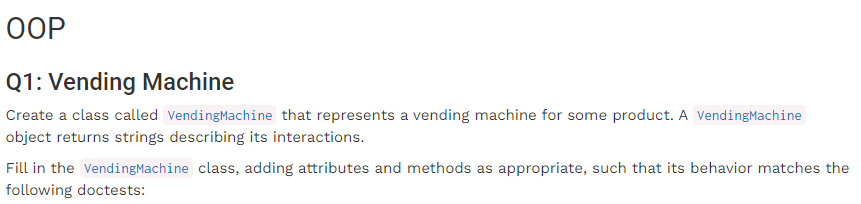
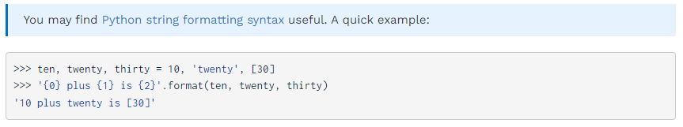
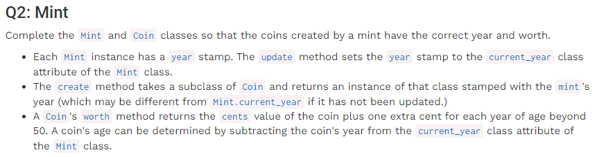
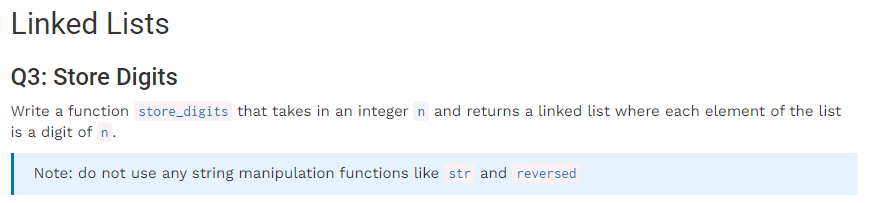

# Homework 5: Object-Oriented Programming, Linked Lists, Trees — Passed 2/3





创建一个贩卖机类，完成以下代码功能：

-   [ ] Class VendingMachine(***sort***, ***price***)
-   [ ] vend()表示尝试购买，若没有***库存***则显示'Inventory empty. Restocking required.'；若有***库存***且投入***balance***<***price***，则显示''You must add \$***price***-***balance*** more funds.'';若有***库存***且投入***balance***=***price***，则显示'Here is your ***sort***.'；若有***库存***且投入***balance***>***price***，则显示''Here is your ***sort*** and \$***balance***-***price*** change.''，同时balance也要更改为0。注意***库存***数量更改！
-   [ ] add\_funds(***x***)表示投入硬币，若购买物品库存为0则返还现金并显示：'Inventory empty. Restocking required. Here is your \$***x***.'；若有库存则会累计金额并反馈：'Current balance: \$***累计投入金额***'
-   [ ] restock(***n***)表示加货几个，并返还显示库存：'Current ***sort*** stock: ***库存数***'

✅



***造币厂***和***硬币***两个类，硬币由造币厂创建并有正确的***年份***和***价值***。

-   [ ] 每个造币厂有一个year年份戳，使用update类函数将其属性current\_year设定为正确值
-   [ ] create是Coin的子类的类函数，它返回的是使用造币厂年份生产的实例（这有可能与没有更新的Mint.current\_year不同）
-   [ ] 硬币价值类函数worth返回其价值（以分为单位），超过50年后每过一年其价值增加1分钱；一个硬币的年份可以用Mint类的当前年份减去硬币生产年份获得。
-   [ ] 有两种价值的硬币，Nickel是5美分，Dime是10美分

✅注意直接使用kind返还硬币类名，coin类定义中需输入铸造年份



输入一个整数n，返回一个相同顺序依次排列的链表

重点：如何将正整数的各位按顺序取出，最大的位最先取出 → 设置一个digit函数使用while循环迭代找到最大位数（如3431找到1000，742找到100），再使用递归处理构造链表。

```python
    if n == 0:
        return Link.empty
    else:
        digits = 1
        while digits <= n:
            digits *= 10     #寻找位数的循环
        digits = digits // 10
        return Link(n // digits, store_digits(n % digits))
```
