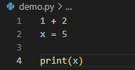

# Lab0.Setup

1.Windows教程安装Python 3.8，于官网Python.org安装最新版本3.11.1

2.运行窗口快捷按键：Win+R；输入cmd进入命令窗口管理界面

3.也可通过Powershell进入

4.实用基础命令：

ls——显示当前位置下的所有文件；

cd——改变目录位置，使用时在其之后输入目标位置；

pwd——显示工作目录；

mkdir——创建文件夹；

mv——移动文件位置，用法 **\~原位置** **\~ 目标位置**；

5.VS Code是一款推荐的轻便代码编辑器，支持几乎所有主流的开发语言，**.py**是python代码的后缀。可以直接在其中调试，使用方法“终端-新建终端”，很有用的调试方法是**在调用前加"-i"**，这样除了可以得到代码结果，还可以**调用其中代数的数值与函数**。

例如：想使用代码中的x值用于其他运算。

6.常用的Python命令行

