# Lecture 10. Containers

1.Lists 数组

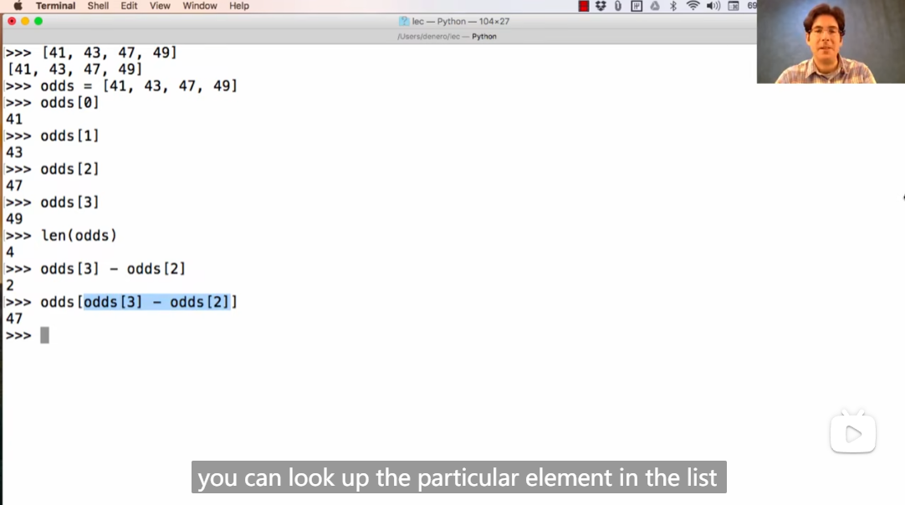

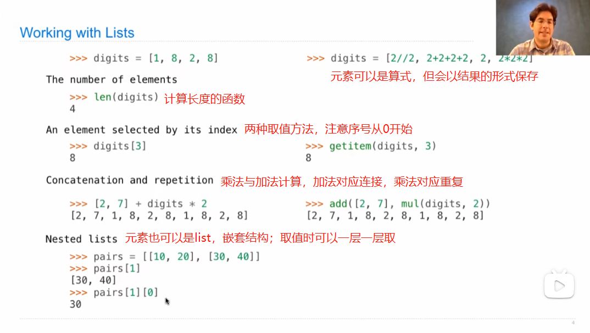

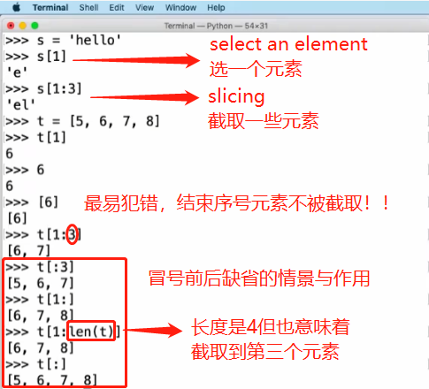

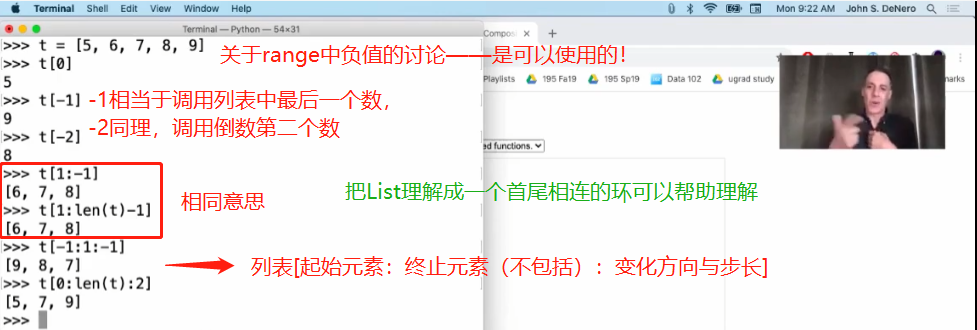

2.Containers **容器**

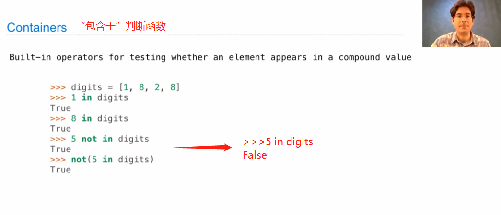

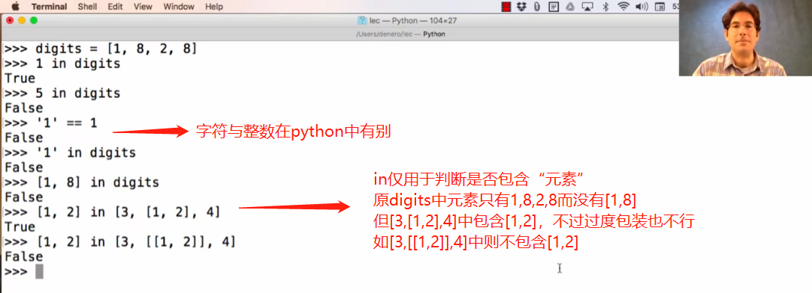

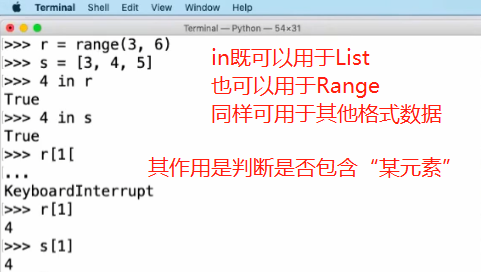

3.for statement

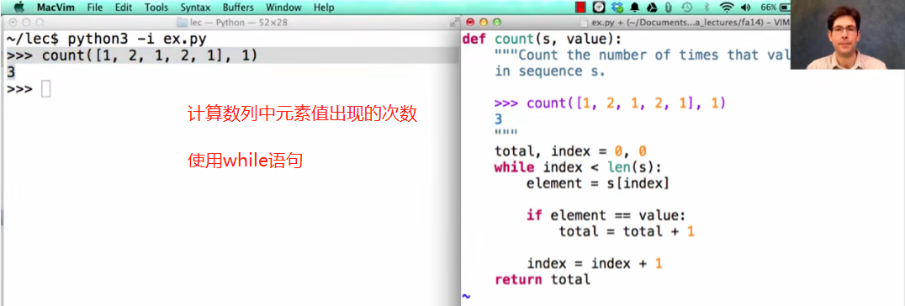

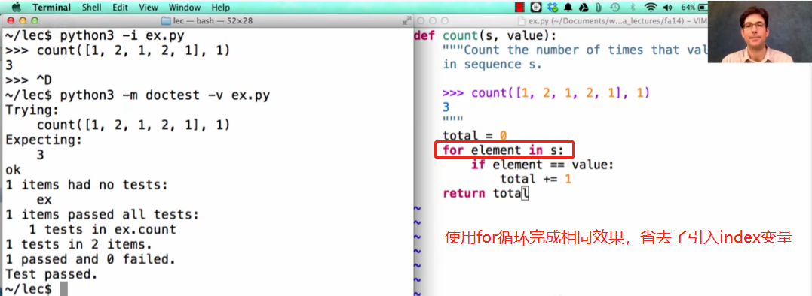

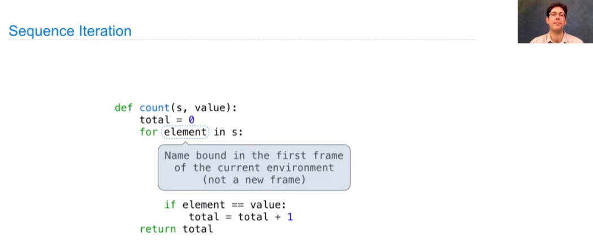

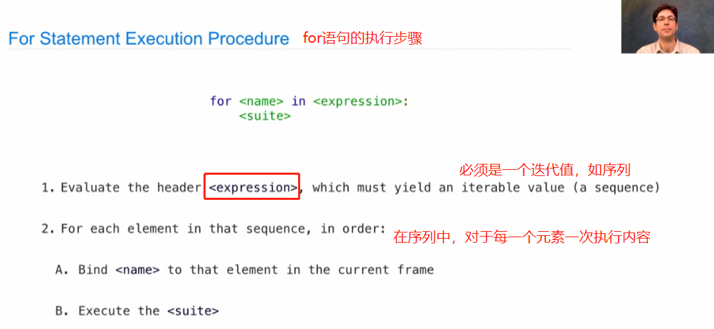

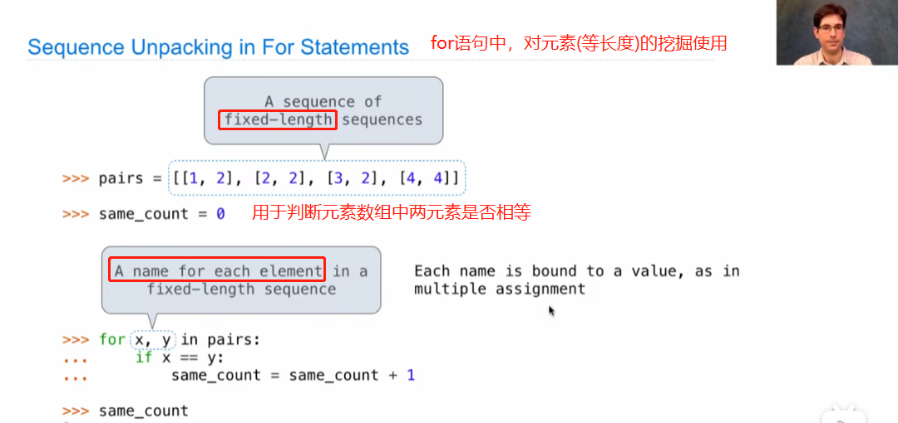

4.Range

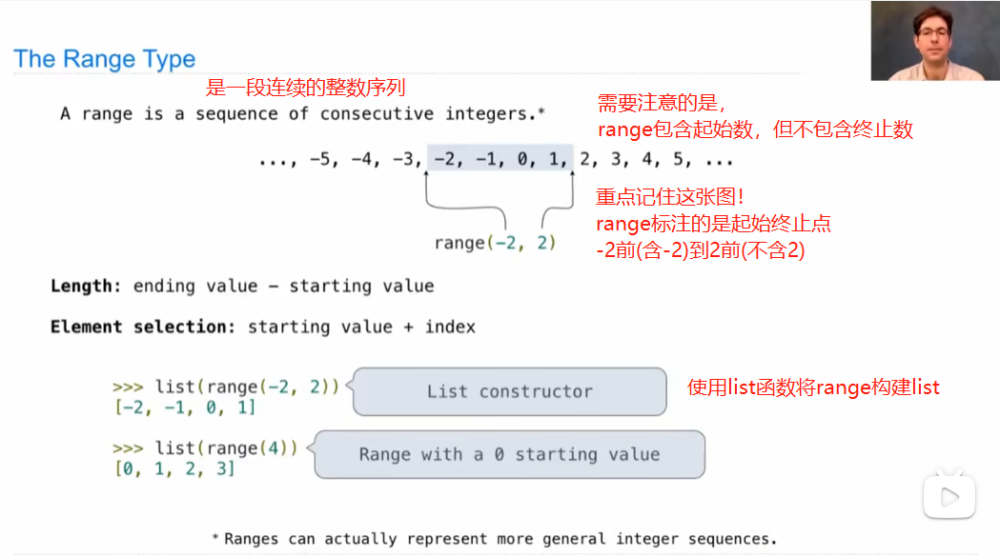

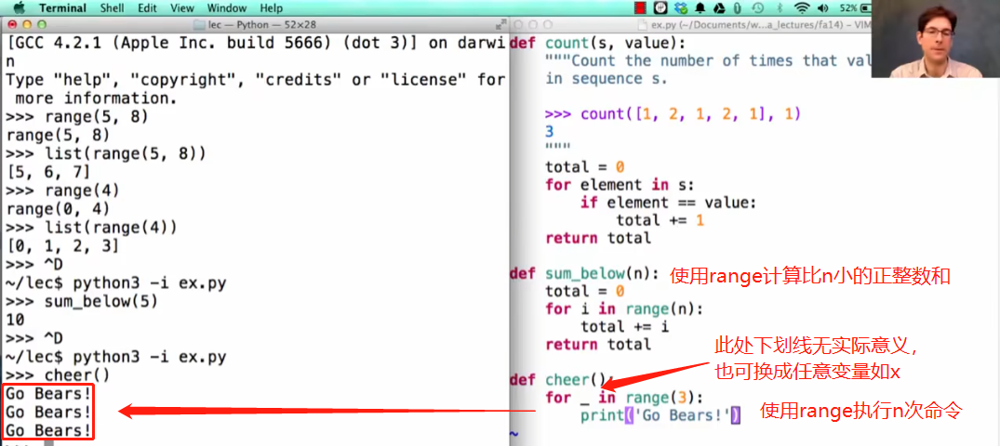

5.使用列表元素进行递归/迭代循环

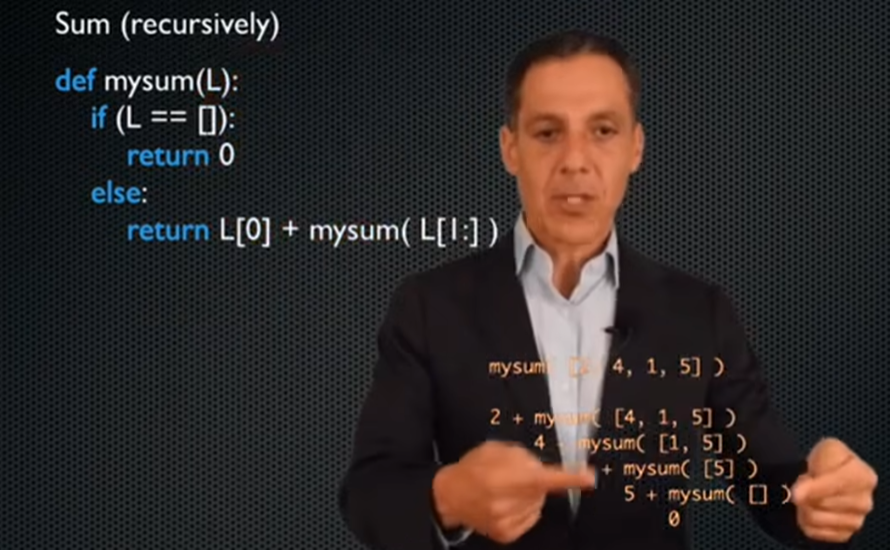

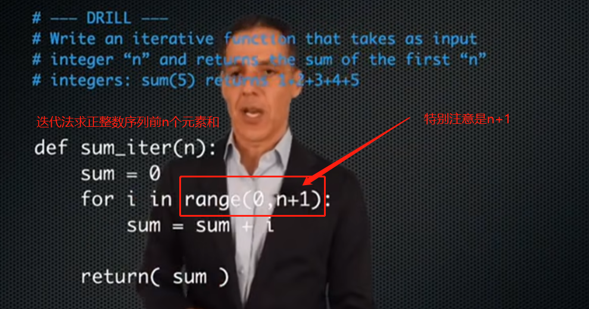

6.List Comprehensions 列表解析

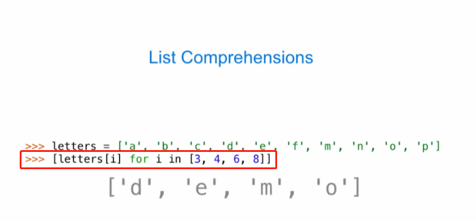

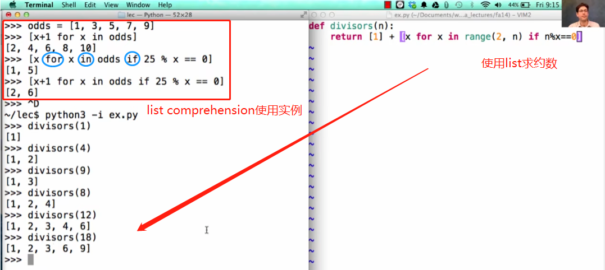

7.Strings字符串

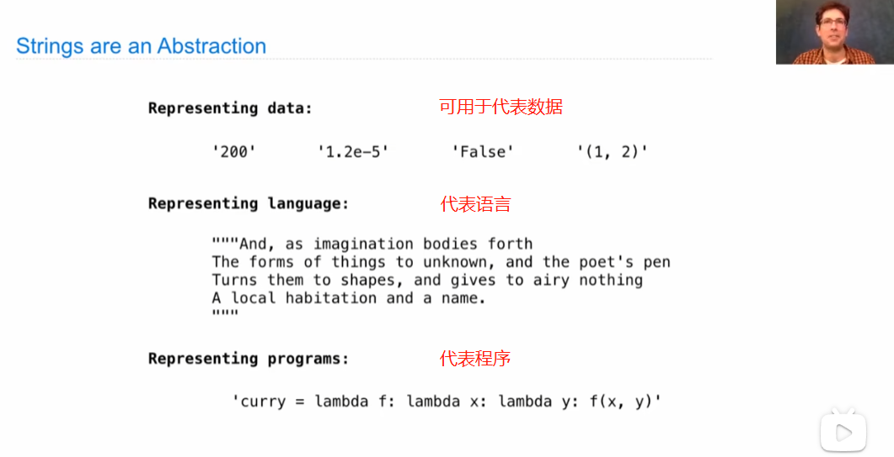

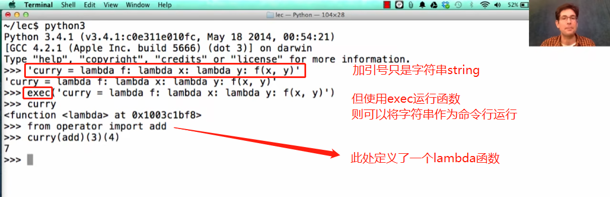

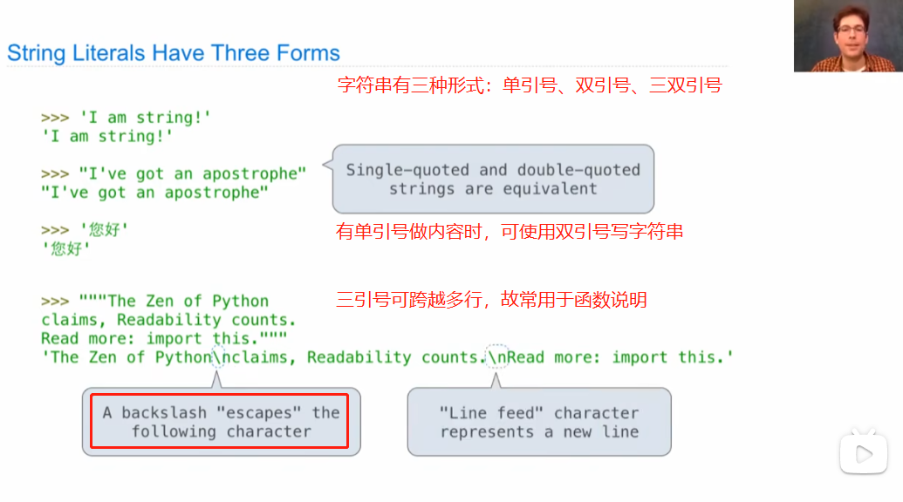

\n是换行，\t等于tab键空四格

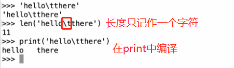

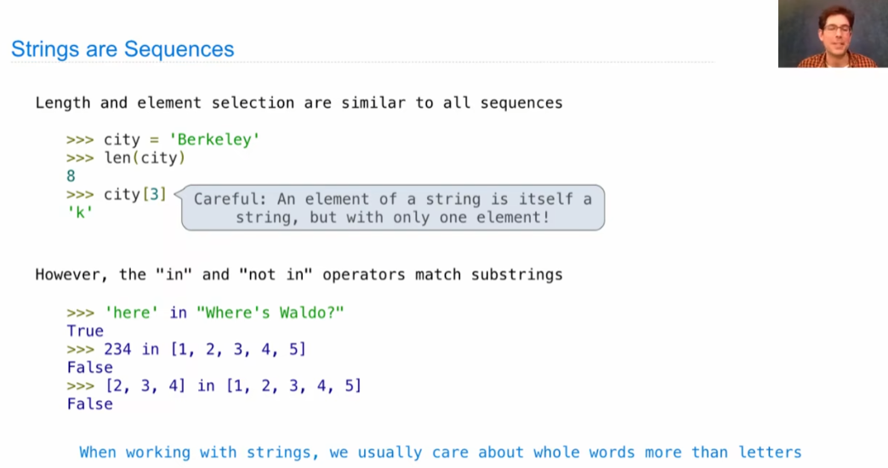

8.使用字符串进行递归，如单词字母倒序

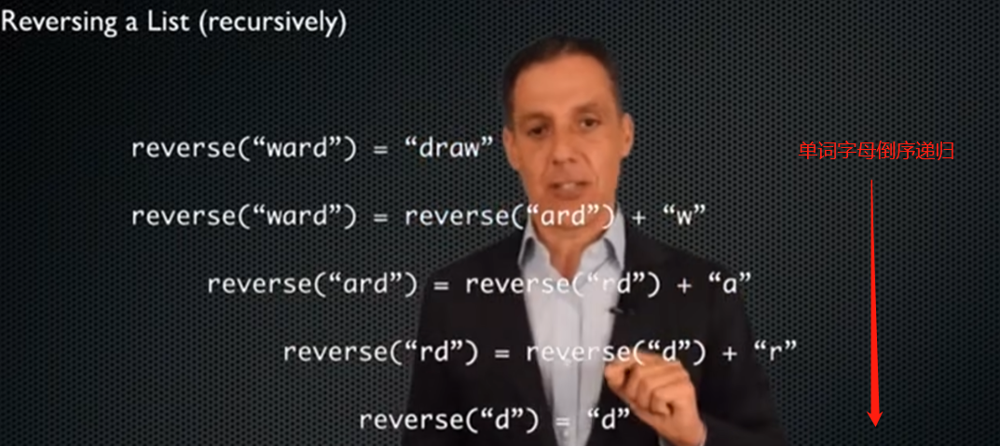

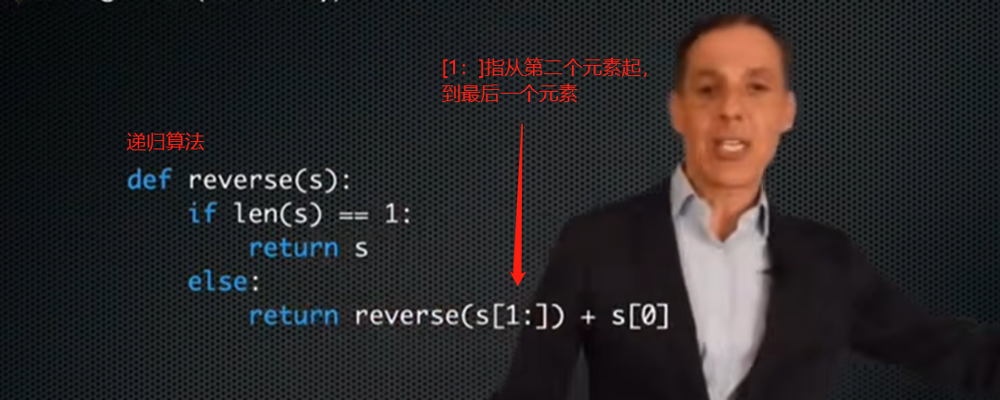

