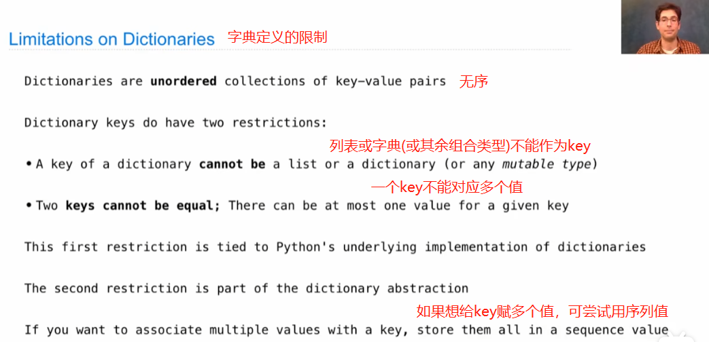

# Lecture 11. Data Abstraction

听完觉得这是一个很重要的概念，数据抽象化的概念个人理解成“对多个/种数据组成的主体数据包的定义和解构使用”，这个数据包可能是本例中定义的“有理数”，也可能是“房子”、“学生成绩单”等等。其概念最棒的一点是，实现主体和内部数据分开定义、调用、运算，这样的一大优点就是在面临长代码或大项目时，修改更新代码的工程量会大大减少，因为只需要修改“受影响”部分的定义，并不影响其他层面的代码运行。

1.Data Abstraction 数据抽象化

可以是程序在进行数据表示时更加模块化

2.Pairs

3.Abstraction Barriers

4.Data Representations

保留数字抽象边界的原因是，在不重写整个程序的前提下，你可以改变你**数字的表示值**（Data Repesentations）。

对于data abstruction，个人觉得最重要的是分清楚**constructor**和**selector**两个概念，并在定义时明确两者的返还值。

constructor是保留了所表述数据的组成形式，他包含了一个所描述数据的所有组成部分；而selector的功能则是能够完成从constructor中取出特定数值的作用。

为表示同一种数据形式（如分式有理数），constructor与selector的定义可以有多种，但这不影响他们在后续其他层级计算中的调用。这也是Abstraction Barriers的优势之处——并**不会**“牵一发而动全身”。

5.Dictionaries

字典：它允许将值与key相连接。类似于定义一个常量。

