# Lecture 12. Trees ☆

Trees其实也是一种data abstraction，它包含constructor（树形数据的定义）和selector（label、leaf、branch函数）！

1.Box-and-Pointer Notation方框和指针表示法

2.Slicing

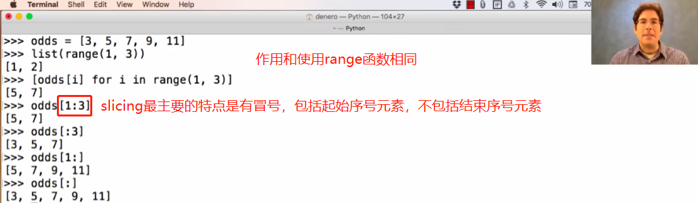

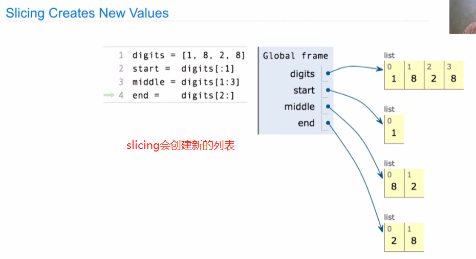

3.Processing Container Values

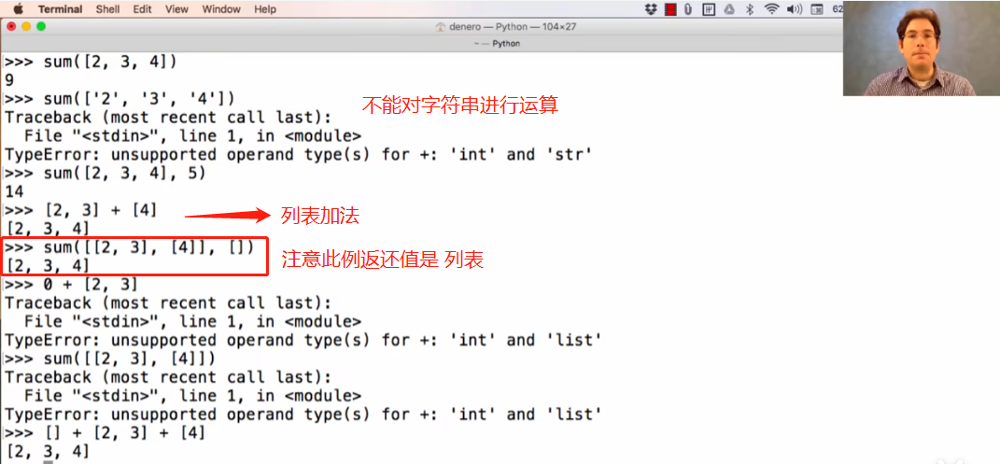

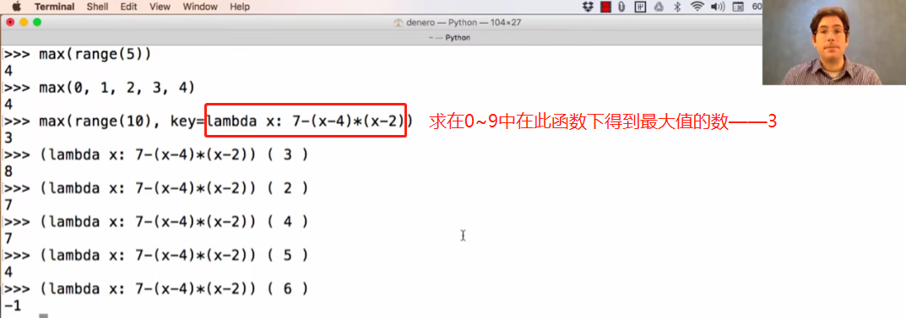

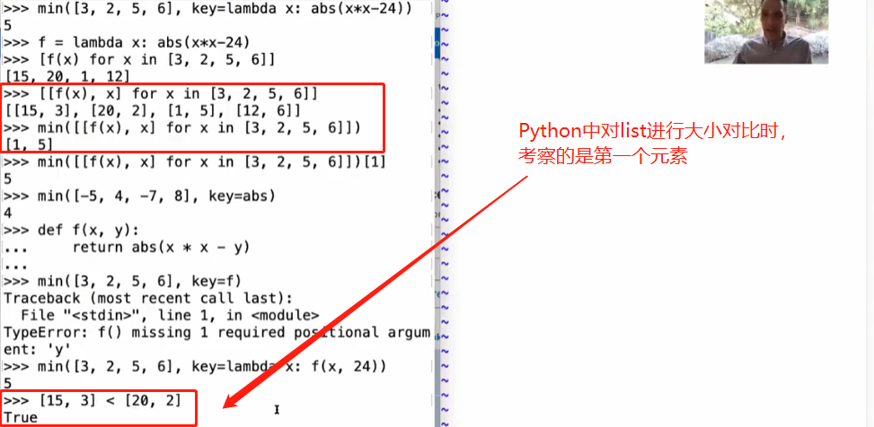

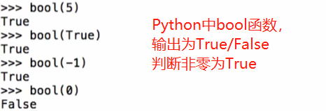

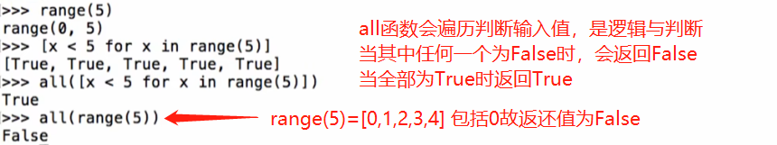

4.Trees

树形数据是一种用于储存有等级关系数据的重要数据类型

5.Tree Processing 以树形数据为输入/输出的函数

\*涉及到树递归，使用函数定义树形函数而非手动输入

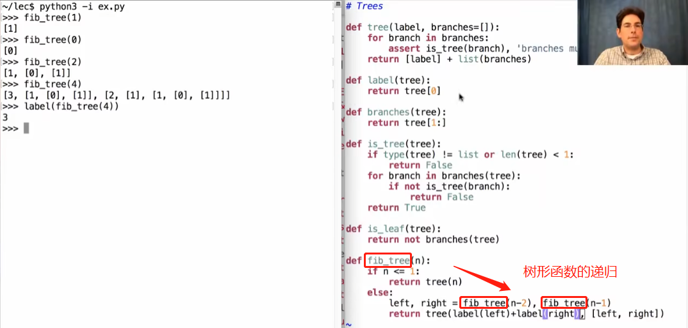

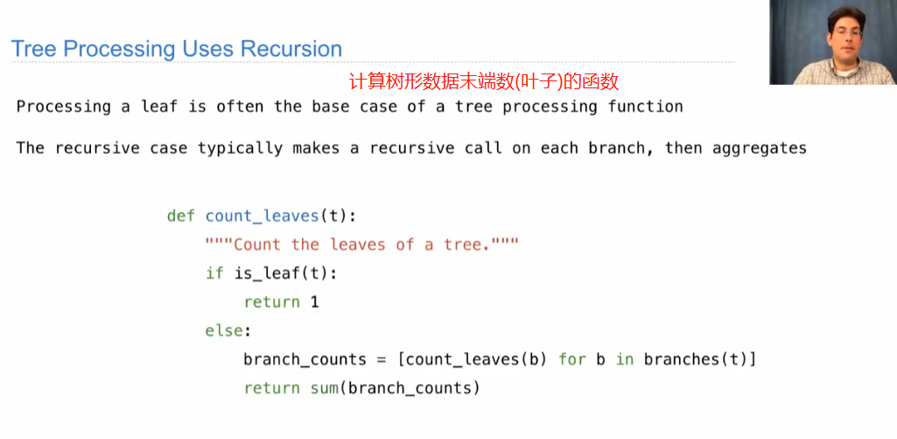

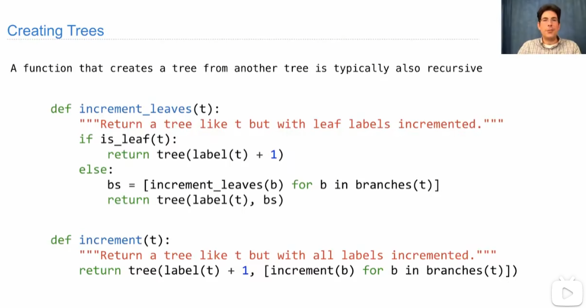

Example: Printing Trees

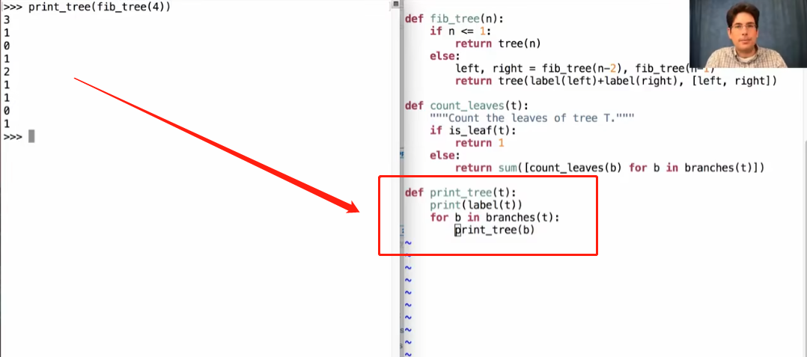

Example: Summing Paths

