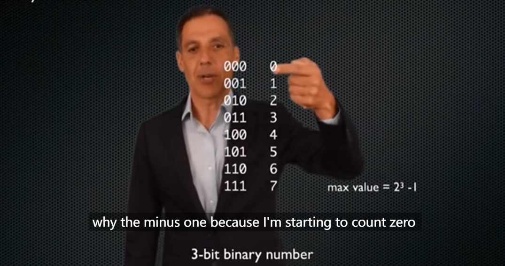
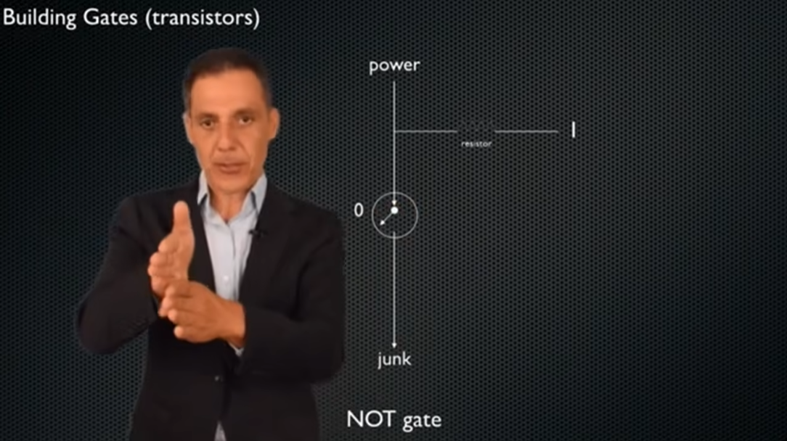

# Lecture 13. Binary Numbers

1.Binary Numbers

日常生活中，我们以十进制进行数字交流。

二进制类似，但只用0和1表示。现代计算机以二进制进行交互。

n位二进制数能表示的最大值为$2^n-1$。减一是因为第一个值为0。但n位二进制数能表示$2^n$个数。

在计算机中使用二进制的原因，**是因为用“通电/不通”电表示“1/0”是一件非常稳定的事**。而若使用十进制，则需模拟十个位数，其中便很难保障准确！

如何使用二进制表示负数呢？——有正负符号的二进制数

最直接的想法使用一个二进制数表示符号，数字最左侧第一个数，是0则表示正，1表示负。

但这种表示方法会存在0有两种表示方法，-0的存在使其对计算机不友好。

于是有了**第二种方法**(two's complement 二进制补码)，依旧是用左侧第一个数表示正负：当为正数时符号位为0，但当为负数时不仅符号数变为1，其后方的数字也进行翻转再加一(1变成0、0变成1后加一，如6为0110而-6为1001+1=1010)。

但此时又有一个新的疑问。3位二进制数可以表示8个数，缺少的100又表示的是什么呢？由于符号位是1，则计算机会进行反向运算。它表示的是-4。

因此在此表示方法下，n位二进制数仍可表示$2^n$个数，其数值为$-2^n$到$2^n-1$。

使用two's complement的另一优点在于运行计算，能很好地处理相加为0的表示。

如何表示有小数点的数呢？

计算机如果使用二进制进行计算：

布尔逻辑：1-True; 0-False

三种逻辑运算：and、or、not

逻辑门表示及物理实现

使用晶体管（半导体，可以通过是否通过电信号代表0与1两种状态）搭建逻辑门

AND逻辑——串联

OR逻辑——并联

NOT逻辑——由一个transistor和一个电阻resistor组成：当输入为0时晶体管关闭，电信号迫不得已只能从电阻处走，输出1；当输入为1是晶体管打开，电信号不再通过电阻线路，输出0

