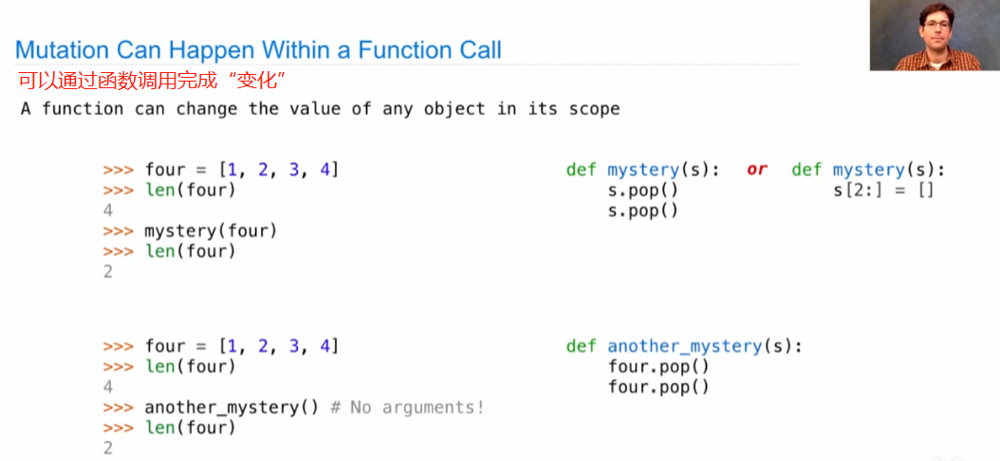

# Lecture 15. Mutable Values

Mutable values 可变值——面向对象编程(OOP, object oriented programming)中非常核心的一个元素

1.Objects

对象是一个按所代表的事物需求所表现的值，你可以“.”表达获取对象的属性。

在Python中所有值都是一个对象，以strings为例：

.upper/.lower这些都是面向字符串的方法，并非函数。

2.Mutation Operations

change contents of lists

change contents of dictionaries

3.Tuples

元组是**不可变化**的序列，使用小括号定义和表示。特别的是所想设置一个只包含一个元素的元组，必须在其之后加上“，”逗号。

4.Mutation

5.Lists

回顾List变化和环境表格

