# Lecture 16. Mutable Functions

指与可变变量相关的函数

1.Mutable Functions

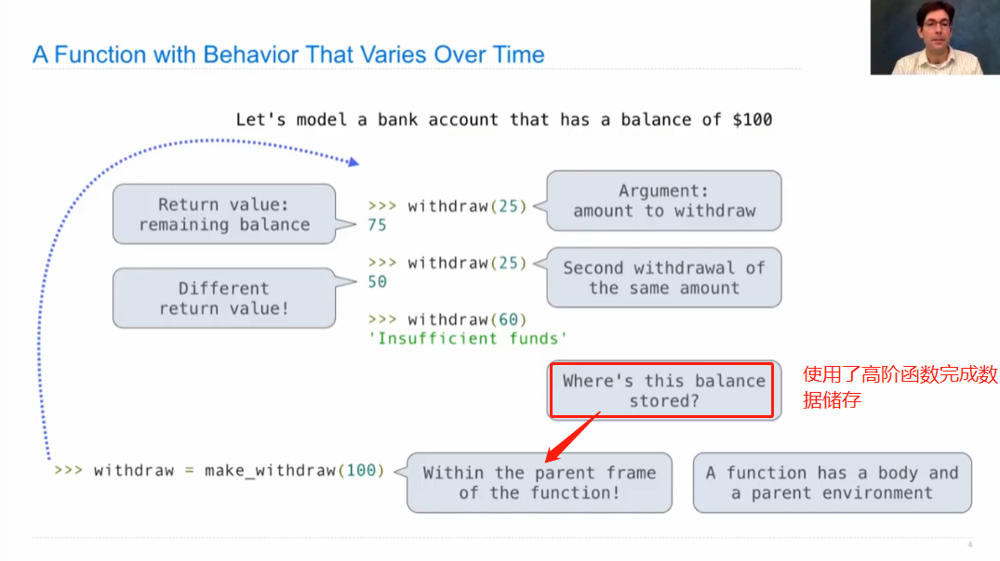

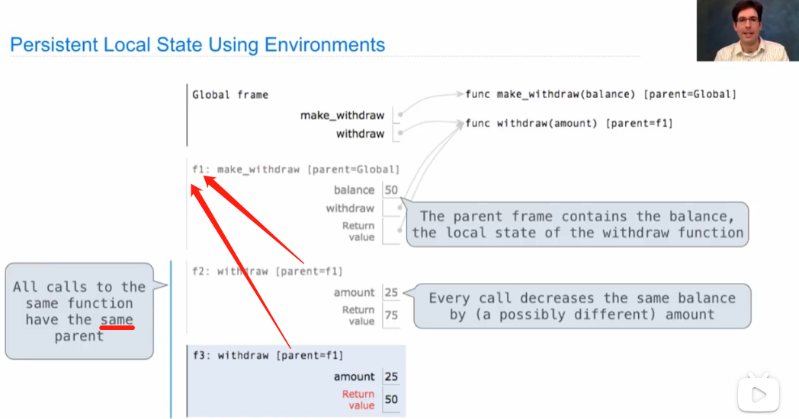

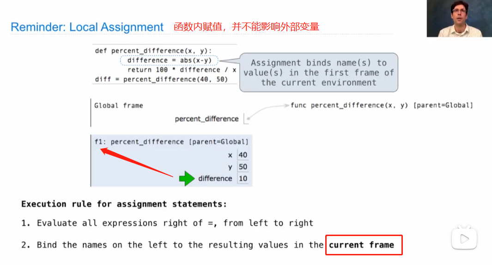

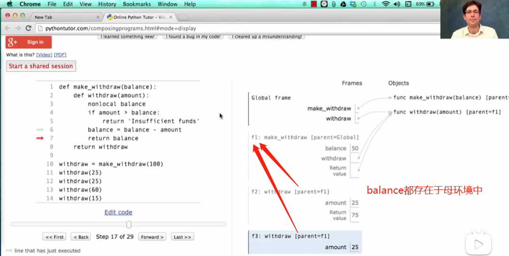

2.Non-local Assignment

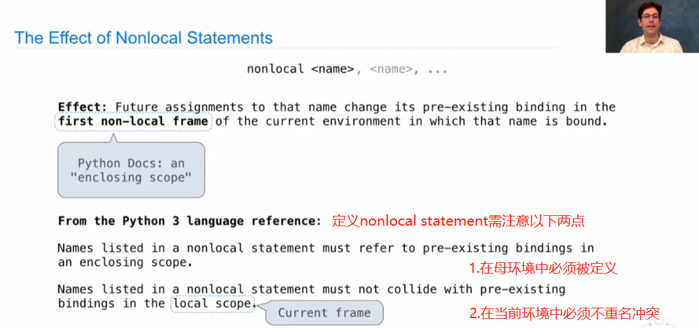

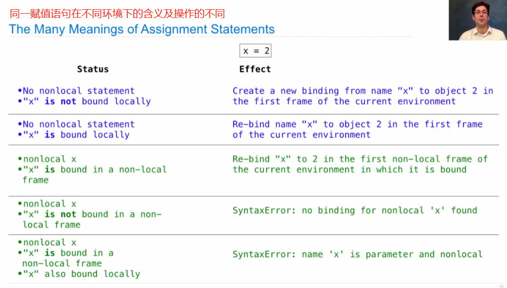

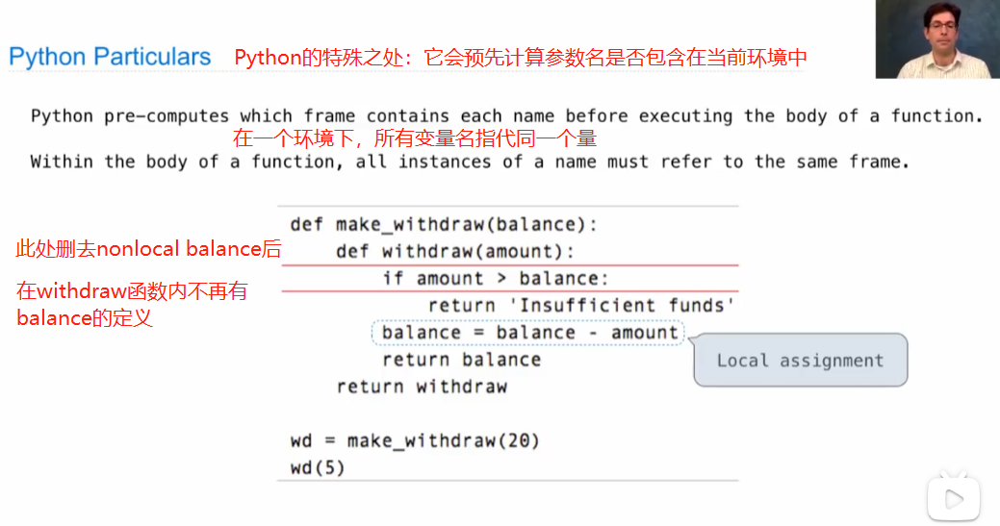

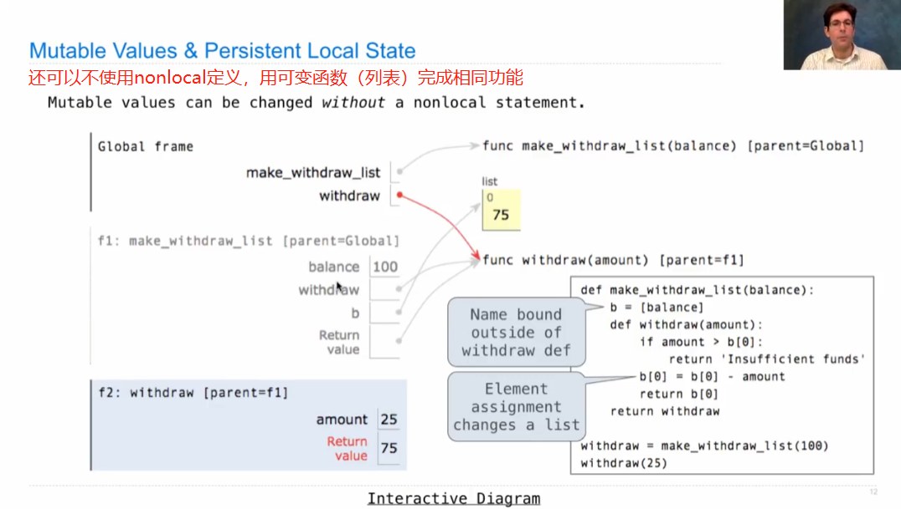

3.Multiple Mutable Functions

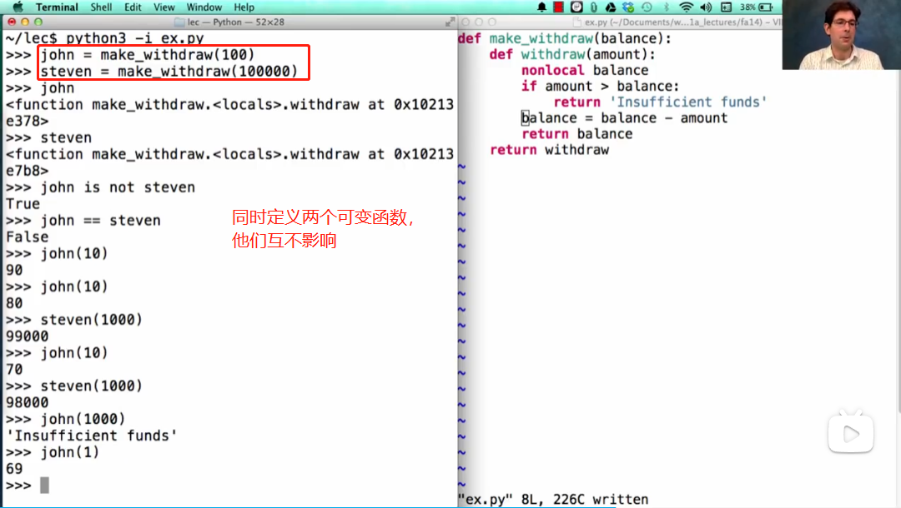

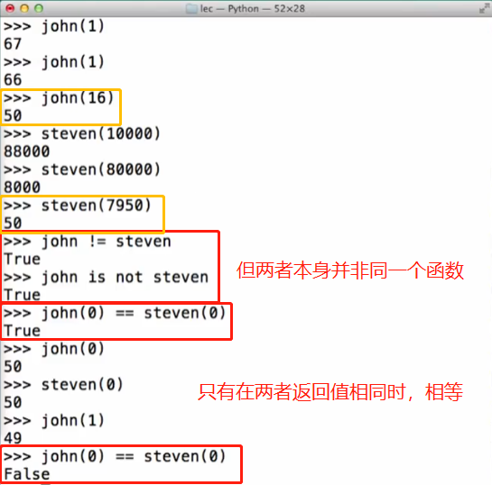

3.Mutation operations cause **referential transparency** lost！引用透明性

函数的返回值只依赖于其输入值，这种特性就称为**引用透明性（referential transparency）**，即“对同一输入值每次都返回相同结果”。

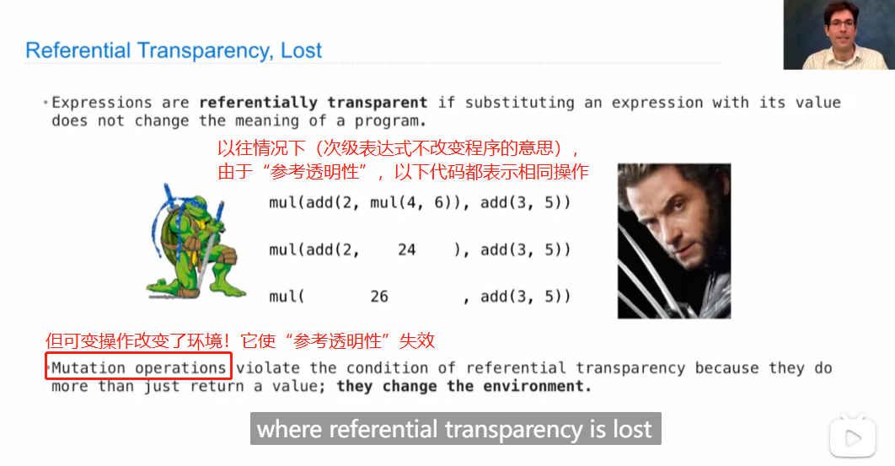

可变函数使这种特性失效，如下列程序在输入b(3)+b(4)和单独输入b(4)时其对应值分别是12和11，并非相同。

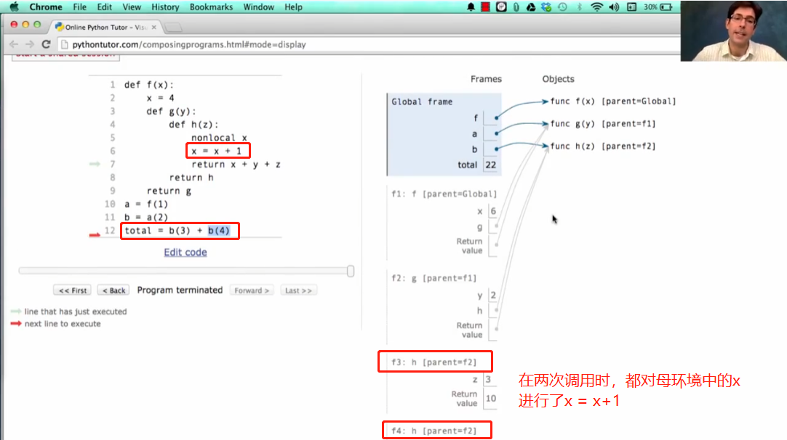
