# Lecture 17. Iterations

1.Iterators

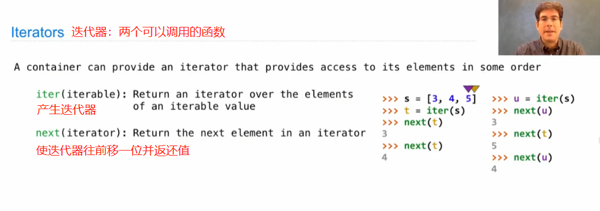

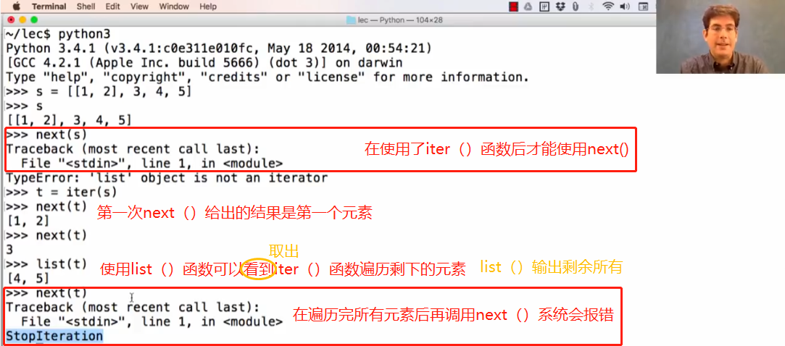

2.Dictionary Iteration

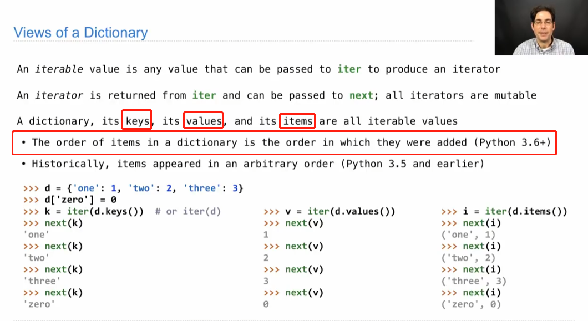

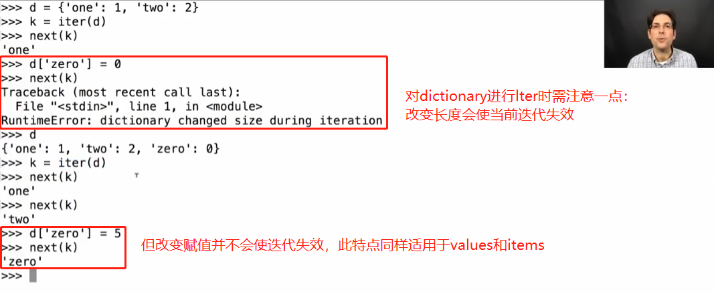

3.For Statements

For statements iterate over iterable values, they can also iterate over iterators themselves.

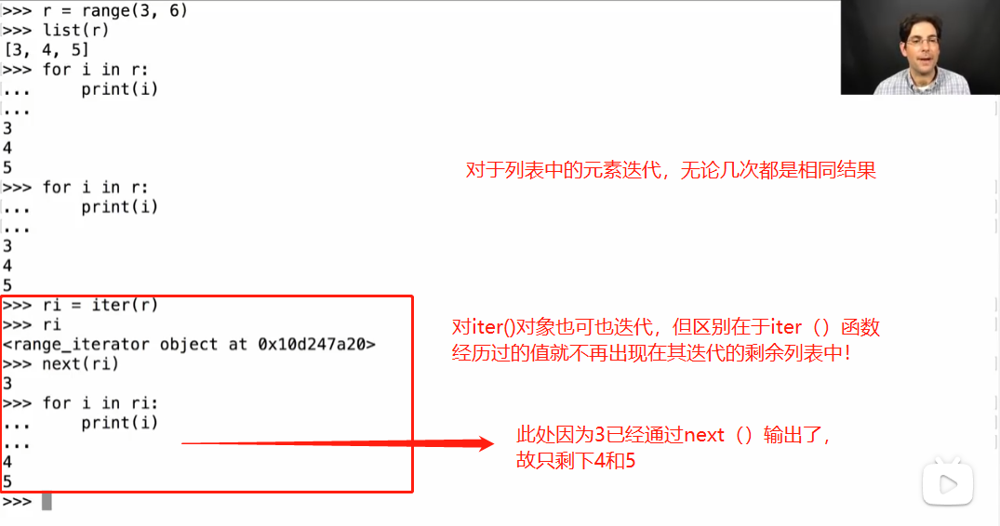

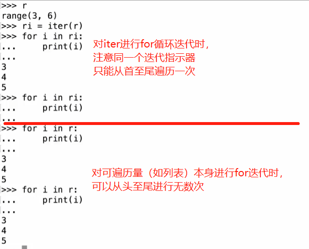

4.Built-In Iterator Function

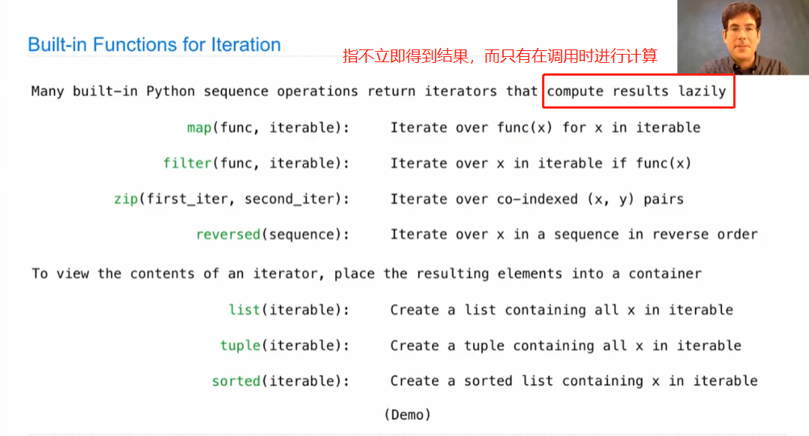

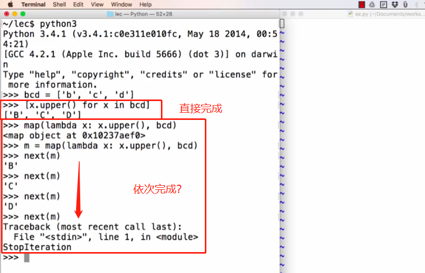

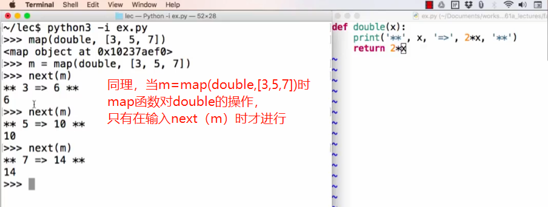

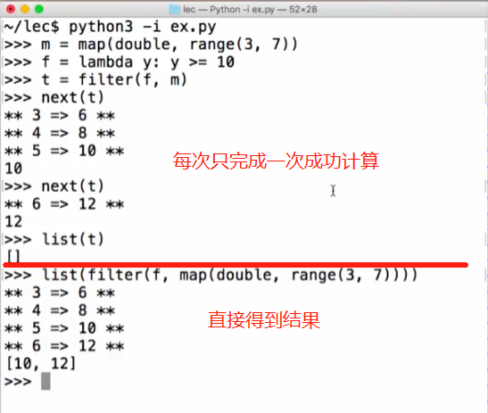

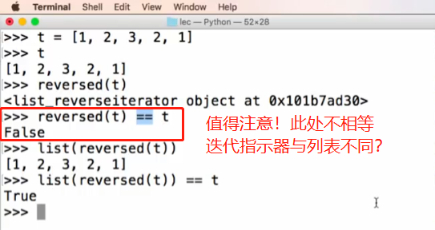

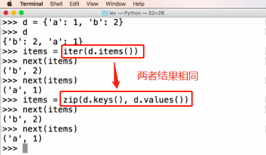

5.Generators

It's a special kind of iterator——it's returned from a generator function.

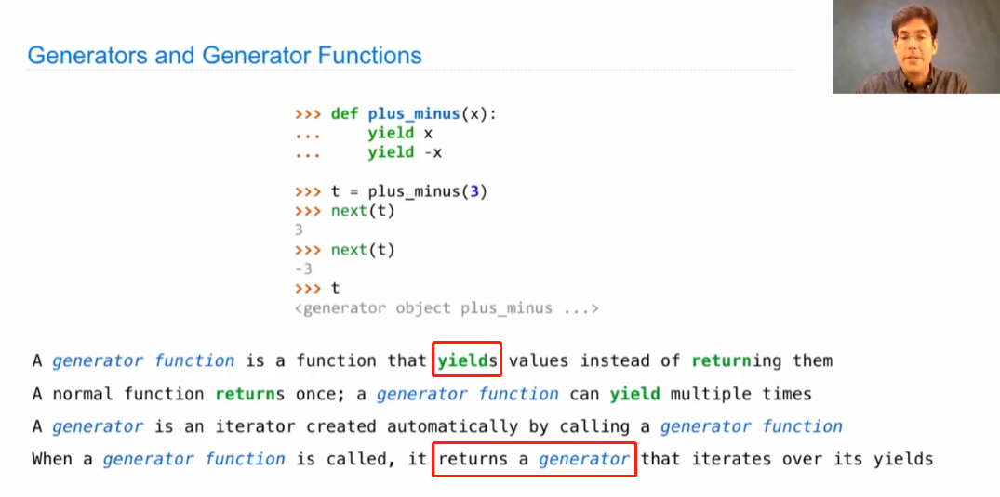

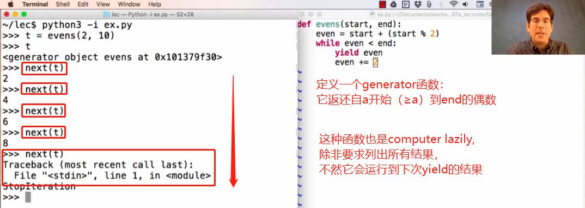

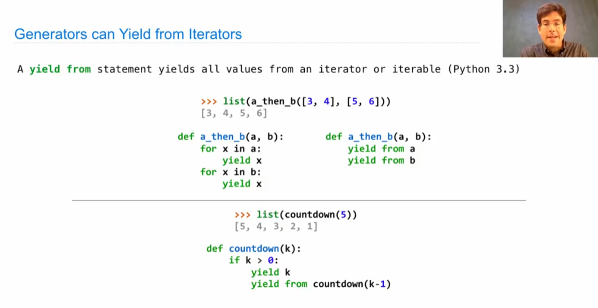

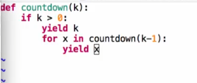

将其使用yield from简写（从可迭代数据中依次yield）

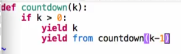

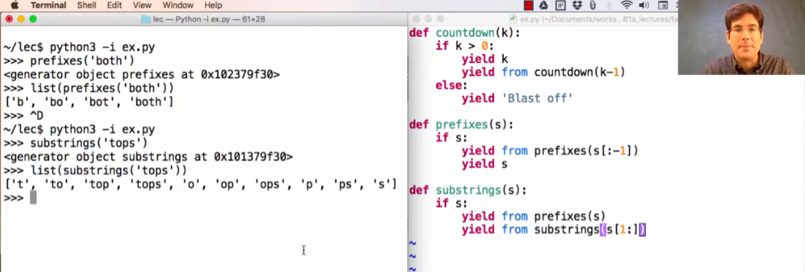
