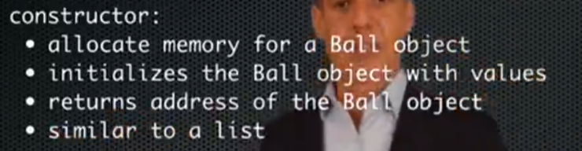

# Lecture 18. Objects

1.面向对象编程OOP Object-Oriented Programming

举例：

其构筑方式，与列表很类似：（1）首先分配储存空间；（2）用数值初始化对象；（3）返还该对象的储存地址。

可以创造多个object,每个都用以上相同步骤构建

可以通过ball1.x访问ball1中的x

***Objects*** are organized according to ***classes***.

2.Class

Class Statements: let you creat any type of data you want

"\_\_ init \_\_"往往是用来定义其输入属性的？

3.Methods

Methods are what represent the messages that objects will accept. 他们是定义在class statement中的函数。

4.Attributes

