# Lecture 19. Inheritance

inheritance遗传特征

1.Attributes

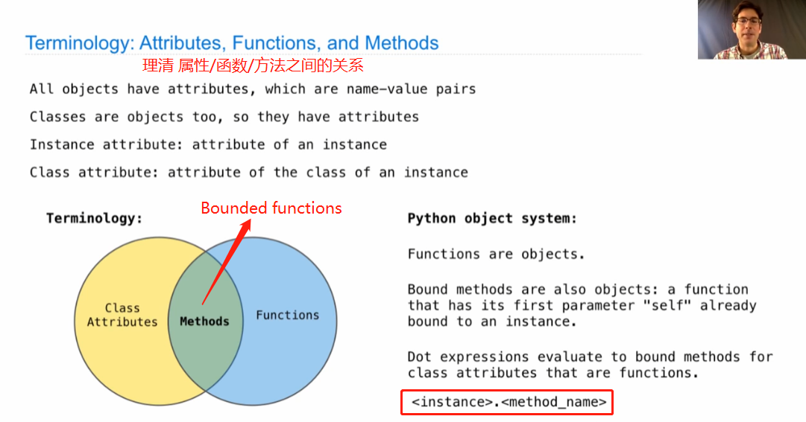

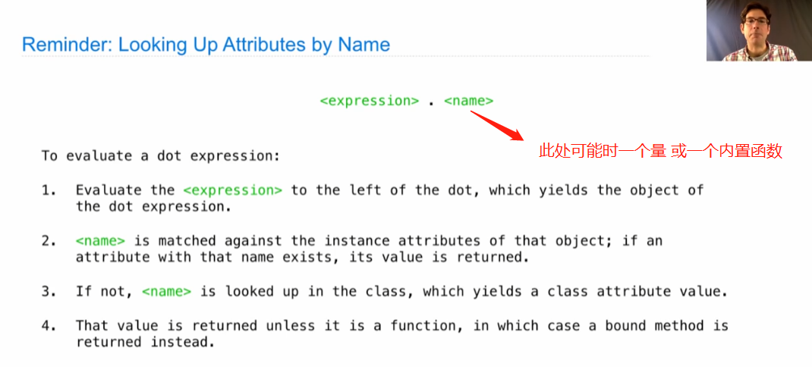

2.Attribute Assignment

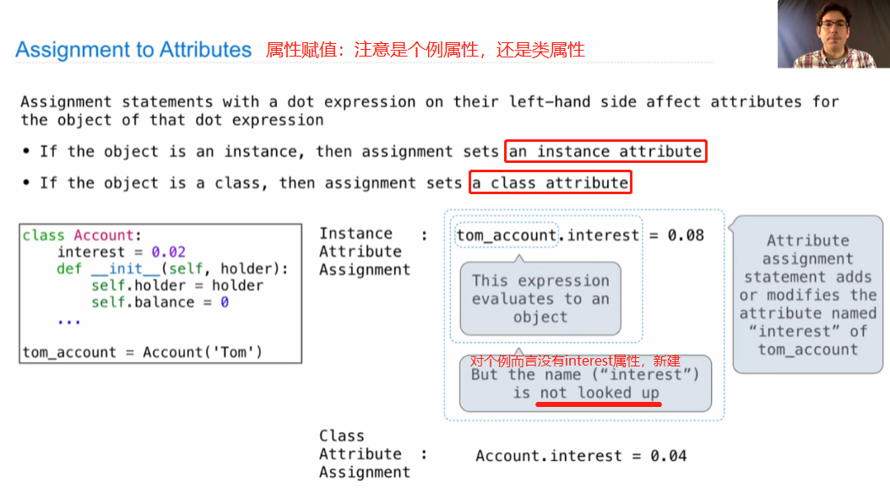

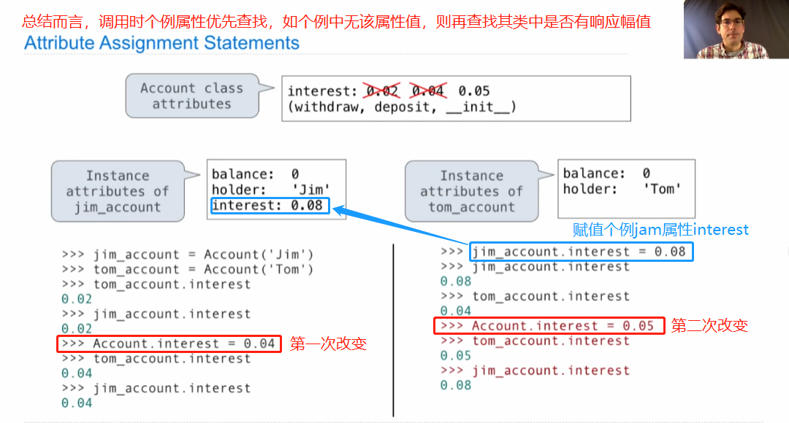

3.Inheritance

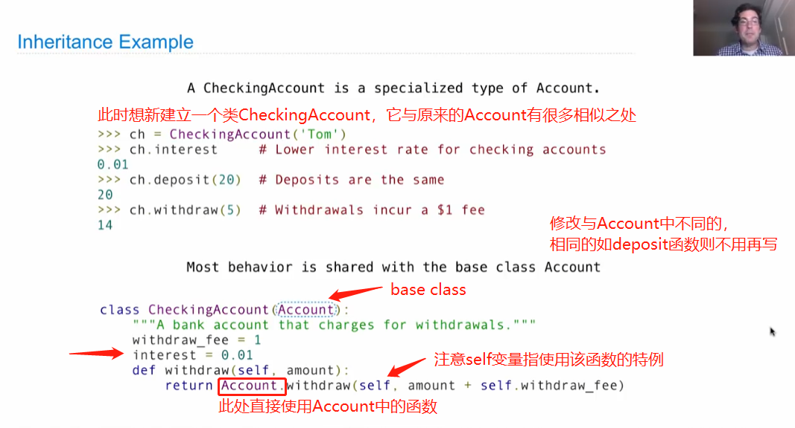

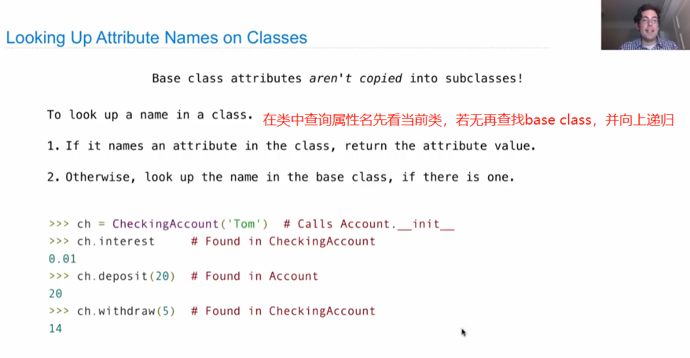

4.Object-Oriented Design

Some guidance for how to come to a useful solution

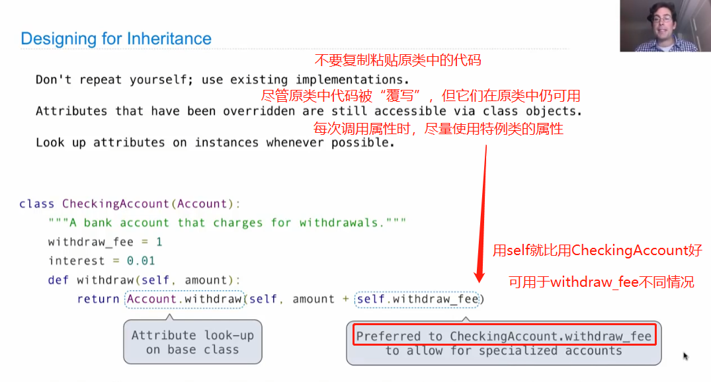

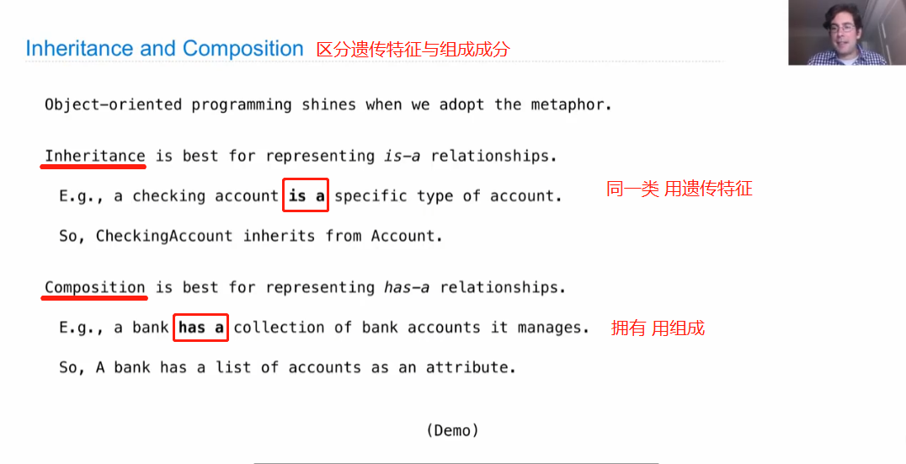

5.Attributes Lookup Practice

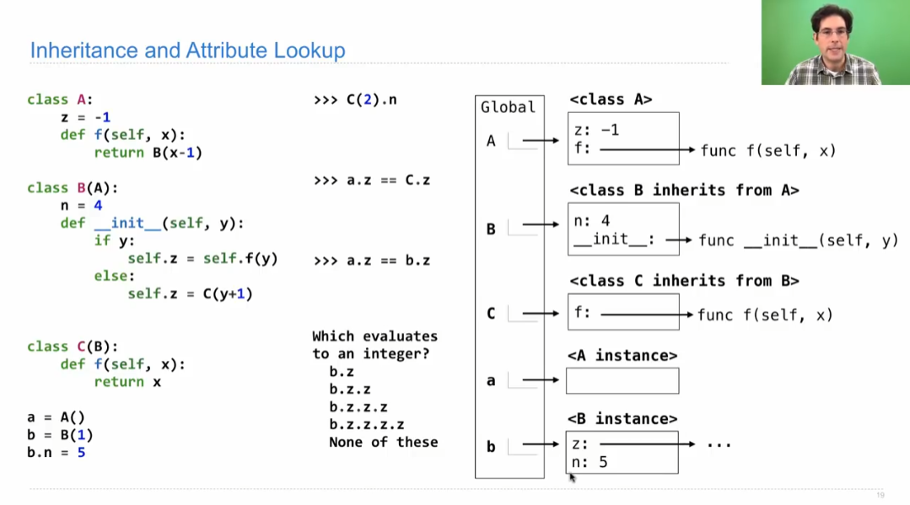

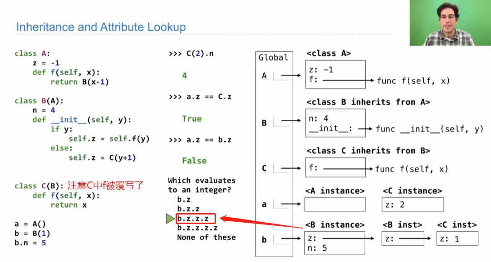

此例中最后一问，哪一个为整数需再消化。每次调用.z是什么

6.Multiple Inheritance

→ a subclass has multiple bass classes

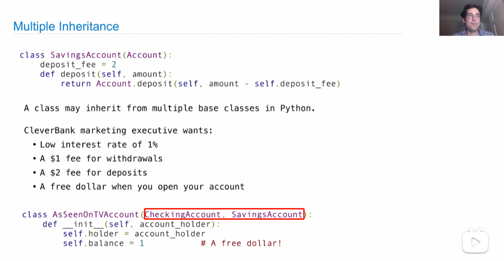

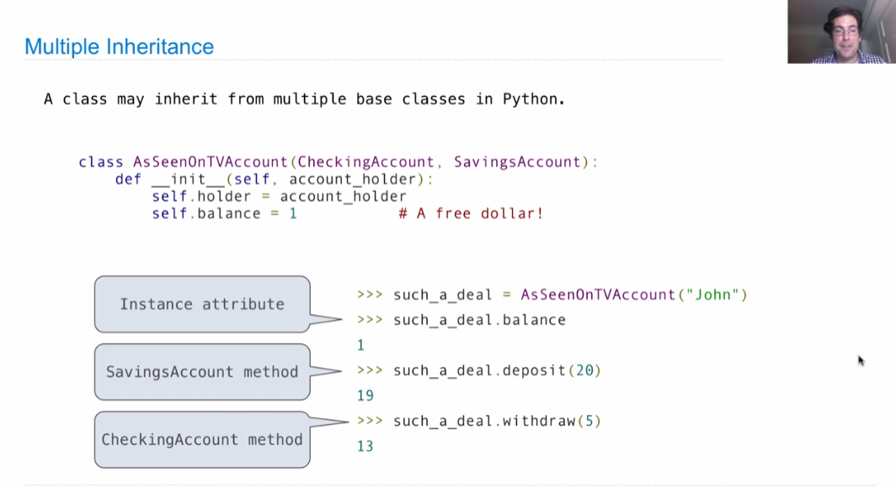

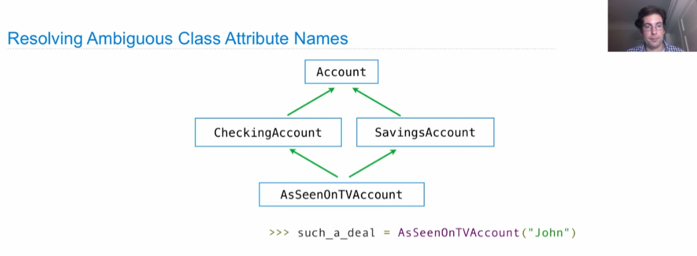

由于Multiple Inheritance的出现会大大增加程序复杂度，故在使用时一定要多加小心程序变为**Complicated** Inheritance

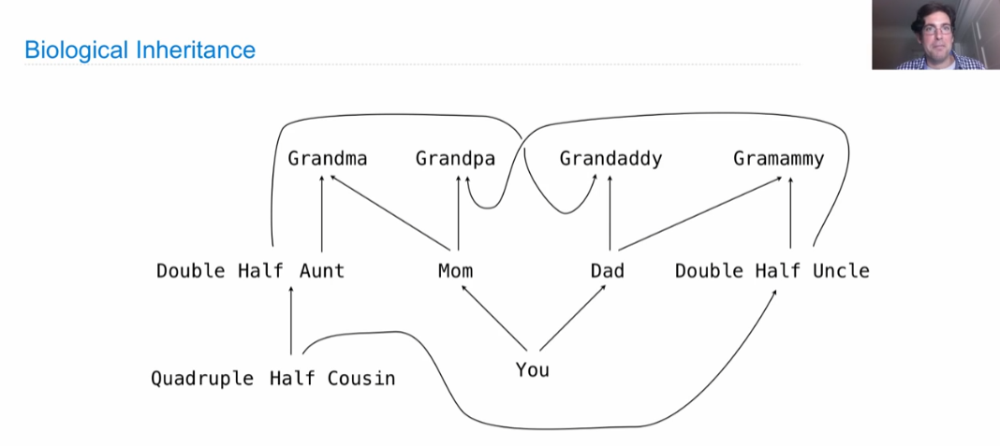
