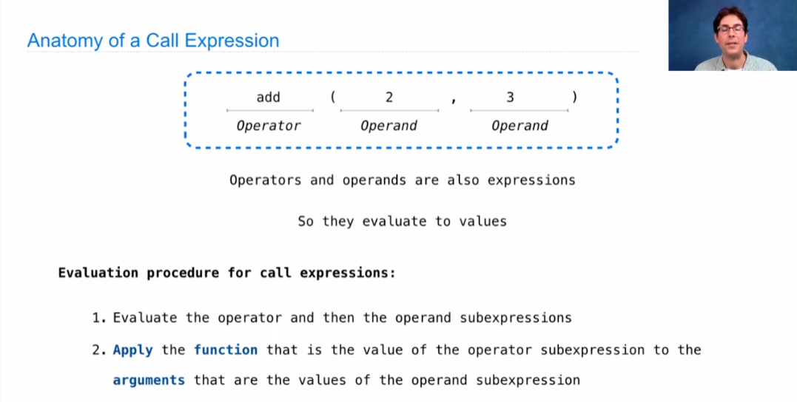
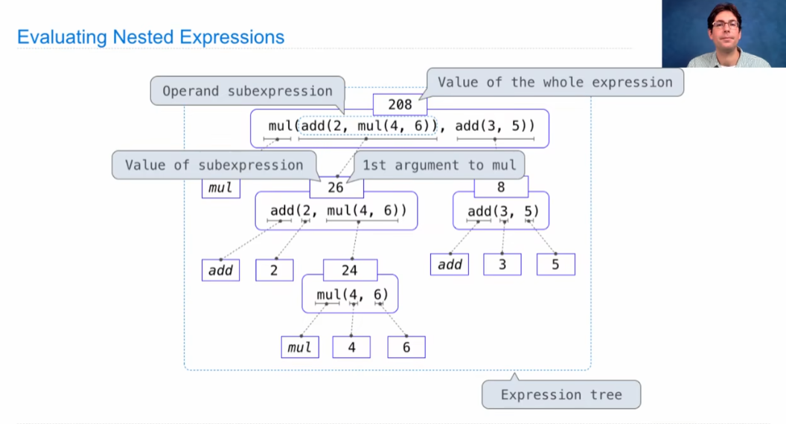
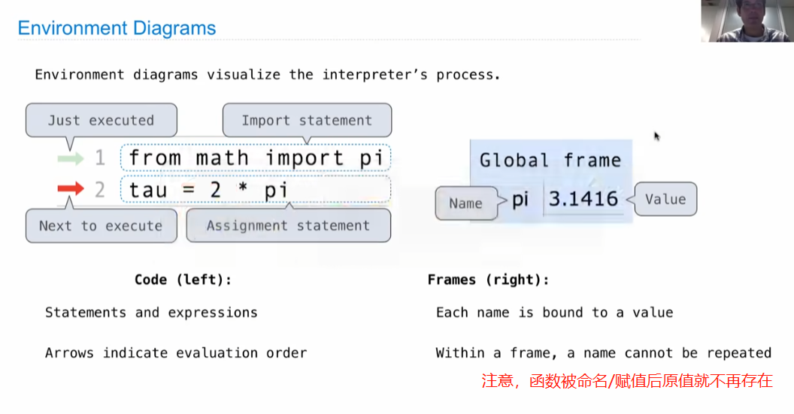
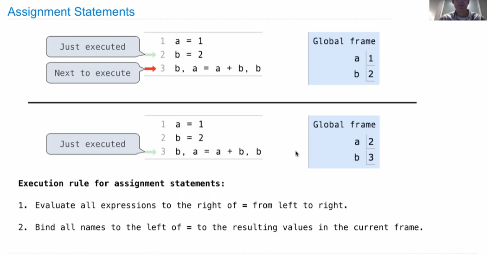
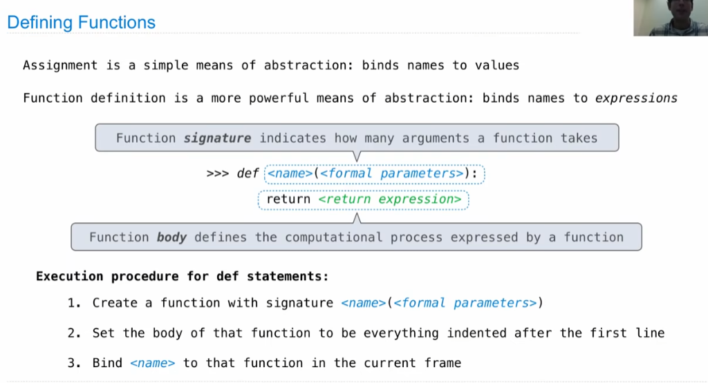
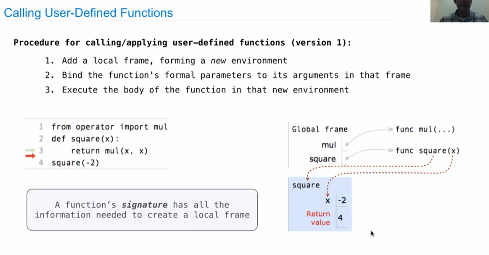
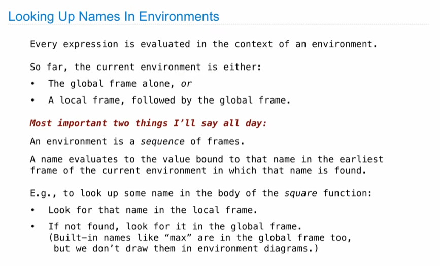

# Lecture 2. Functions

1.所有表达都可以用符号的函数表示。

调用表达式(call-expression)重要且有用。

2.Environment Diagrams环境图：可视化编程过程。

注意程序运行顺序！

**首先**，程序会将等式**右端**的数值计算完毕；

**其次**，将右端的值**赋值**给左边的变量。

3.如何**使用Python定义函数**

通过Python**使用自定义函数**

4.常用计算符号、函数

整除：//

取模：%

取余：mod

四舍五入函数：round（输入数值，保留小数位数）
