# Lecture 20. Representation

数据的表现方式

1.String Representations

字符串表示法

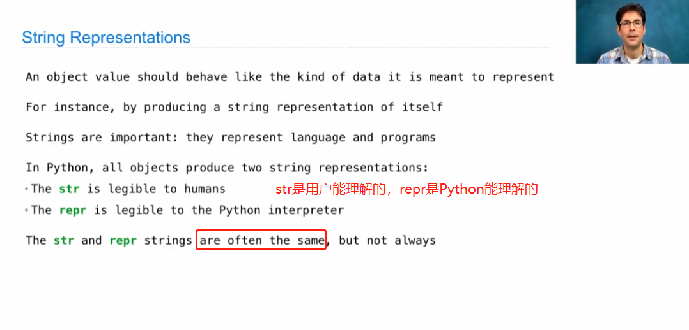

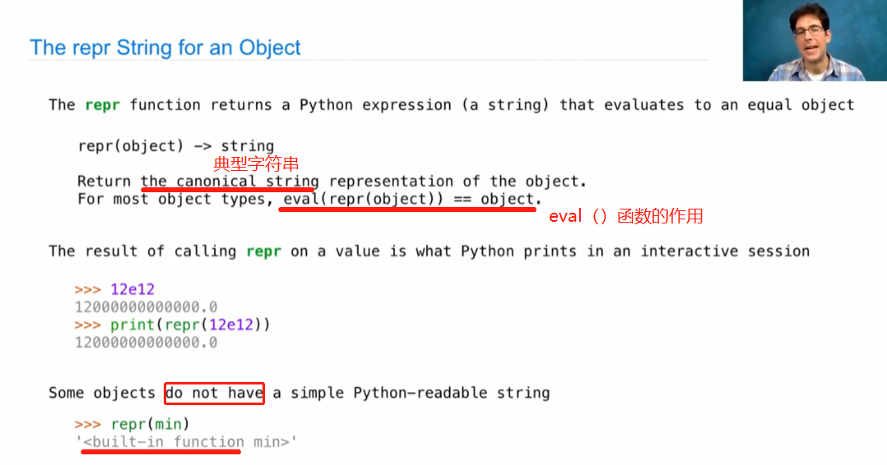

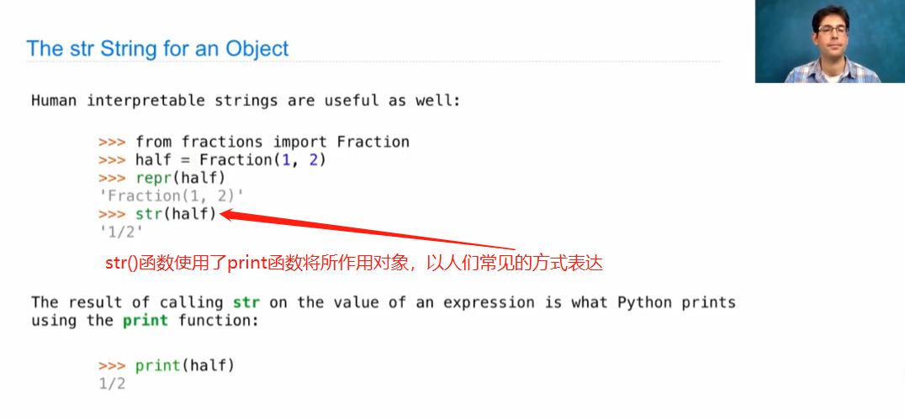

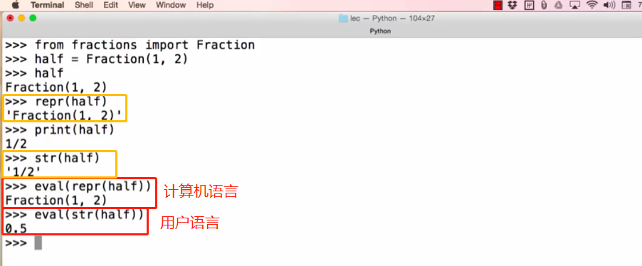

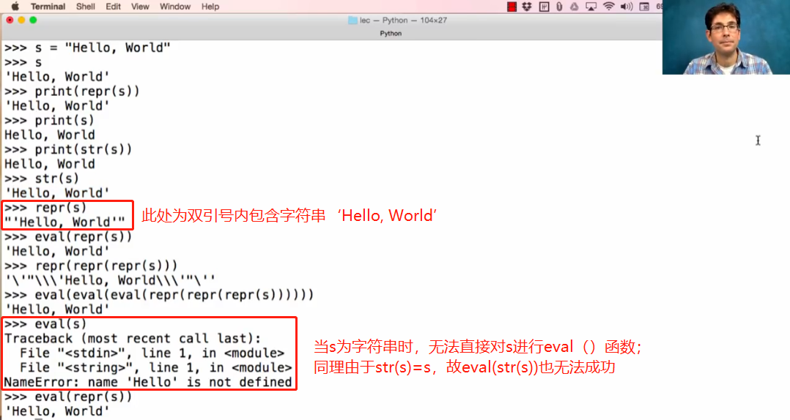

2.Polymorphic Functions多态函数

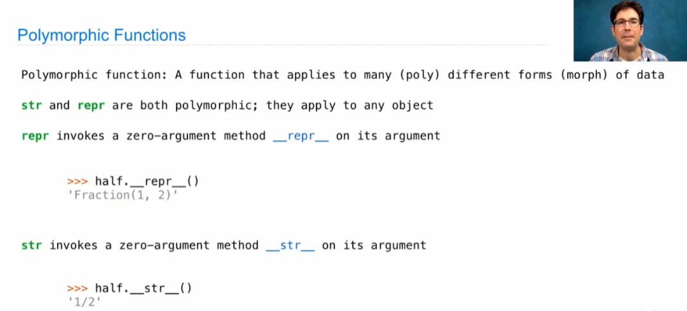

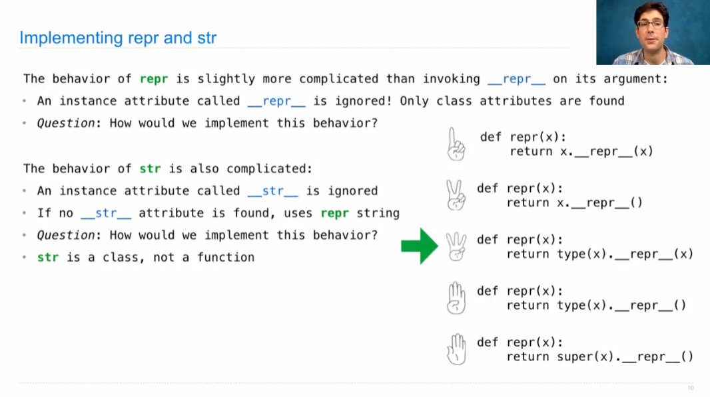

***例：*** 在定义\_\_repr\_\_(self)条件下，所有语句输出都是一样的

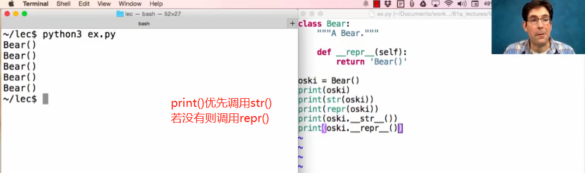

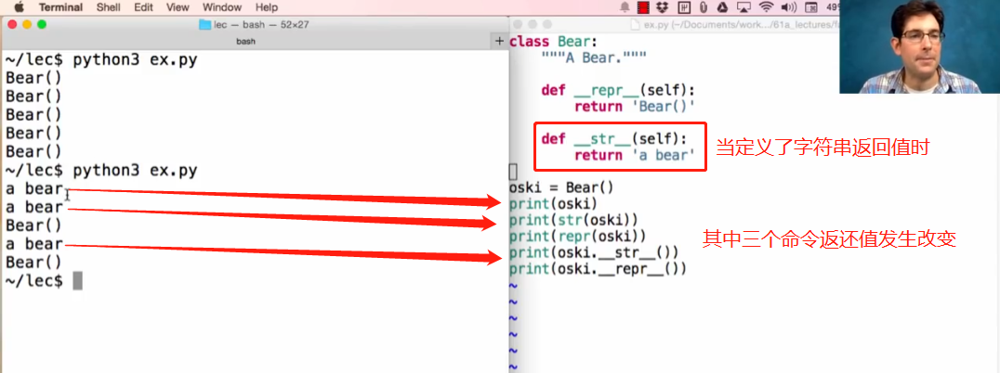

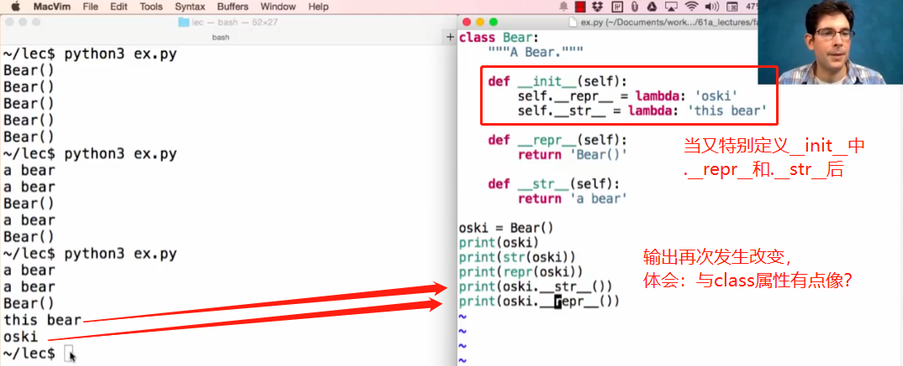

自己定义repr()和str()函数以更深刻理解其意义：

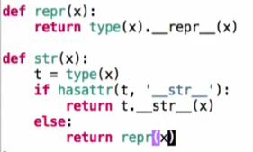

交互界面Interfaces

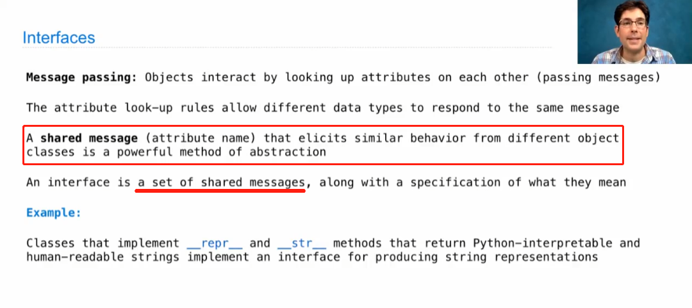

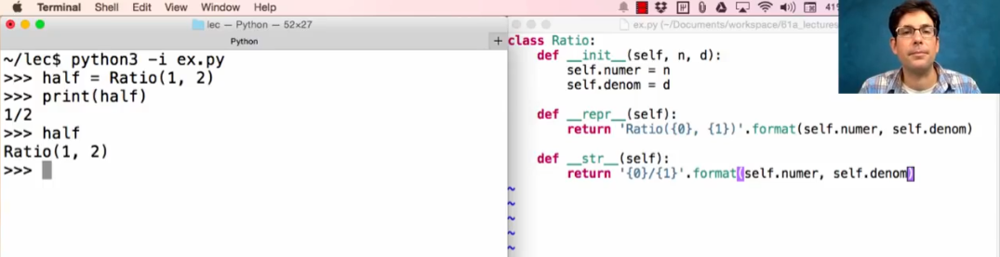

3.Special Method Names

They're a topicparticular to the python language.

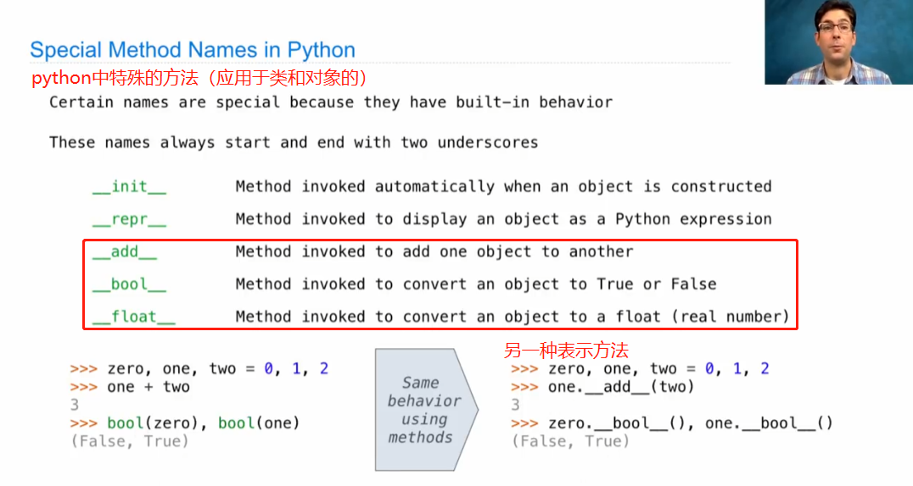

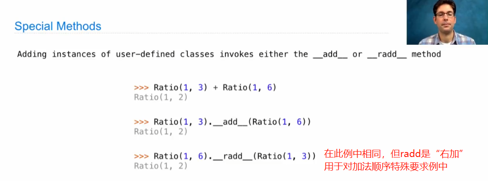

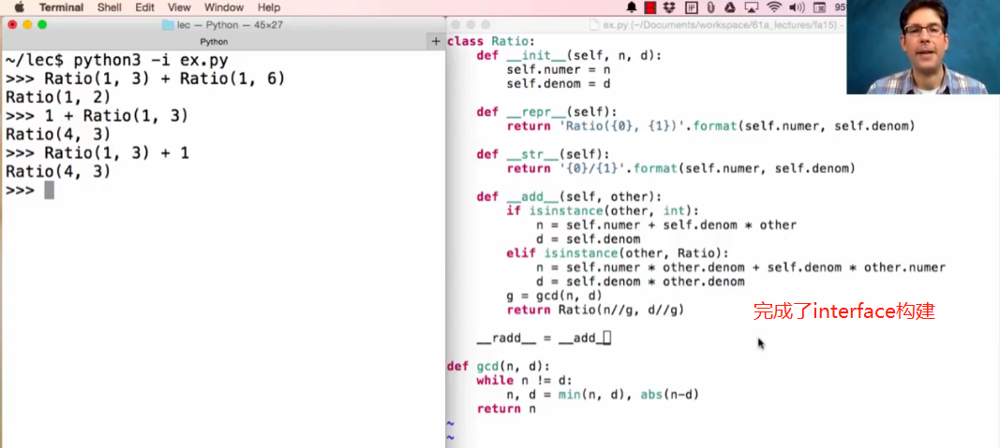

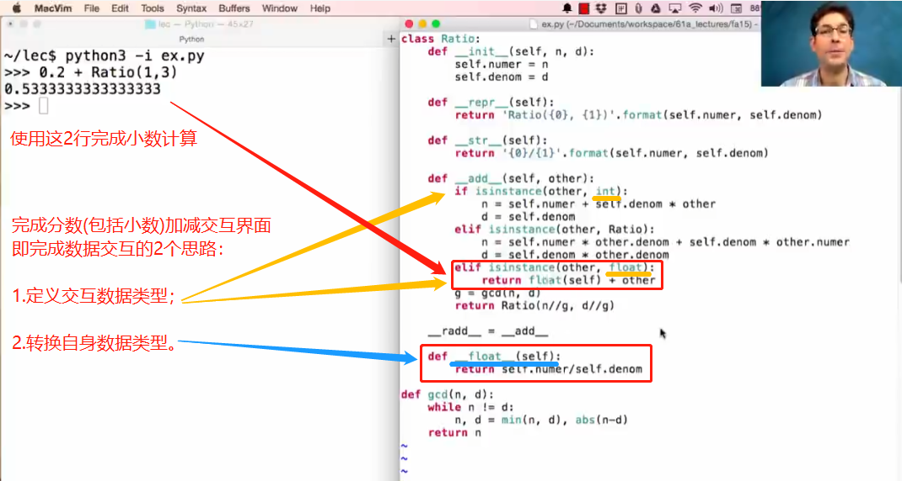
