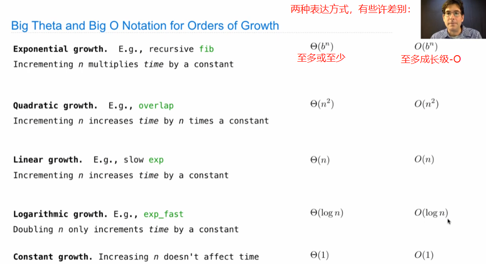

# Lecture 22. Efficiency

1.Measuring Efficiency

此例记录的是调用函数的次数，之后还有更多的方法记录程序运行的时间。

2.Memoization

It's an extramely useful technique for speeding up the running time of a program.

3.Exponentiation

4.Orders of Growth

They describe how time scales with input size.

除上述两种描述计算增长的种类外，还有其他种类。

常见的增长级种类

5.Order of Growth Notation

6.Space (memory)

Another resource that gets consumed by programs as they execute.

可以使用Python Tutor并选择"don't display exited functions"查看被储存的环境框架。

