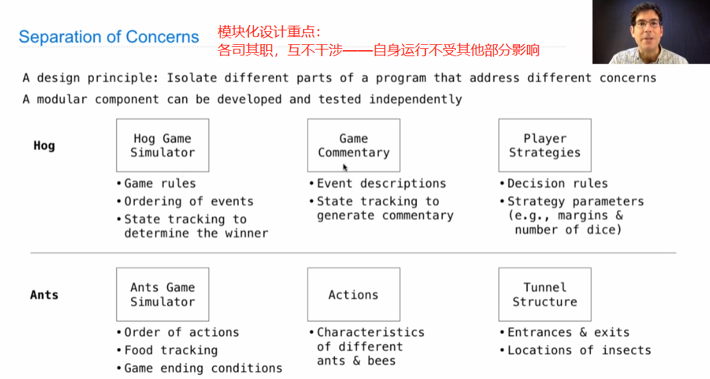
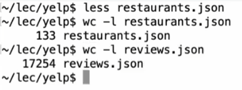
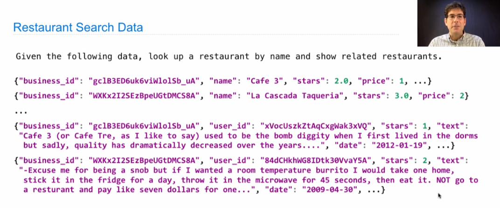
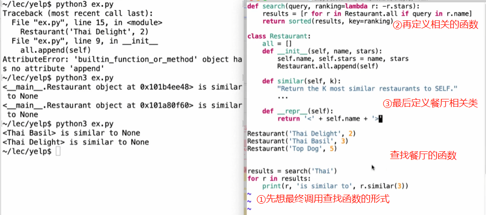
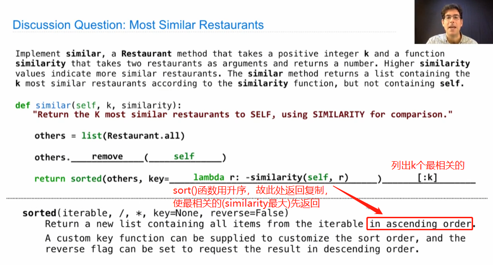
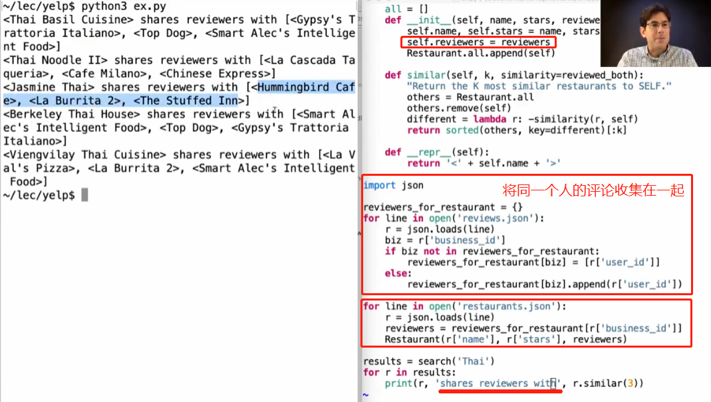
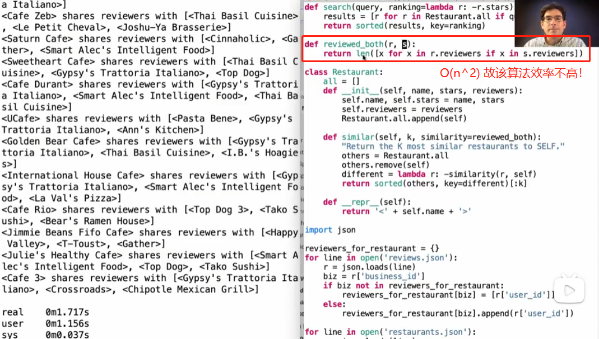
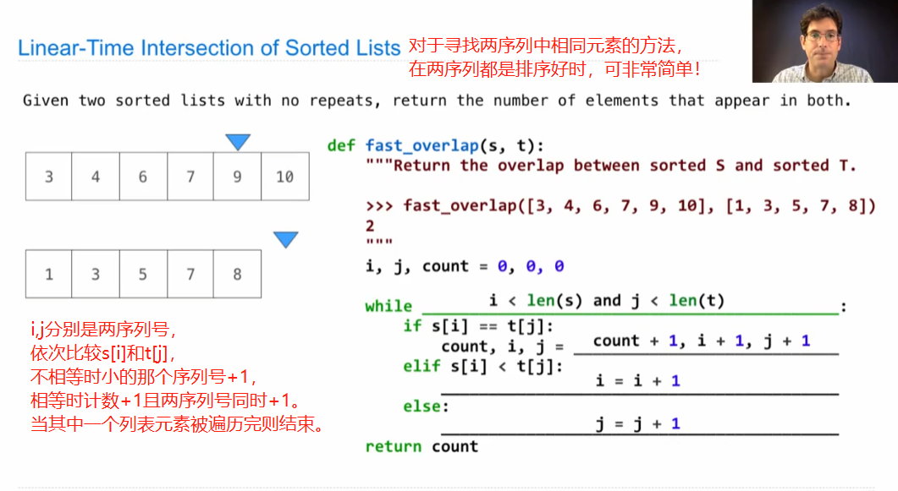
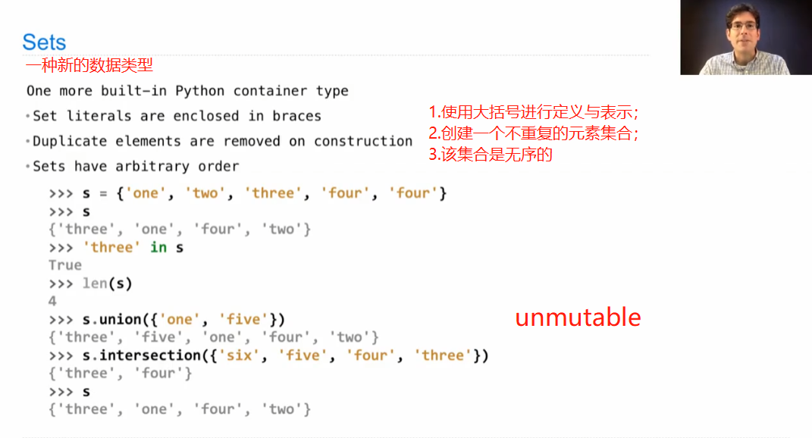

# Lecture 23. Decomposition

1.Modular Design模块设计

Example：Restaurant Search

有许多餐厅名称、相关评论

首先想实现搜索相关餐厅。

Example：Similar Restaurants

Example: Reading Files

2.Set Intersection

针对以上搜索函数方法过慢的情况，减少序号级的方法。

3.Sets

