# Lecture 24. Data Examples

1.Objects

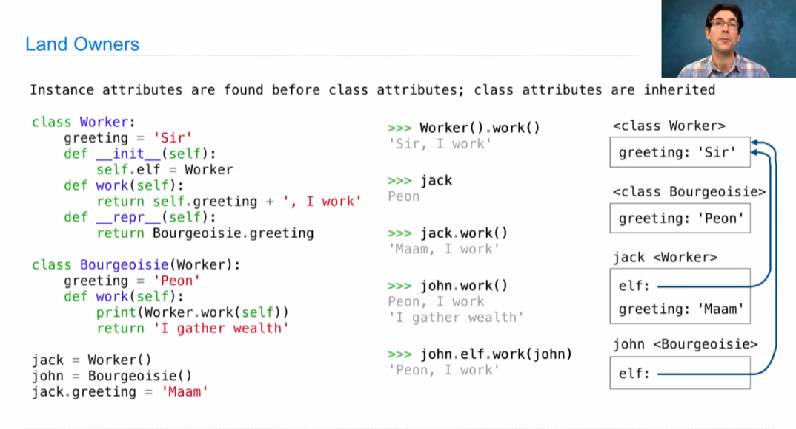

2.Iterables & Iterators

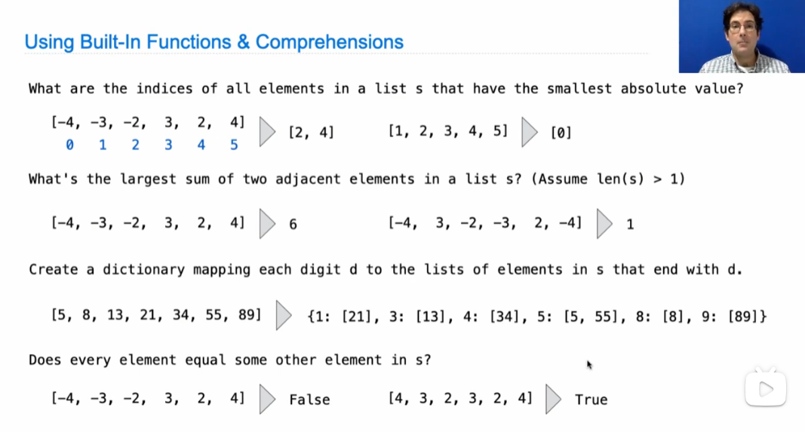

例一：

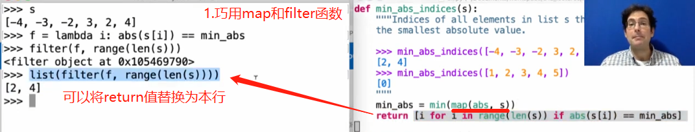

例二：

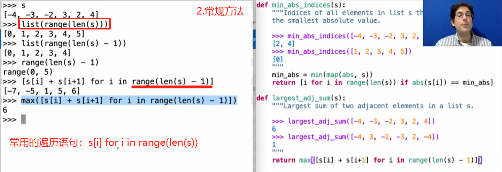

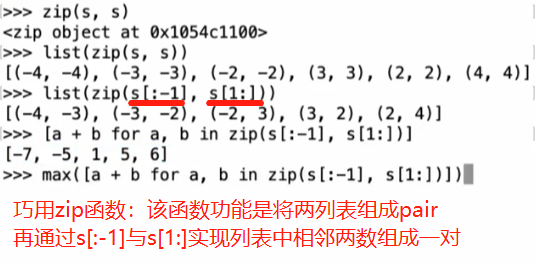

例三：

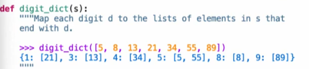

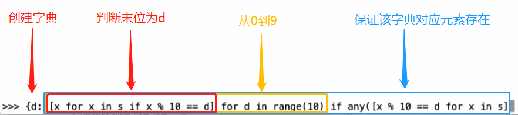

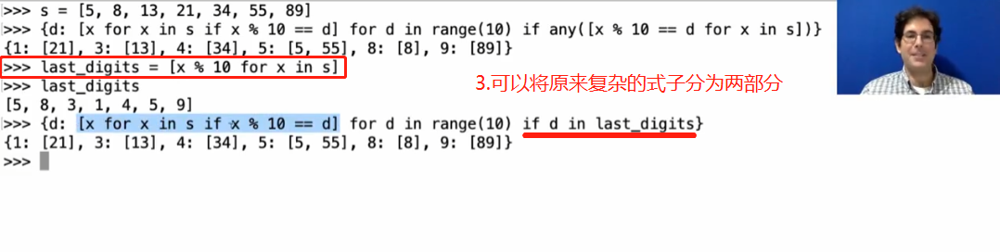

例四：

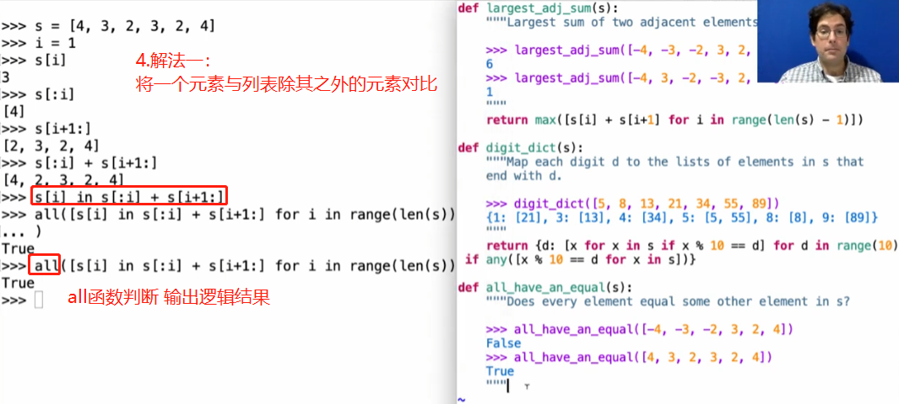

`any()`：判断一个tuple或者list是否全为空、0、False。如果列表中所有元素都为False，则返回False；否则有一个为Ture，就返回True；

`all()`：判断一个tuple或者list是否全为不为空、0、False。如果列表中所有元素都为True，则返回True；否则有一个为False，就返回False。

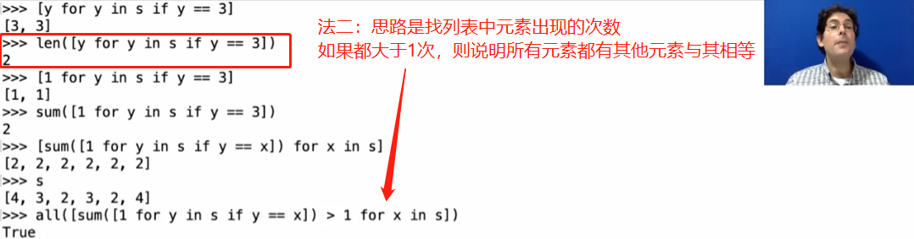

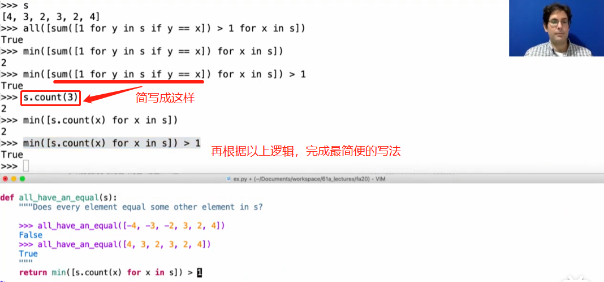

3.Linked List

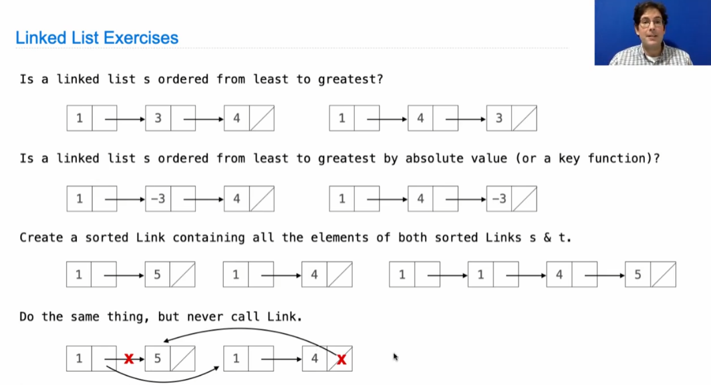

例一和二：链表排序和函数值是否按顺序排列

例三：两链表的顺序衔接，使用link函数与递归

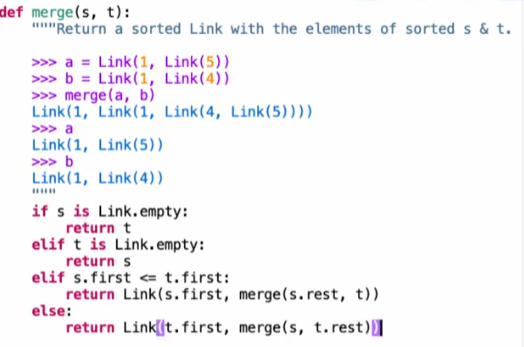

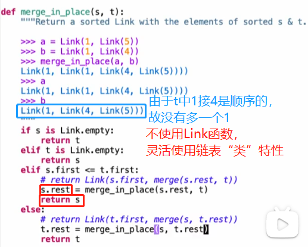
