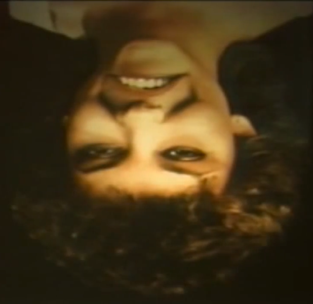

# Lecture 25. Users

一批80年代的资料影片，其中引用了不少60年代内容，深刻讲解了关于用户界面与人机互动的内容。主讲人Alan Kay创建了第一个面向对象编程语言small talk，他与他在apple的团队创建了许多现代计算机操作系统的特征，他引用的其他人也创造了许多优秀的东西如“窗口”、“鼠标”。

Graphical Input Language

computer literacy使用电脑的能力

1.access part; 2.creative literacy; 3.genre literacy

教老妇人学网球的例子

1.Learning happens when attention is focused;

2.In general for learning most things, it is good to find a way of short circuiting that mentality we think of is the eye that always tries to take over;

3.The problem with being a beginner is that you get a lot of practive in staying a beginner.

&#x20;alan从这个实验中受到启发，觉得应该开发出能使初学者一坐下边考研使用并获取成果的交互界面。

五岁、十岁、十五岁对圆的印象

