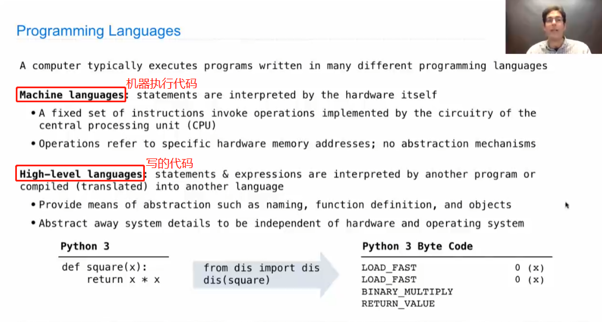
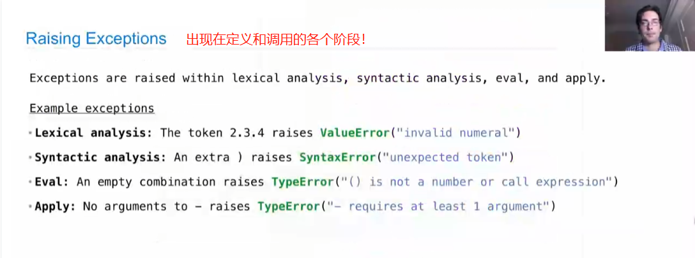

# Lecture 29. Calculater

非常值得参考的一篇知乎：[漫谈计算机语言](https://zhuanlan.zhihu.com/p/35293341 "漫谈计算机语言")

1.Programming Languages

2.Parsing

It's the process of ***taking text input*** which represents a computer program or some other formal language expressions and ***turns those into some sort of object*** that represents the expressions while validating their syntax.

3.Calculator

4.Evaluation

5.Interactive Interpreters

