# Lecture 3. Control

#### **心得：** Python中不用分号（；）作为每行结尾，但在if/while等头语句末尾会加冒号（：）

1.Print and None

注意print和python自动输出输入值的区别，如输入None无输出，而输入print(None)输出为None

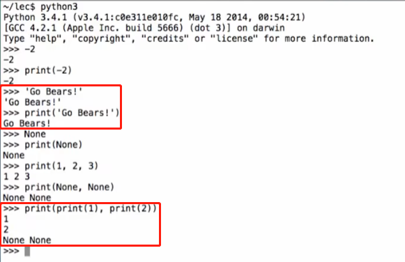

None表示没有反馈值，它在python中是单独的一种表达，不能与整型相加减。可以理解为不能将某些数加到一个没有的东西上去？

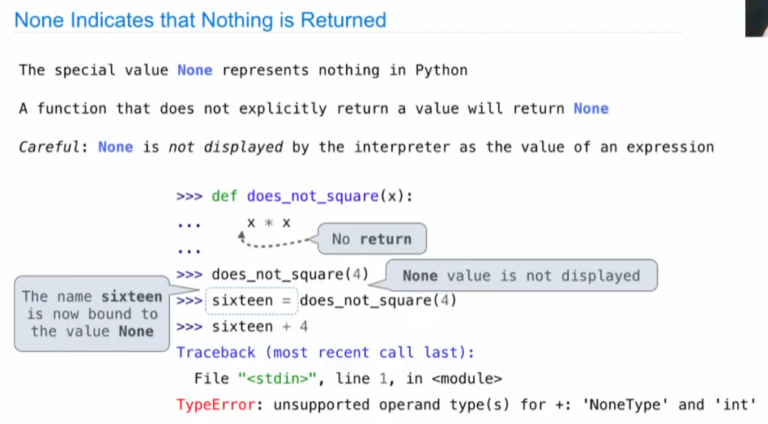

注意区分**纯函数**（输出为**值**，调用函数时会显示值，如绝对值函数abs）和**非纯函数**（输出为**none**，调用函数时不会显示none，但有别的作用，如print函数是将括号内信息展示出来）

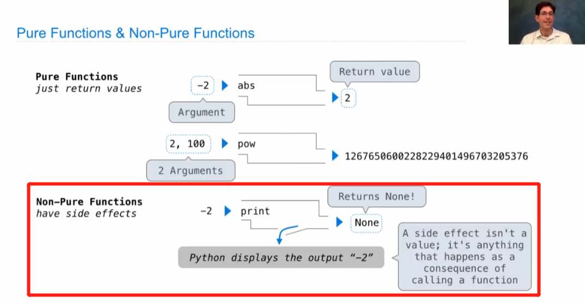

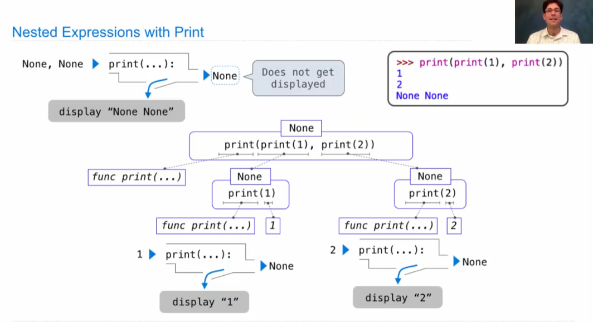

2.Multiple Environments

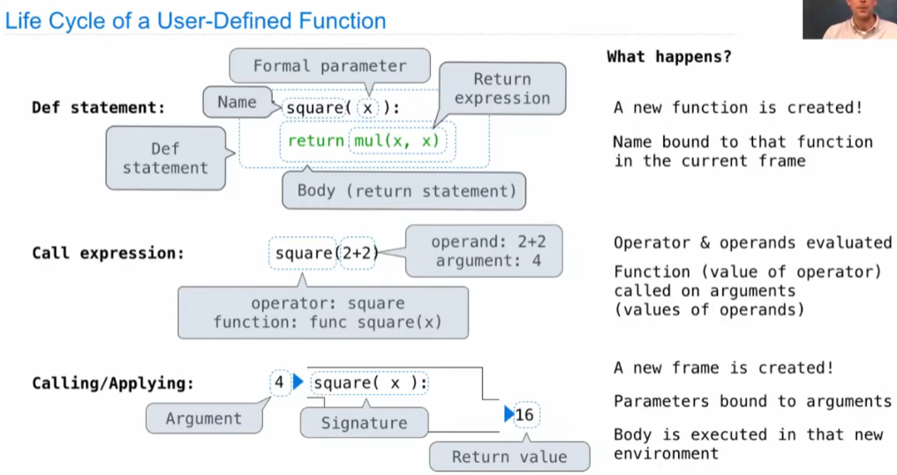

注意相同名字的变量/函数在不同环境中意义不同！虽然不影响程序运行但日常编程中为防止混淆要尽量避免。

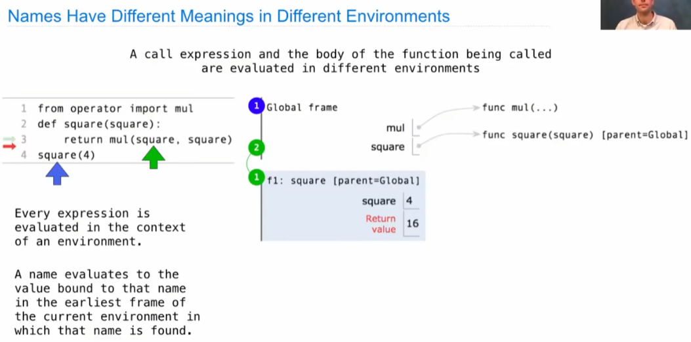

3.Python的一些特性

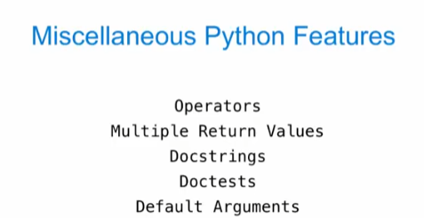

（1）运算符在Python中可以直接使用是进行了一些简化，类似于内置函数。

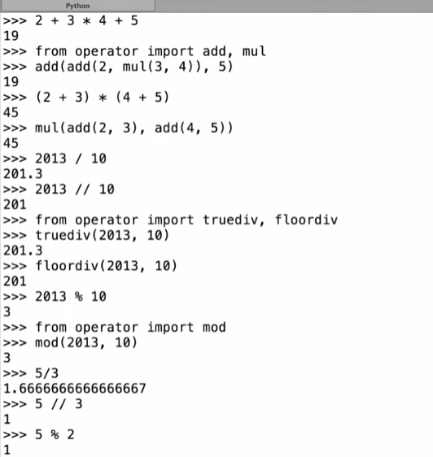

（2）多数值输入、输出

（3）docstring为函数的注释文档，在三对双引号中，通常写在函数定义的第一行

（4）可以使用>>>在注释中写示例，同时通过-m命令测试代码是否正确

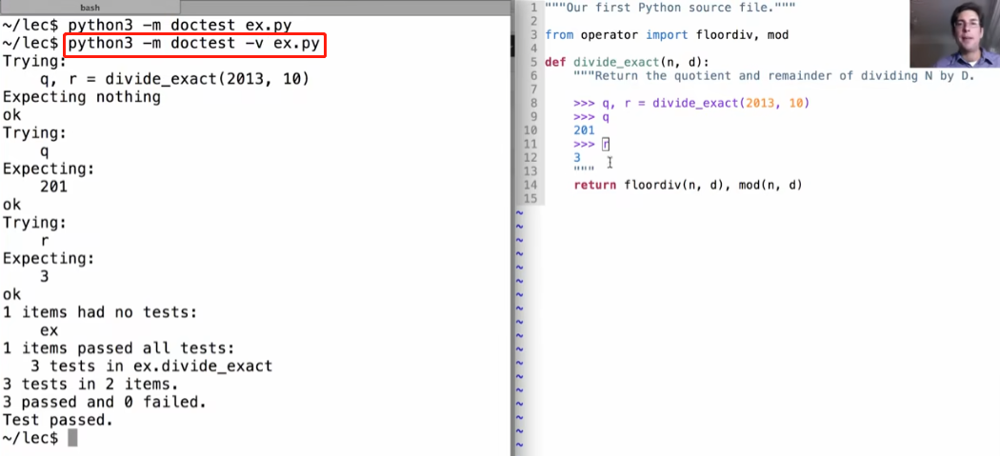

（5）在定义函数时设定默认输出值，此例中若函数第二个参数未给出则默认以10进行计算。

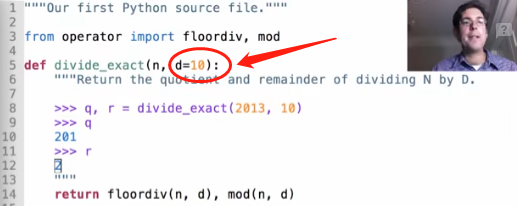

4.条件语句Conditional Statements —— if语句

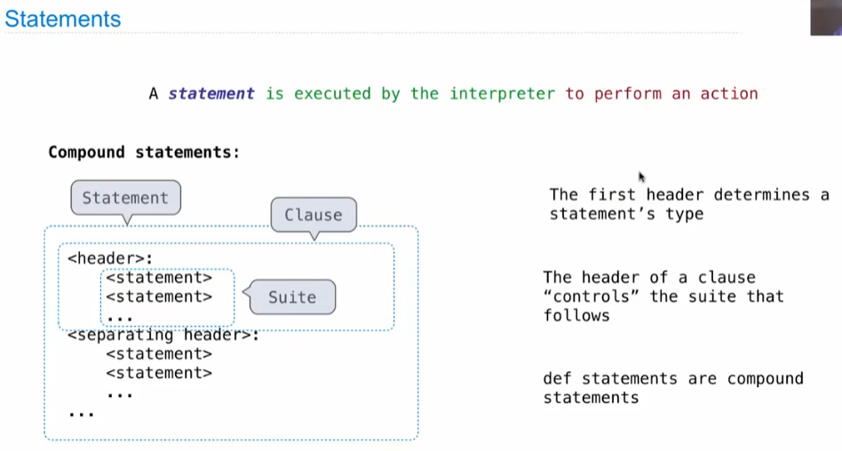

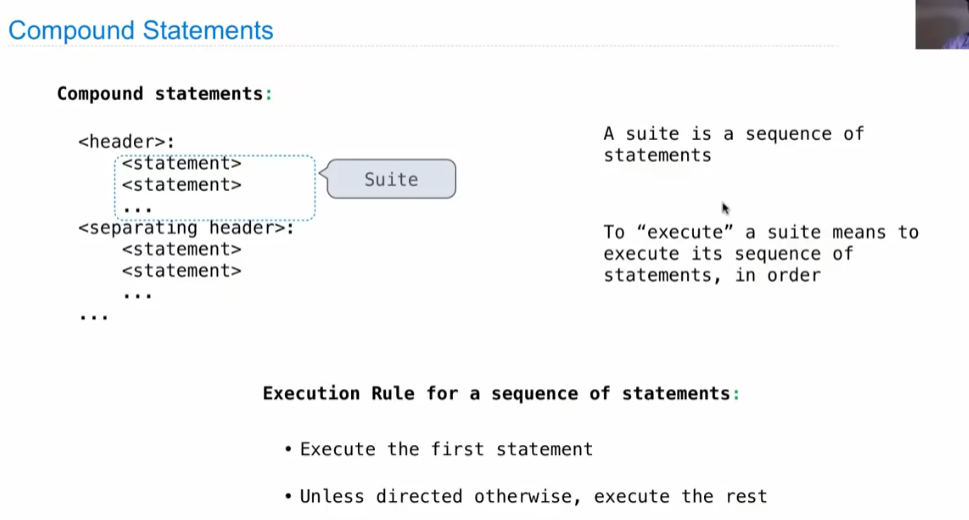

最简单的条件语句例子：绝对值函数

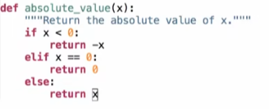

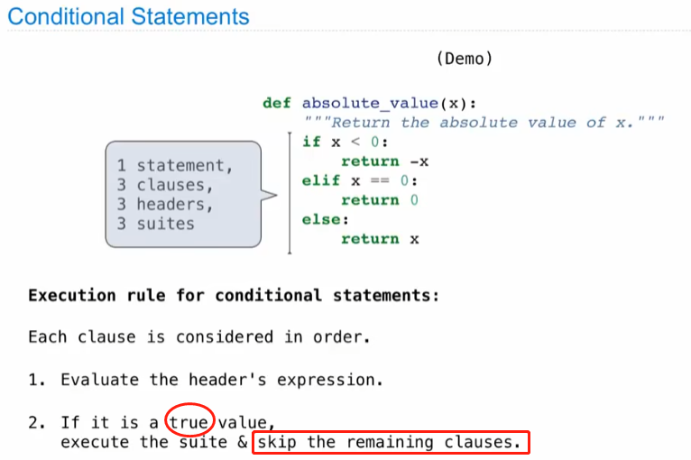

if语句语法注意事项

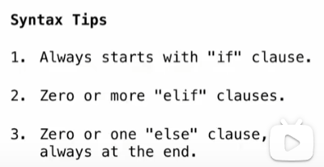

布尔数：判断逻辑“是”或“非”；在Python之中，false/0/''/None会被识别为“非”，其他会被识别为“是”，例如-12被识别为“是”，字符串'Ture'被识别为“是”。

5.循环literation —— while语句

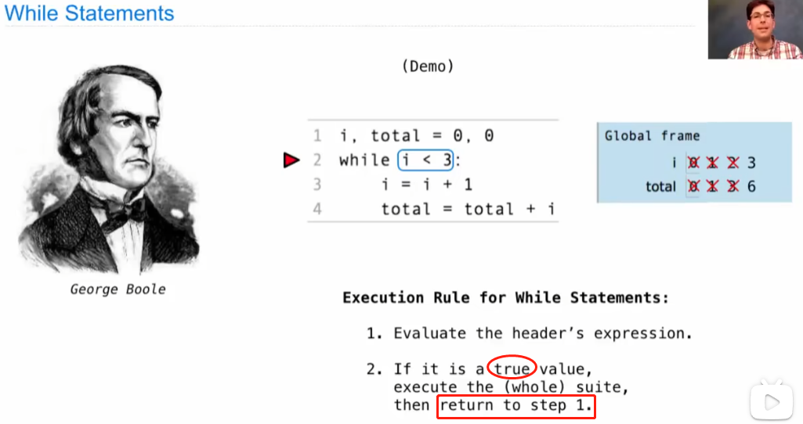

例如求某个数的因数，值得注意的是尽量不要使用循环嵌套，而是将工作分给**两个函数**：一个用于输出，一个用于处理找出最小因数！

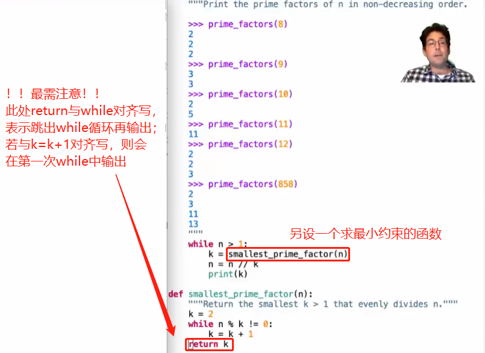
