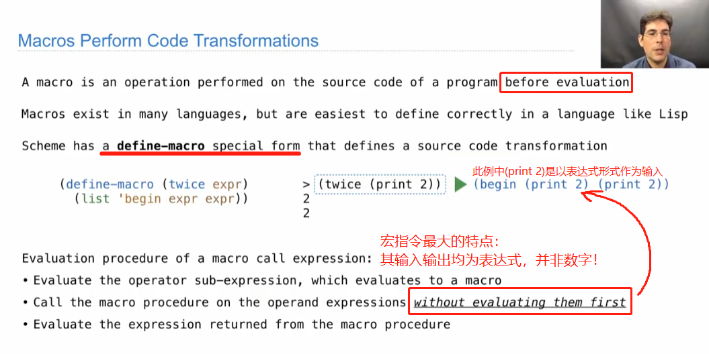
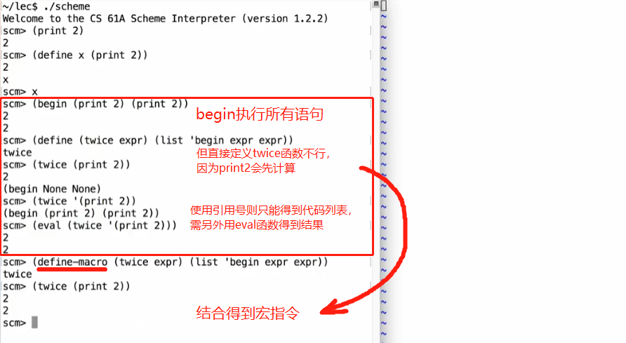
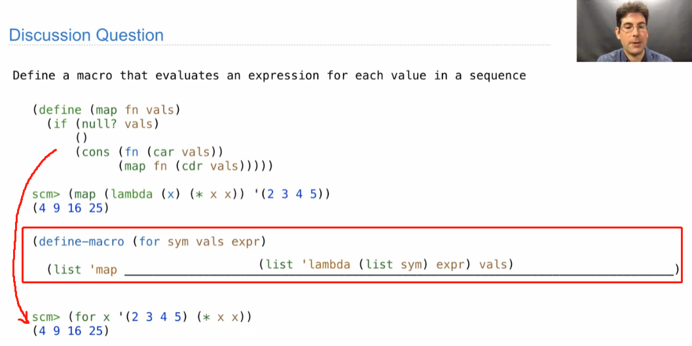

# Lecture 36. Macros

Macros(宏指令) are a feature of scheme that allow you to define a special forms in the language.

It's kind of feature that makes people fall in love with lisp programming and reason it works well in lisp languages like scheme is that \*\*\*it's easy to \*\*\****view code as data***.  Programs are just lists.&#x20;

For Macro

