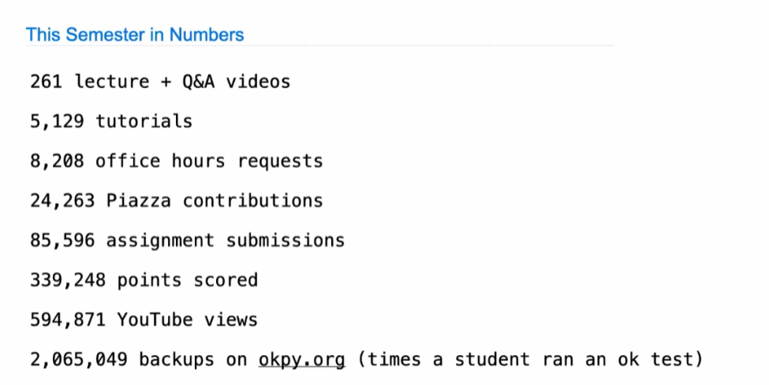
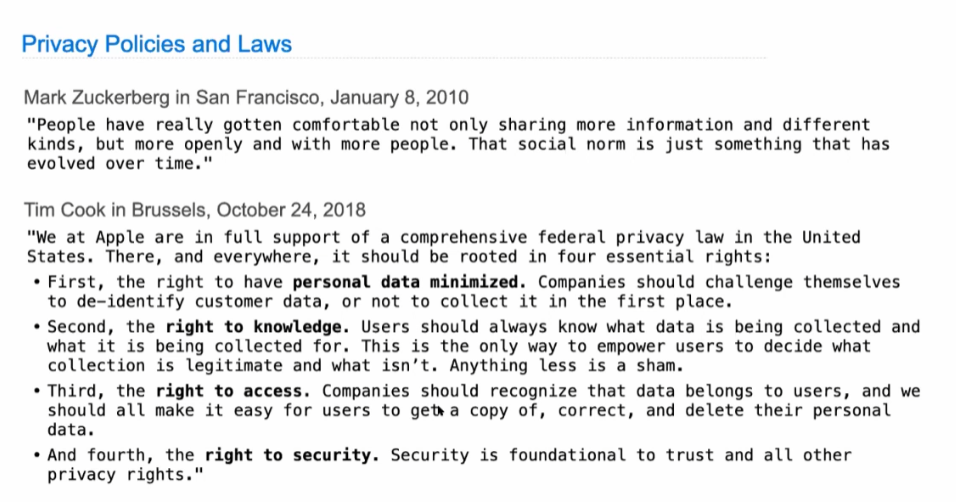
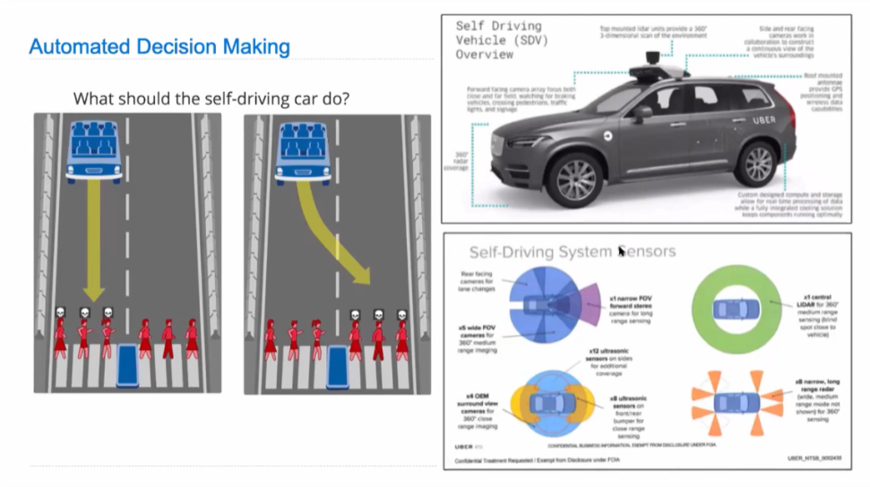
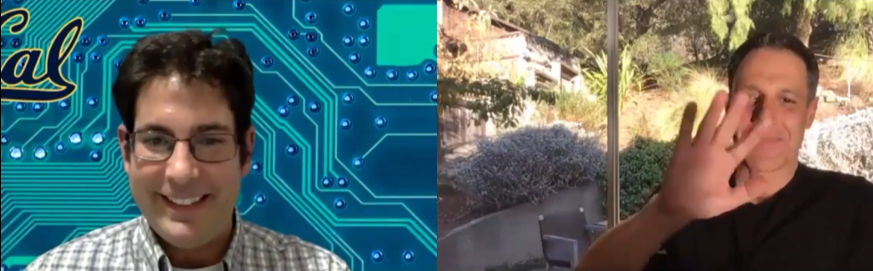

# Lecture 38. Conclusion

### ***Society***

科技管辖、如何使用科技。

The easiest thing that data-driven technology like machine learning and AI  would do was trying to ***recreate the past***!

### *Life*

John Denero:

When I was getting married, I was a PhD student at the time. My mom pulled me aside on my wedding day and said "John I want to give you some advice". I was like oh she's going to like tell me to listen to my wife or whatever. But she didn't. She said only two words that have stuck with me for a long time. She said "don't compare". That's all. And then she was like okay you can go back to do whatever you're doing. At the time this was very hard for me to process because I was in a university which is all about comparing people based on like what their exam score was. It turns out that out there in the world, there are no exams that everybody takes that are standardized anymore. All that matter is what you go and get done on your own particular path. So, comparing yourselves to other people becomes meaningless rapidly as what really matter is what you could do yourself, like what you're capable of and what you bother to do and how you choose to spend your time. It took years of this two-word phrase "don't compare" to marinate inside of me and for me to realize that my self-worth really has nothing to do with what other people can do or whether I can do it better than them or worse than them. It has everything to do with what i've done and what i'm gonna do next and how I spend my time and better myself. I should just focus on improving myself and forget about what everybody else is doing.&#x20;

Hany Faird:

It is something that took me a long time in life to understand not to compare. And there's a trap too that we do. We compare for example how big our house is to that one friend and how much money we make to another friend, and the kind of clothes we have to this friend and how smart we are to that friend. We pick and choose these things and that's first of all, even doing that individually is meaningless right? But it's also a trap and this is the problem with social media, you see these sore of curated worlds of other people and it's a trap. One of the great things of getting older is you will get there, I promise, you will realize it's a trap and comparing means absolutely nothing. It really is a very internal thing of what are you doing, who do you want to be, how do you want to go through this world, how do you want to treat other people. At the end of the day, that, and almost nothing else, is going to matter. And you got to just trust that it's going to be there.&#x20;
