# Lecture 4. Higher-Order Functions

1.Iteration Example 迭代示例

设计循环时最重要的是思考什么信息是**需要一直记录**以完成迭代的

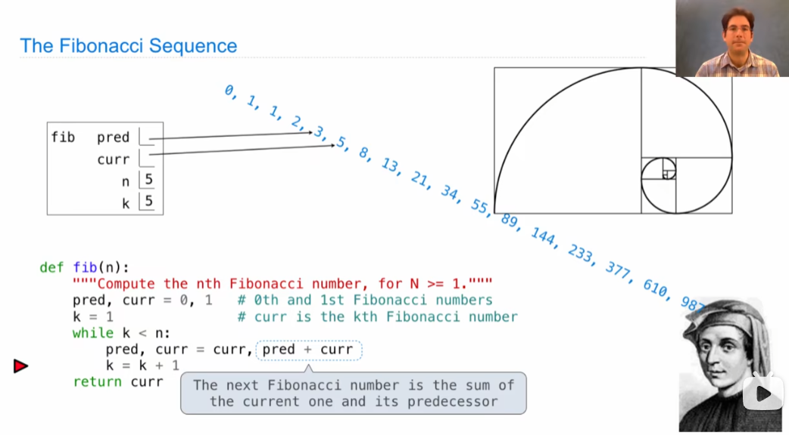

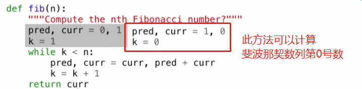

2.Designing Functions 设计函数

——知道函数的定义域和值域，函数的作用是创造两者之间的关系

对设计函数的建议

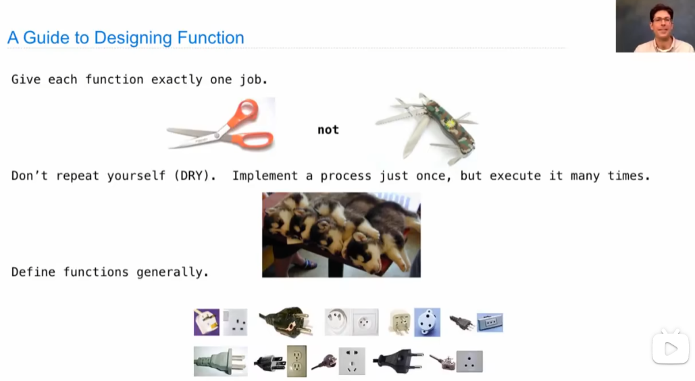

3.Higher-Order Functions

（1）通过参数概括

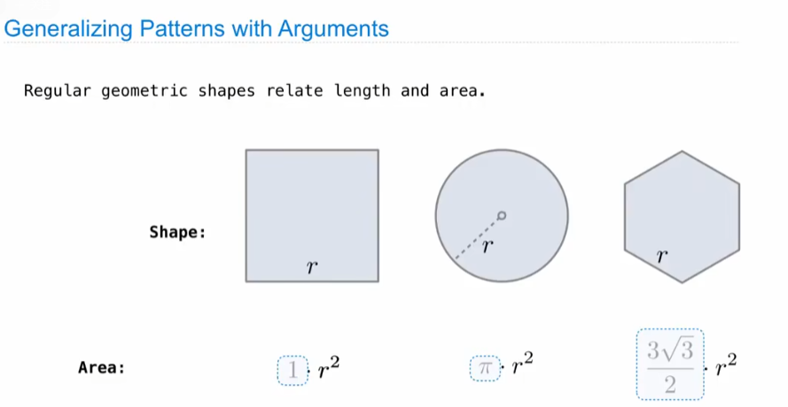

提取统一求解的内容，化繁为简并不重复代码工作！

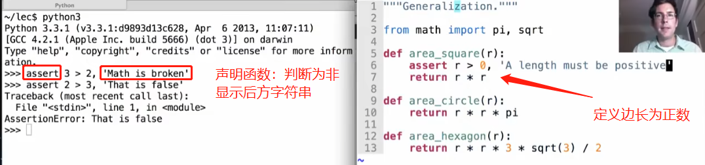

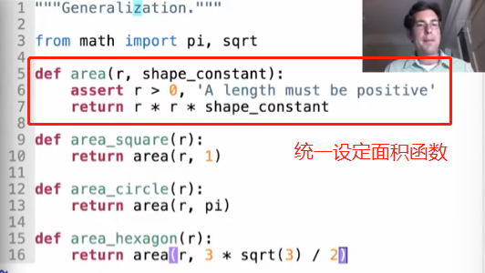

（2）通过计算过程归纳

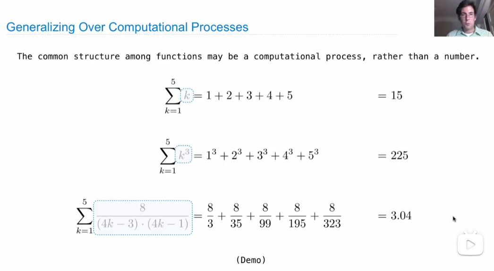

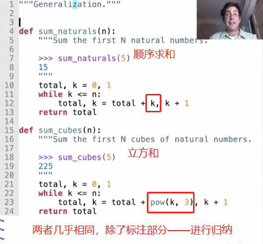

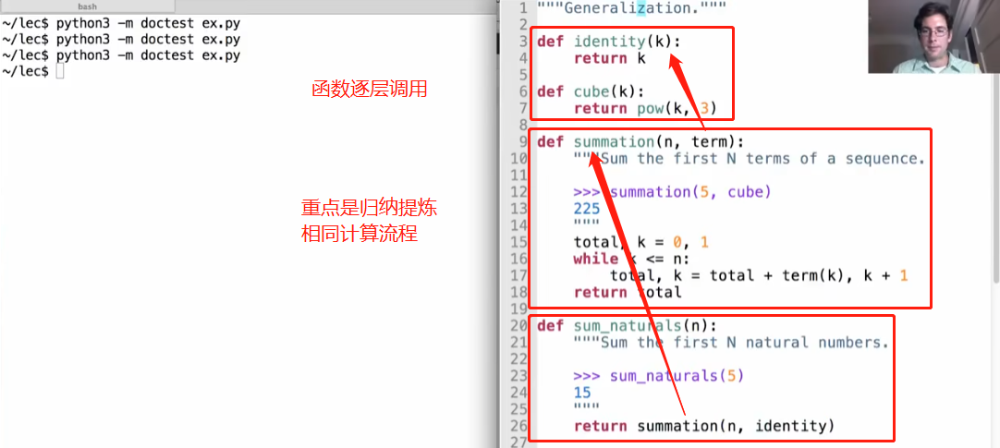

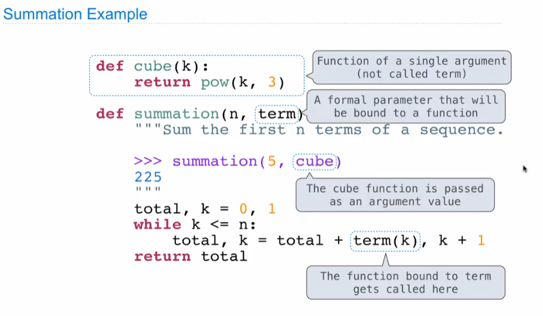

(3)Functions as Return Values

一类输出为函数的特殊函数，即内部再定义新的函数

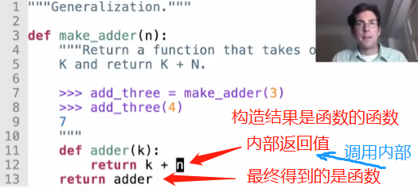

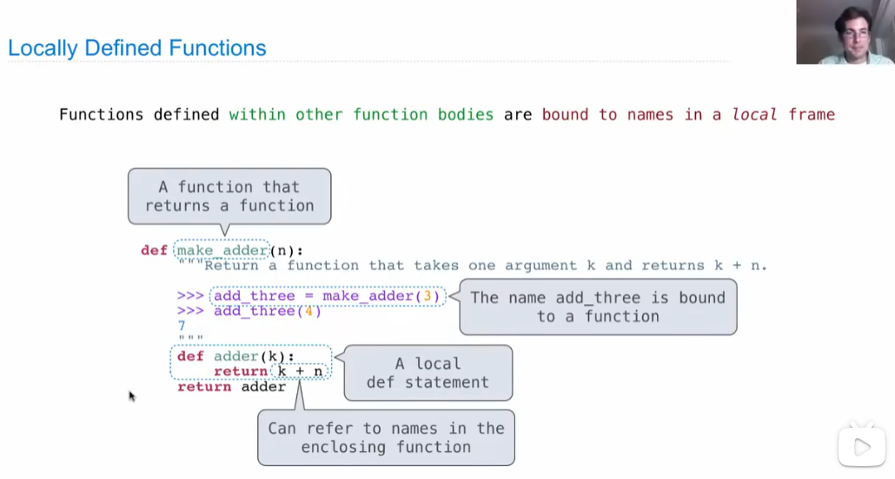

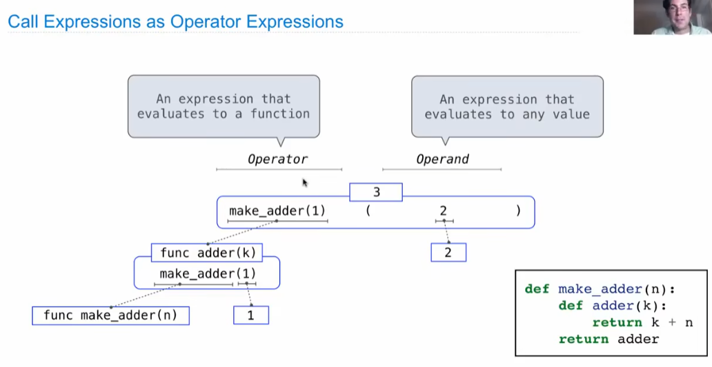

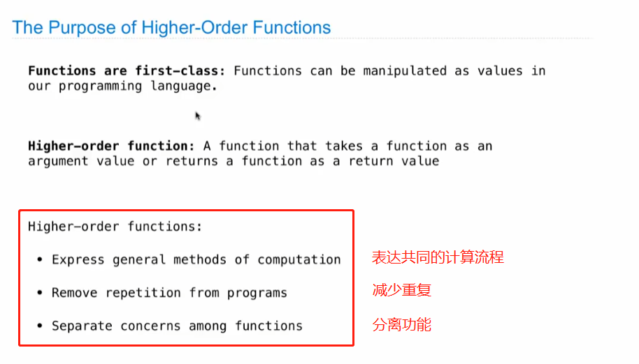

4.Lambda Expressions

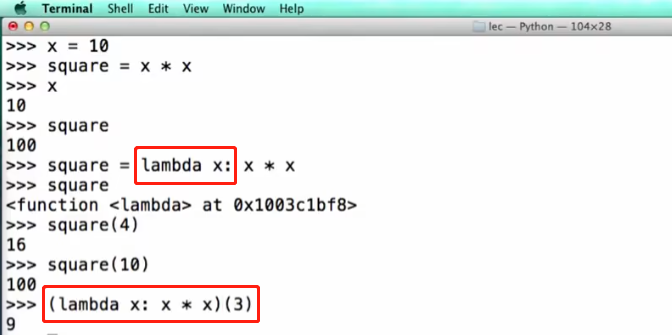

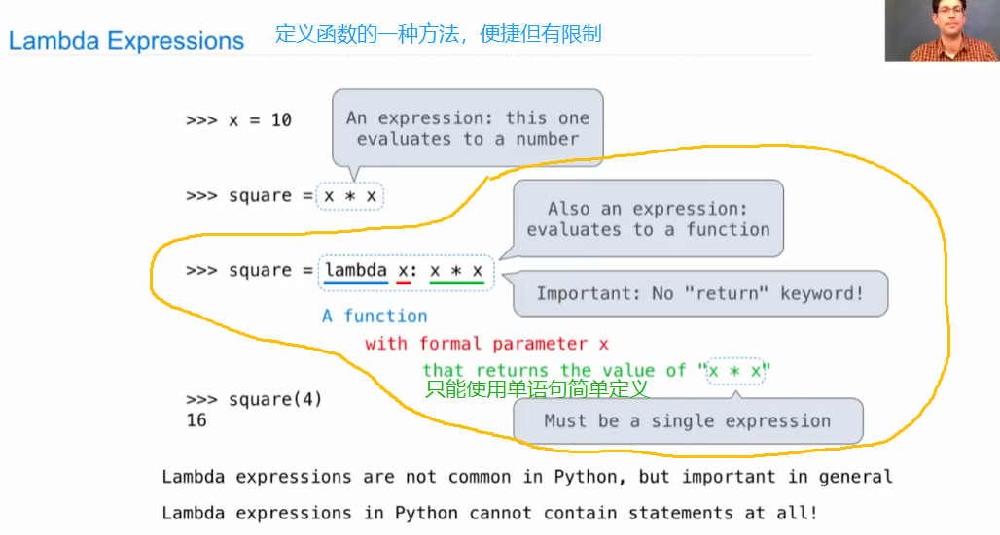

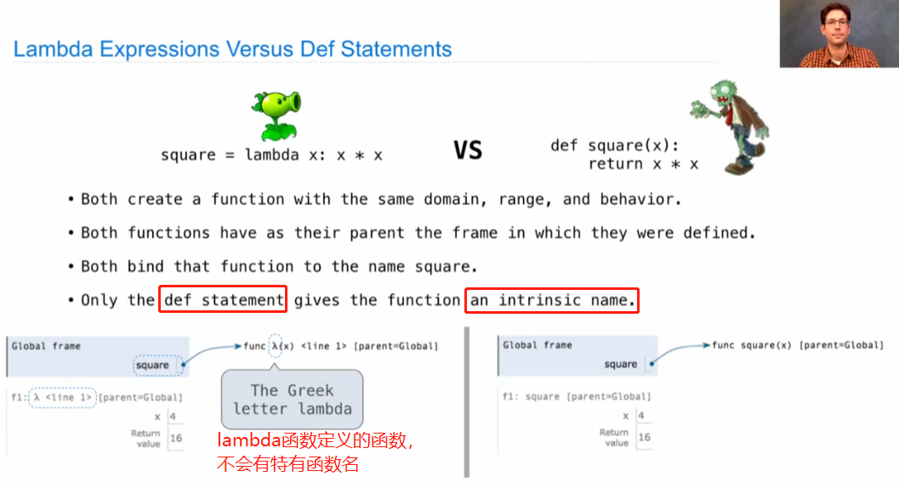

λ函数直接写其计算表达式，不能出现while、return等语句。由于其没有定义函数名的特殊性，它无法单独成行，往往需要搭配函数定义“f=lambda x:……”或函数调用“f(lambda x:……)”使用。

总结而言，λ函数的定义能使代码更加简洁，但同时也使代码更难理解。通常在**函数的输入也为函数时**，若作为输入函数是较为简单的计算，会使用λ函数来定义。

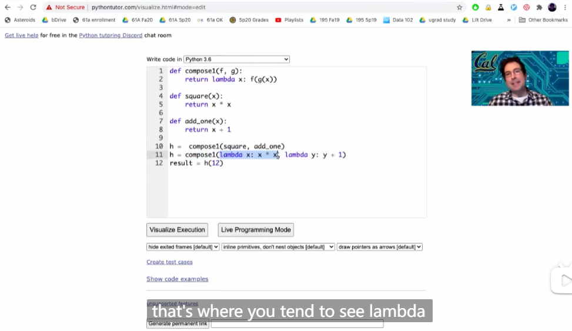

5.Return

Return代表着函数调用的结束，并决定着调用表达的输出值。

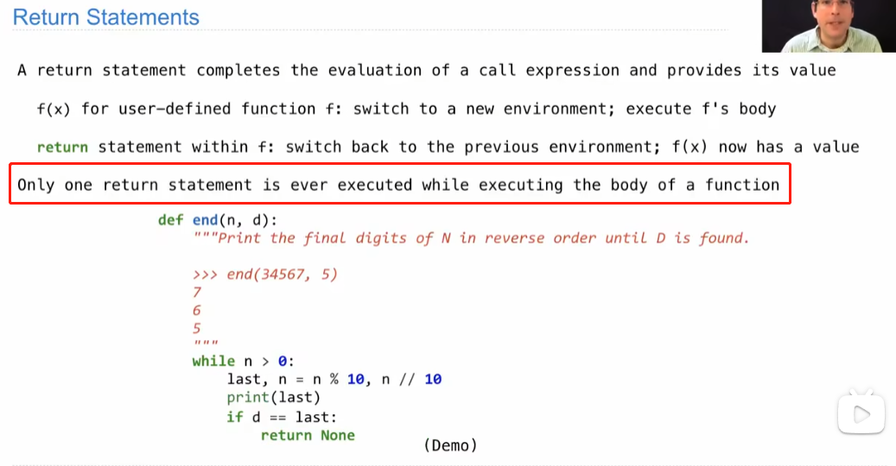

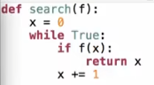

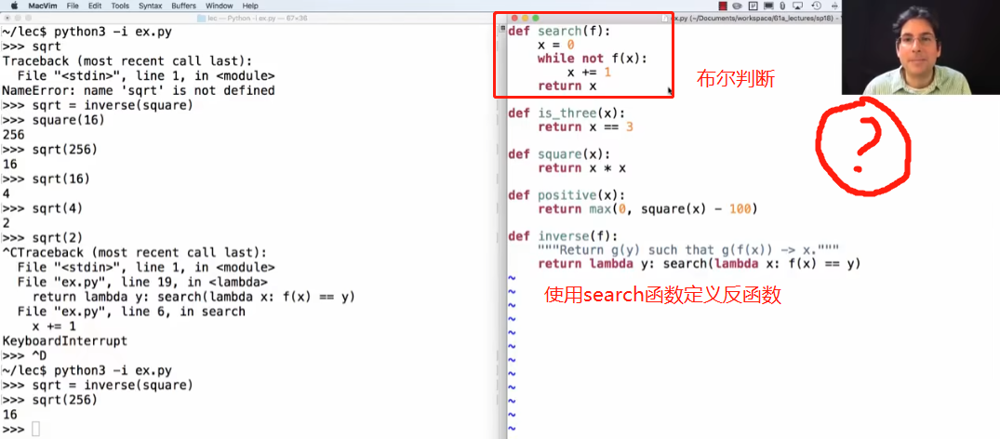

6.Control

控制语句的重要性，理解为它用于**选择执行**！

区别于调用函数时所有语句都要先执行得出相应值（这是由Python对于调用语句用法规定造成的，属于语法）。

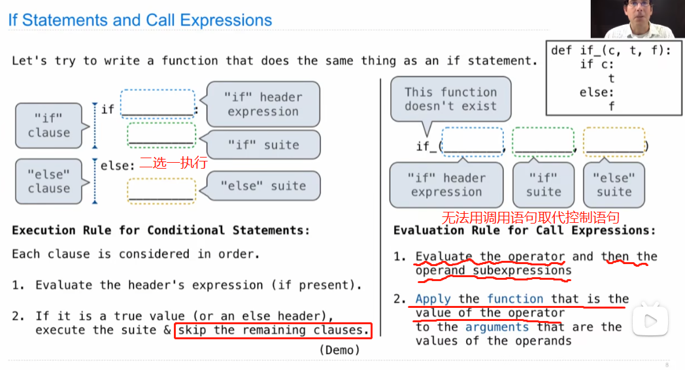

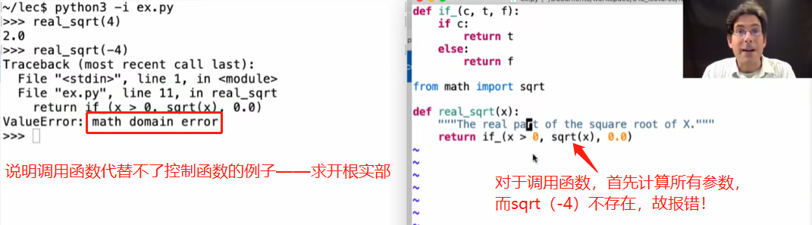

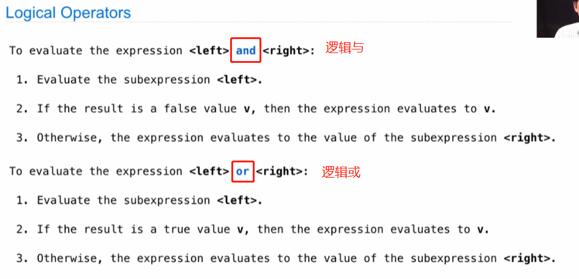

例子：

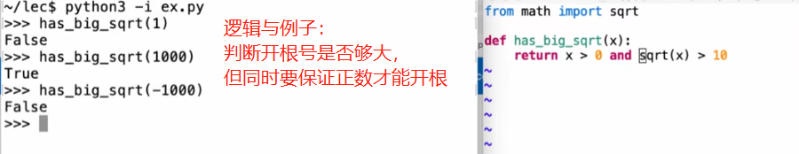

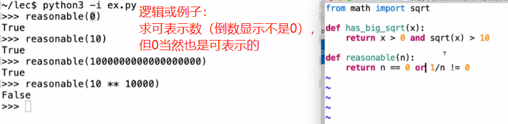

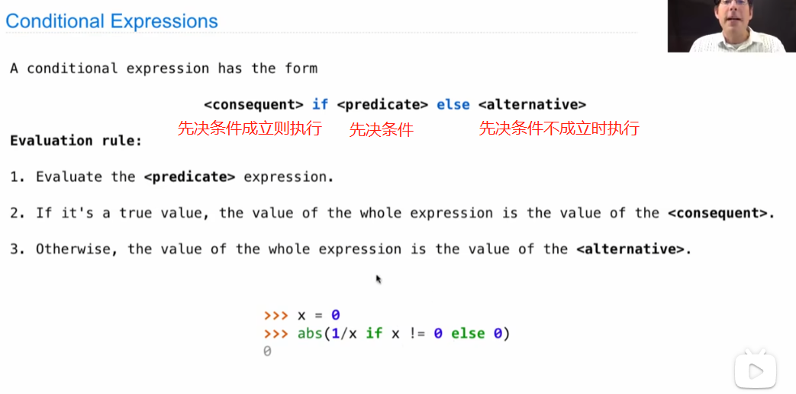
