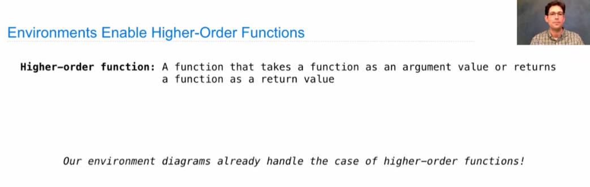
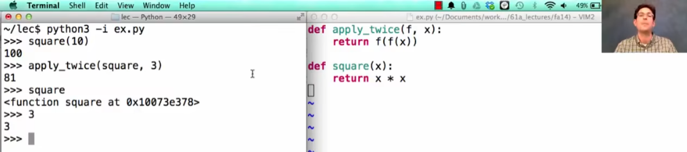
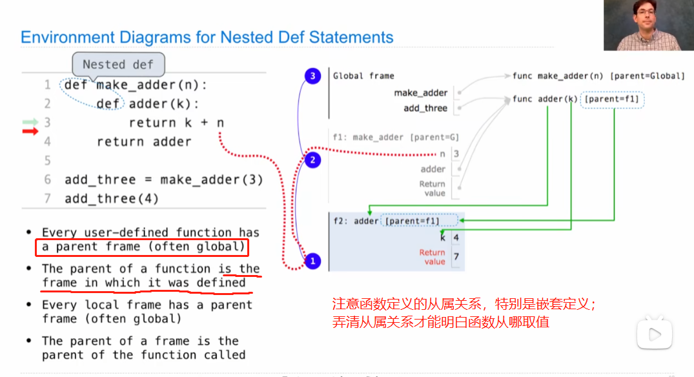
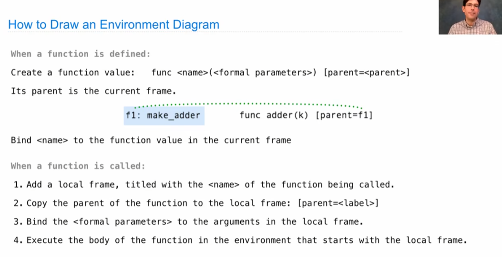
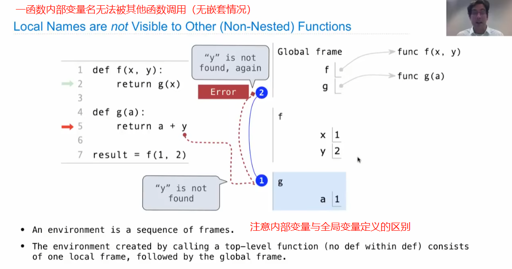
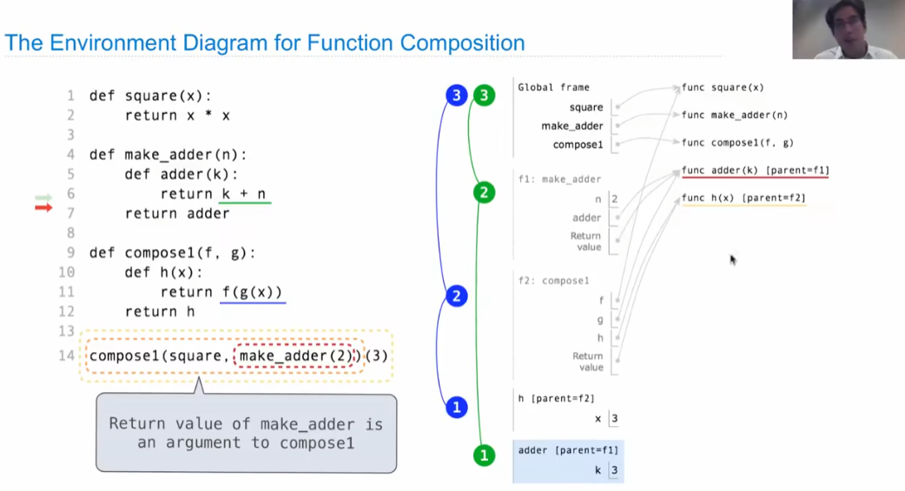
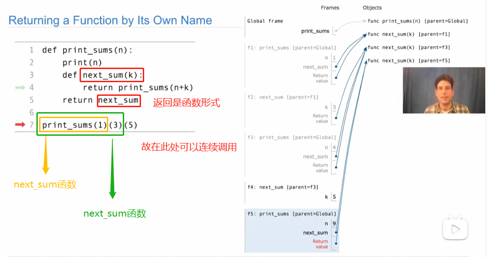
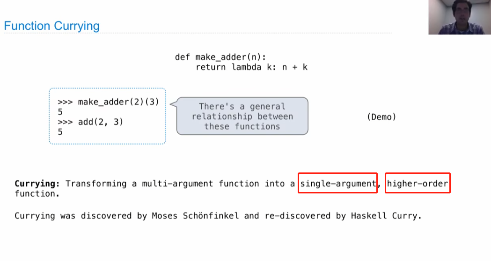

# Lecture 5. Environments

1.Environments for Higher-Order Functions

高阶函数：将函数作为输入参数或输出的函数

2.Environments for Nested Definitions（嵌套定义）

3.Local Names

4.Function Composition 复合函数

5.Self-Reference

6.Currying

百度百科：在计算机科学中，柯里化（Currying）是把接受多个参数的函数变换成接受一个单一参数(最初函数的第一个参数)的函数，并且返回接受余下的参数且返回结果的新函数的技术。

通常使用情景如下：当在使用他人编写的多参函数时，其中有些函数是一直保持不变的，这时可以通过柯里化简化函数，将不变的参数内嵌在新函数中，使每次调用函数使少调用那些不变的参数。

