# Lecture 9. Tree Recursion

1.Order of Recursive Calls 递归函数调用的顺序

“瀑布函数”，函数调用只有在其值得出后，才会运行进行之后的代码

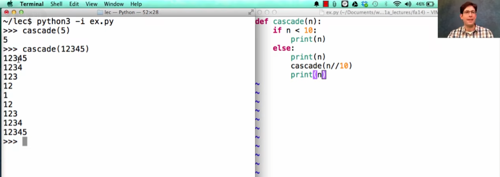

有一些“嵌套”的感觉

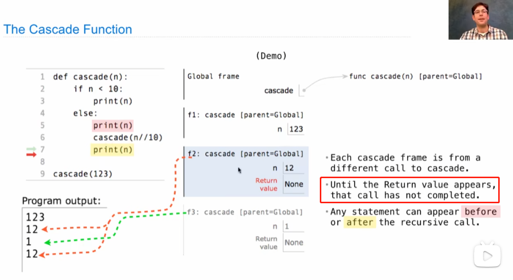

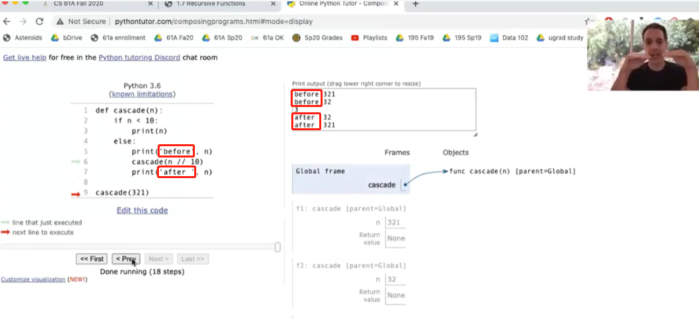

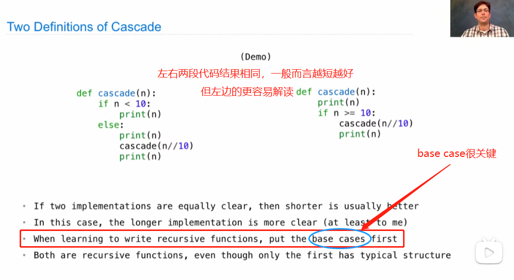

例：反瀑布函数

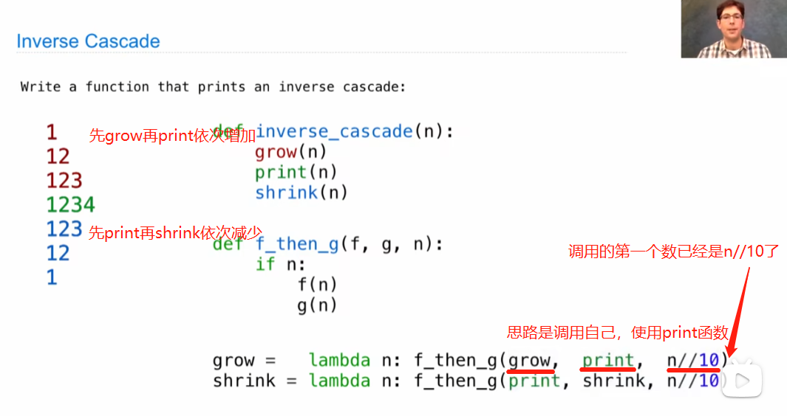

2.Tree Recursion 一个函数进行不止一个递归调用

最典型的示例：斐波那契数列fib(n)=fib(**n-1**)+fib(**n-2**)

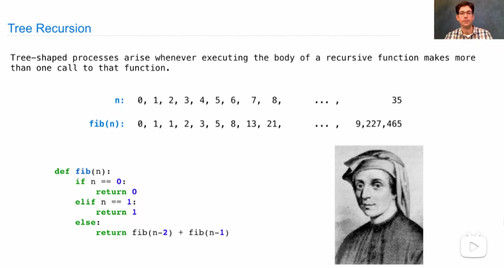

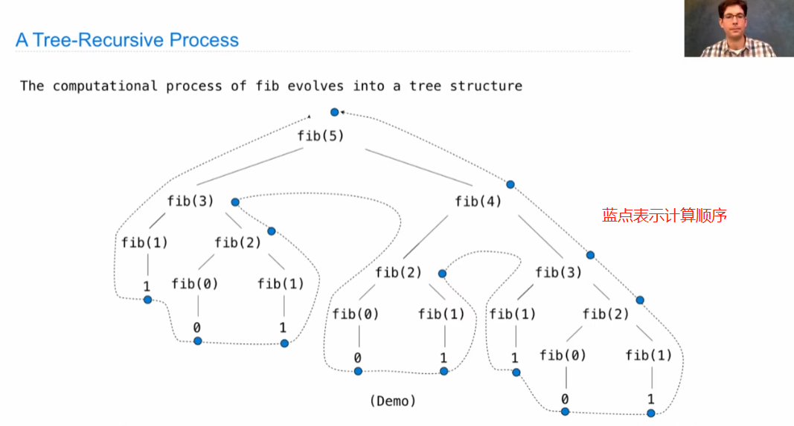

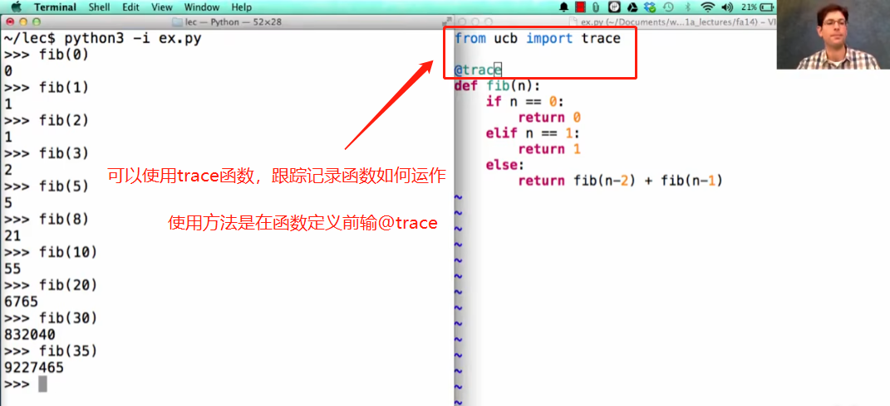

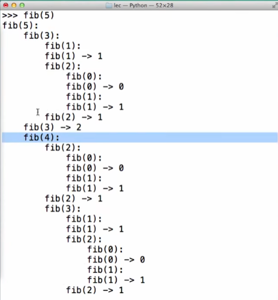

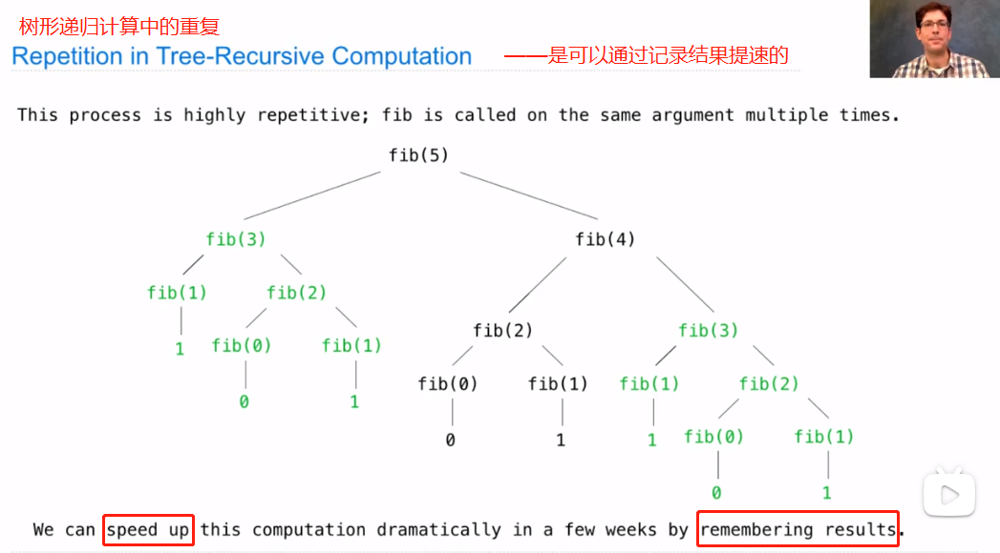

3.Tower of *Hanoi*与递归函数——只需要完成最底下那层的移动+递归

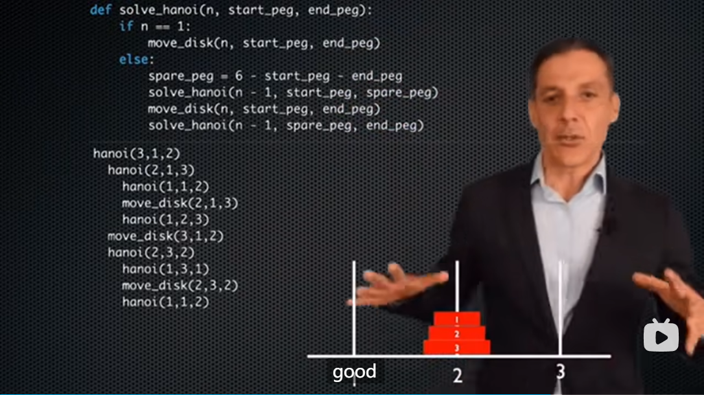

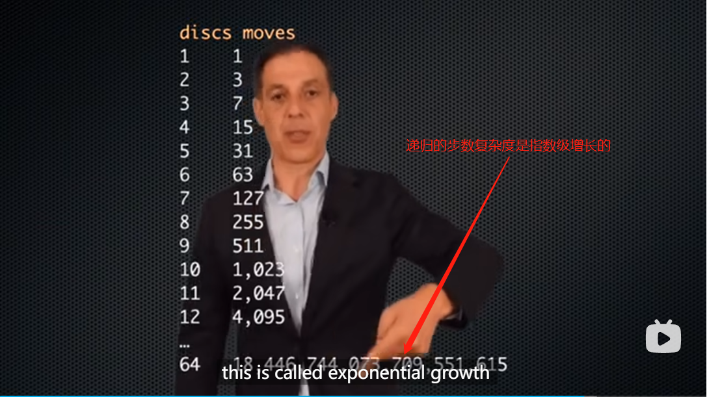

4.Example: Counting Partitions整数划分

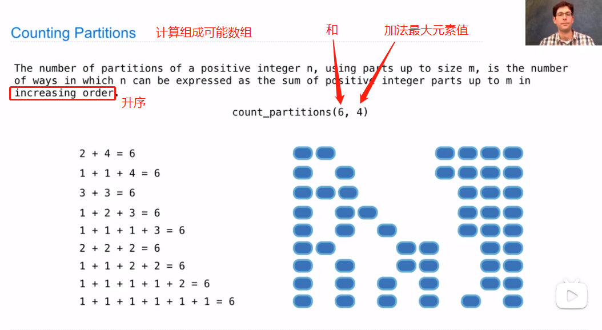

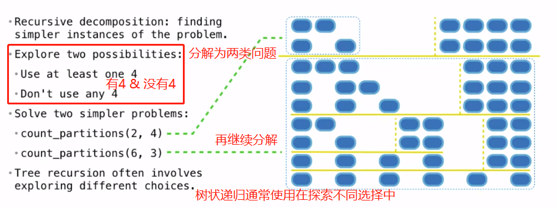

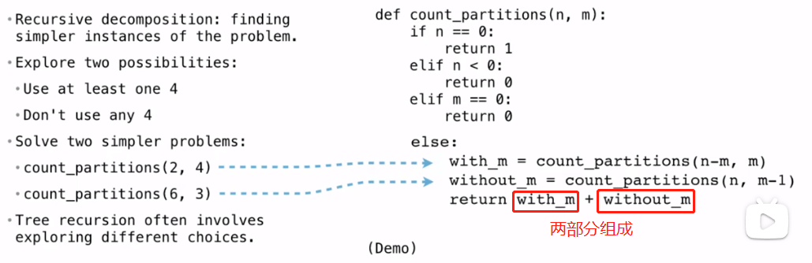
