# Lecture 21. Composition

再次讨论树形结构

1.**Linked List**：链接列表/链表

fundamental data structure and computer science

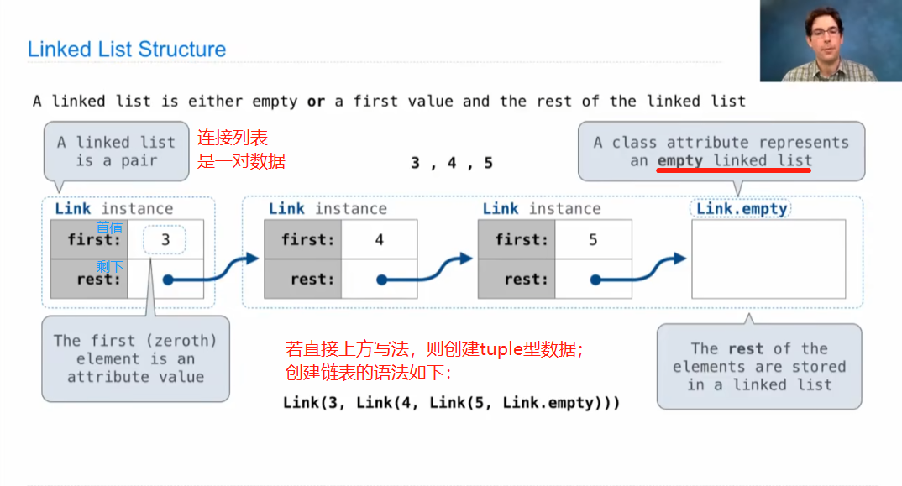

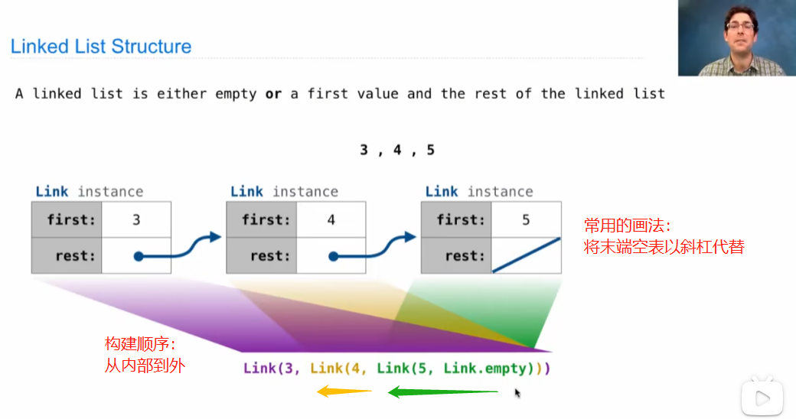

表示方法中也可也类似于画图，简写如下：

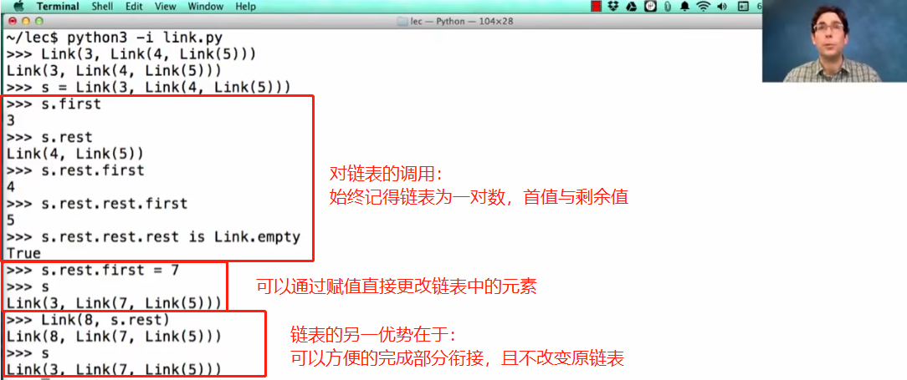

2.Linked List Processing

Recursion is very common in linked list processing when constructing a new linked list or taking an existing linked list and doing something with it.

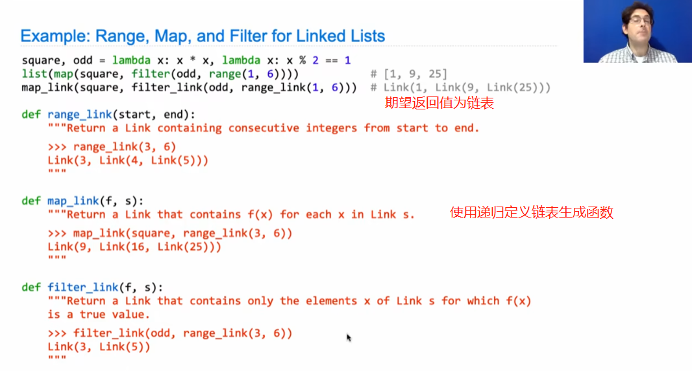

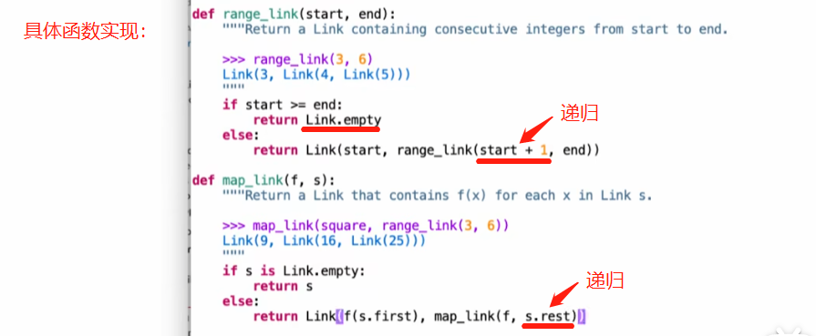

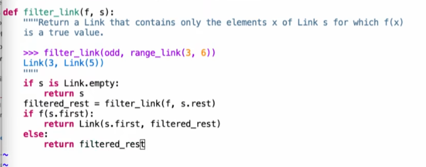

3.Linked Lists Mutation

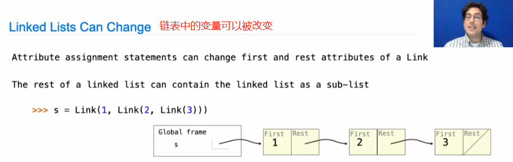

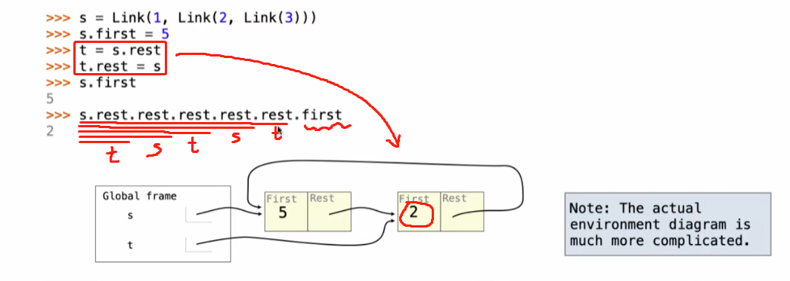

Example：

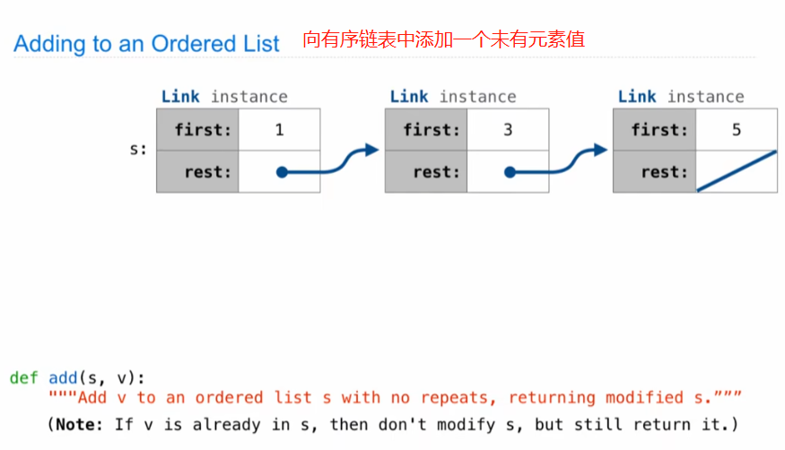

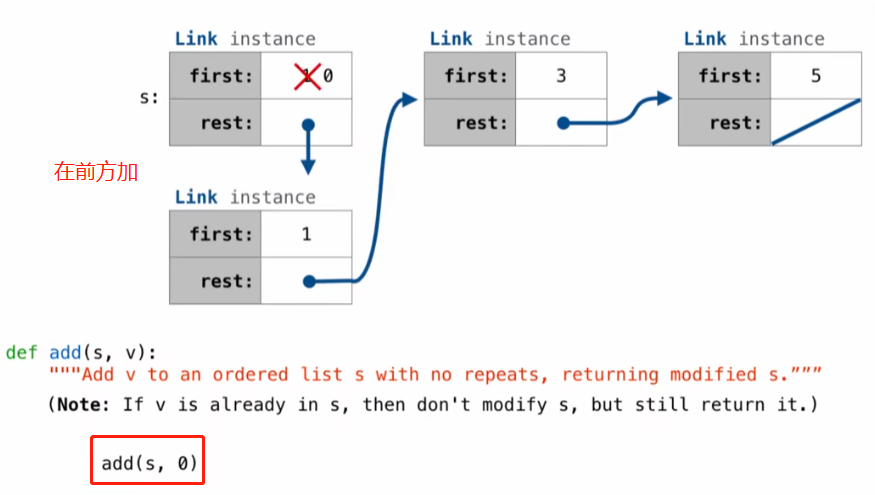

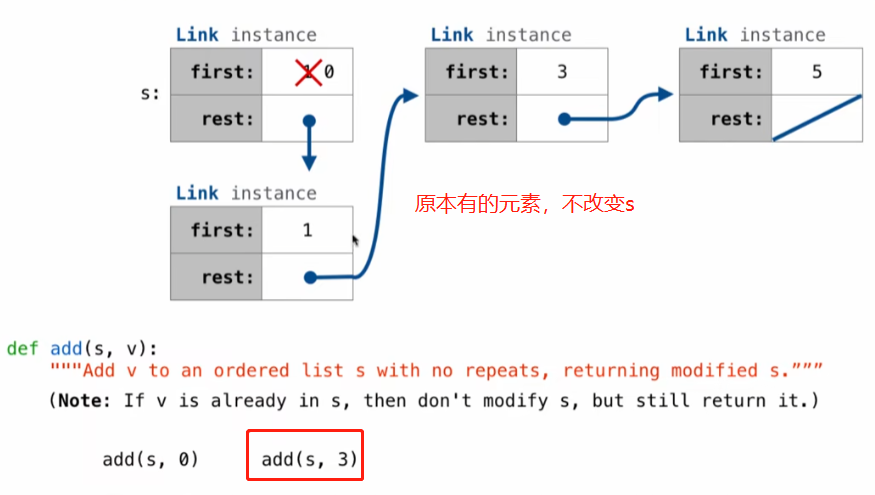

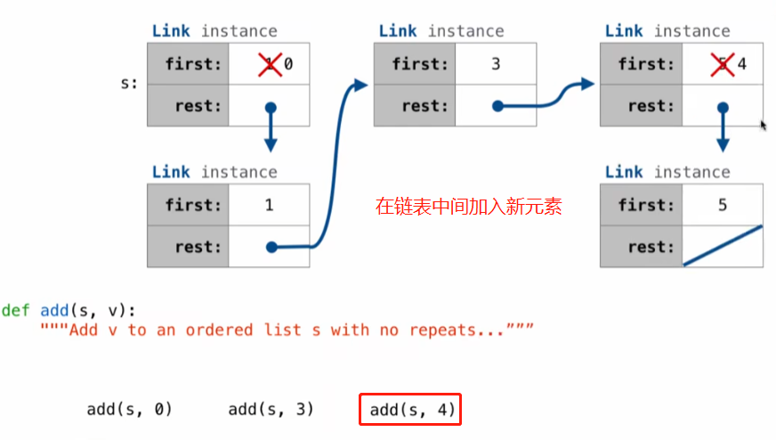

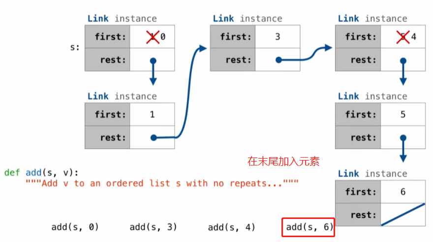

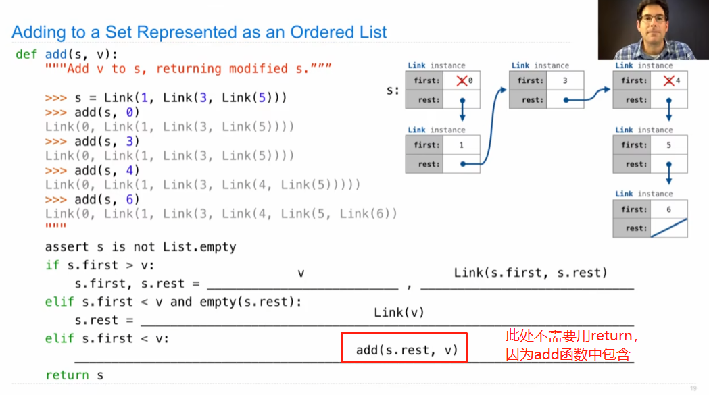

4.Tree Class

Tree is another ***recursive computational*** data structure.

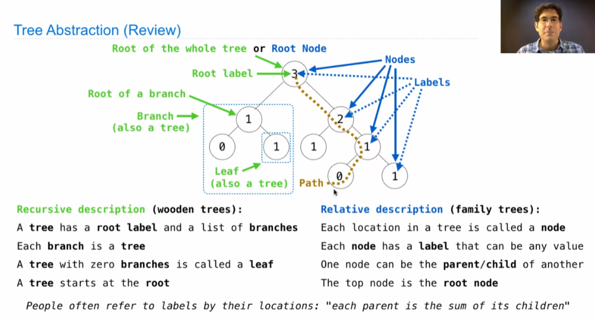

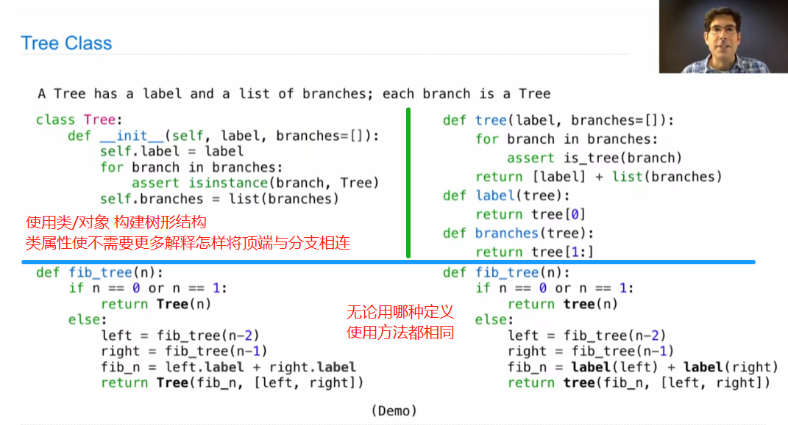

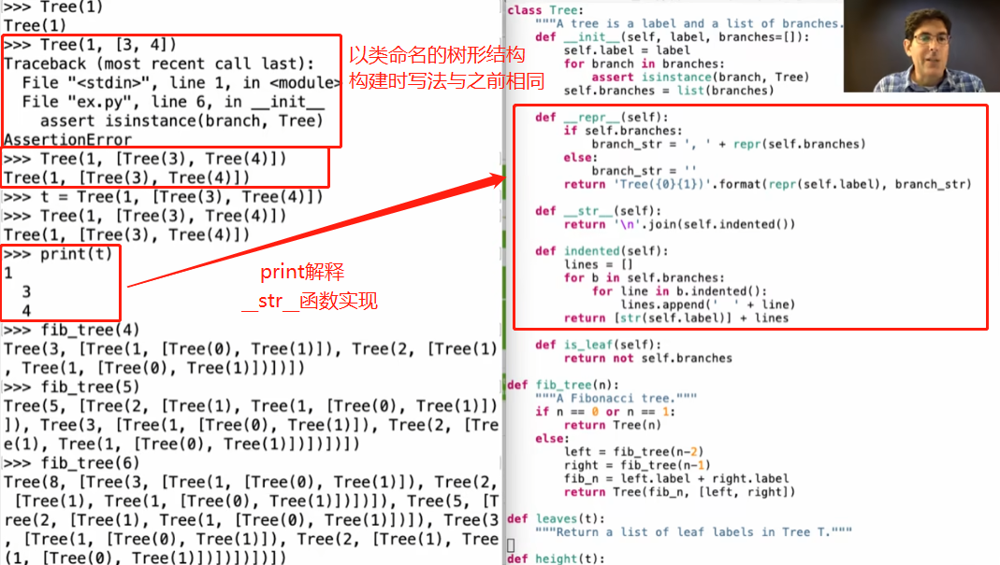

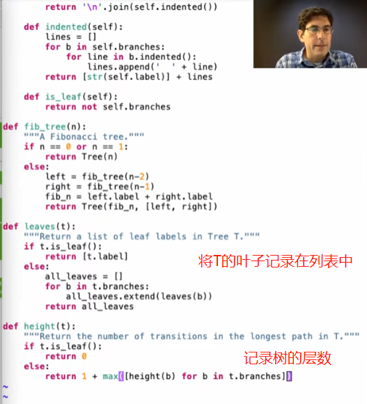

5.Tree Mutation

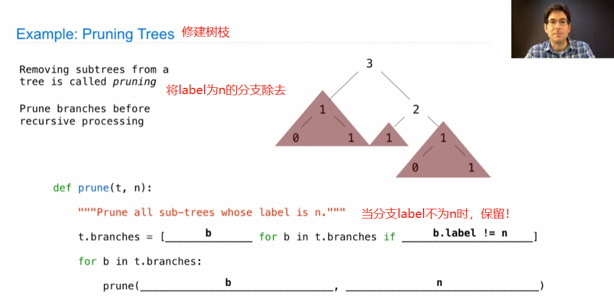
