# Lecture 30. Interpreters

Interpreting Scheme

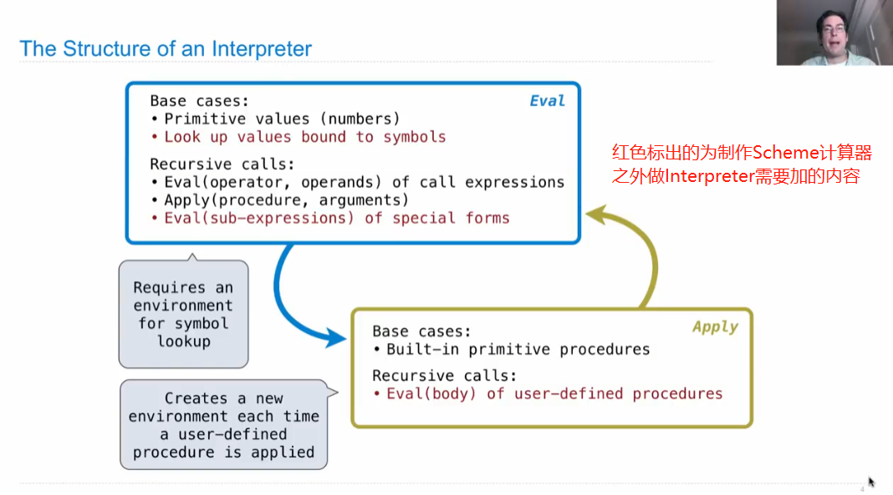

&#x20;

1.Special Forms

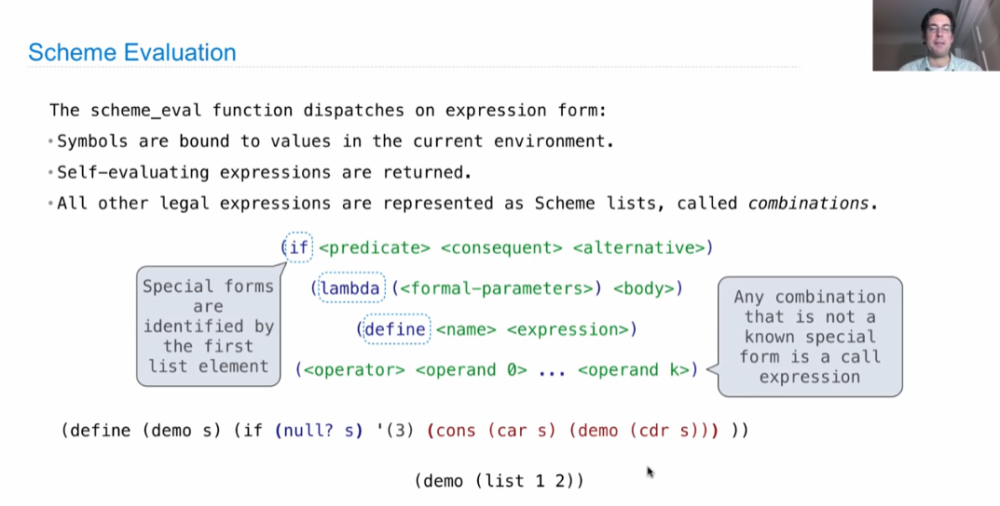

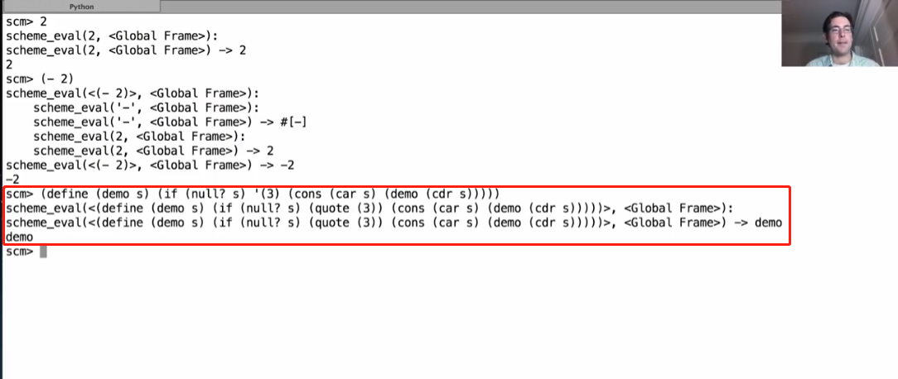

在eval函数前添加@trace查看 (demo (list 1 2)) 过程

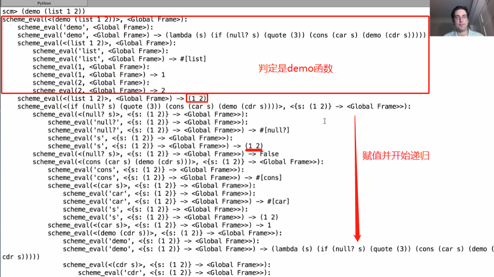

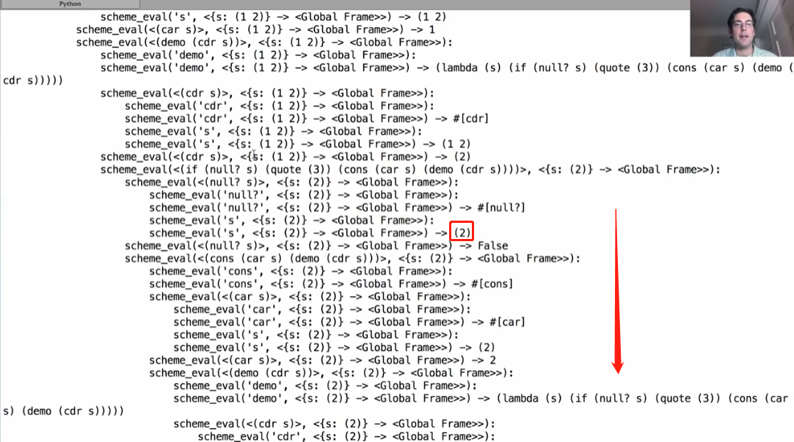

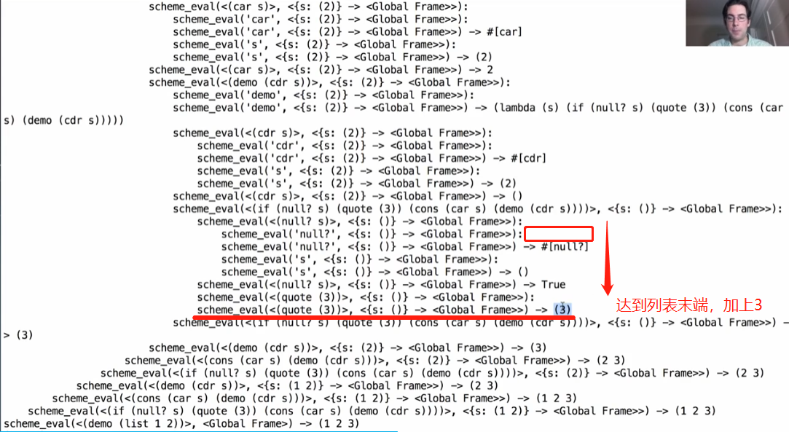

2.Logical Forms

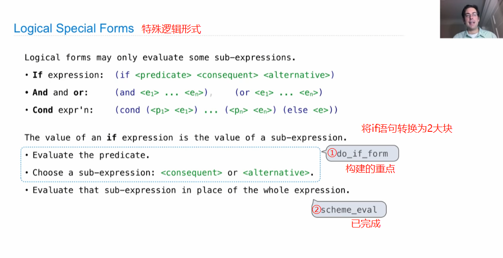

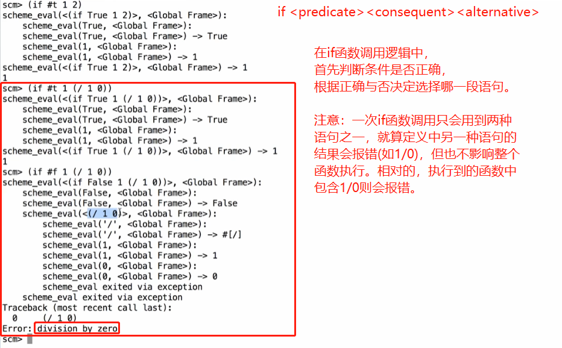

3.Quotation

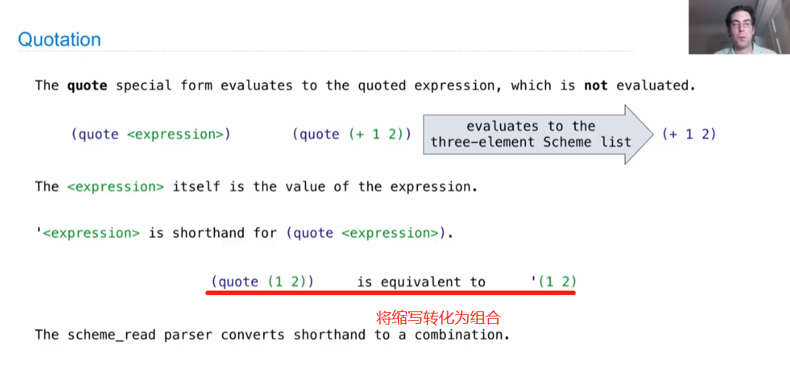

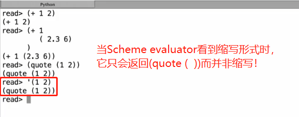

4.Lambda Expressions

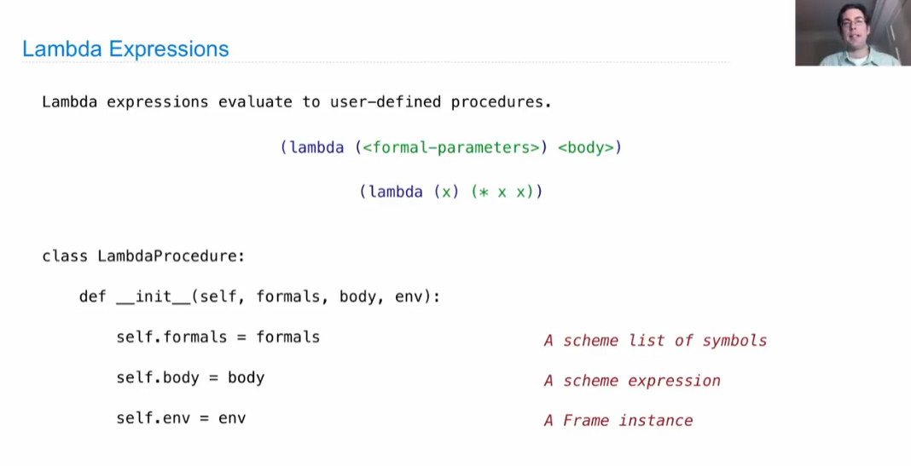

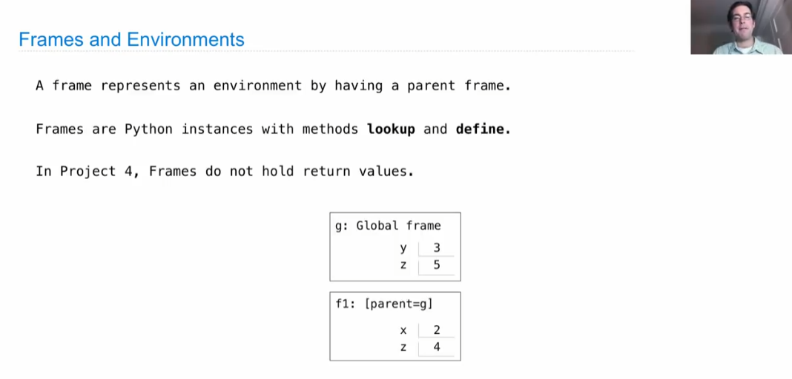

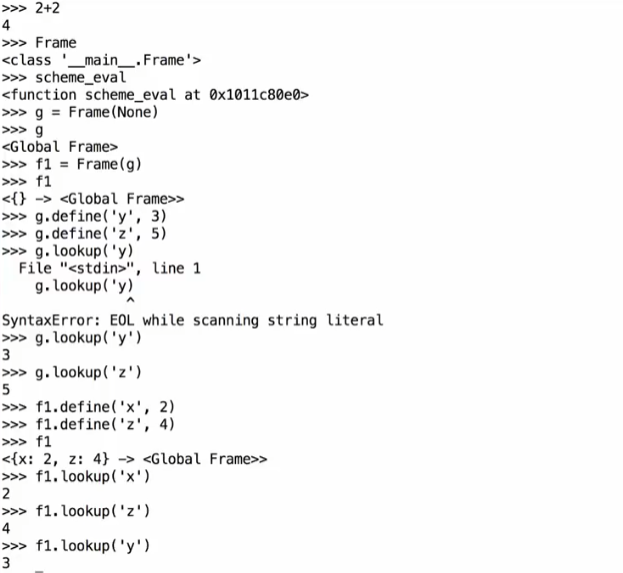

5.Define Expressions

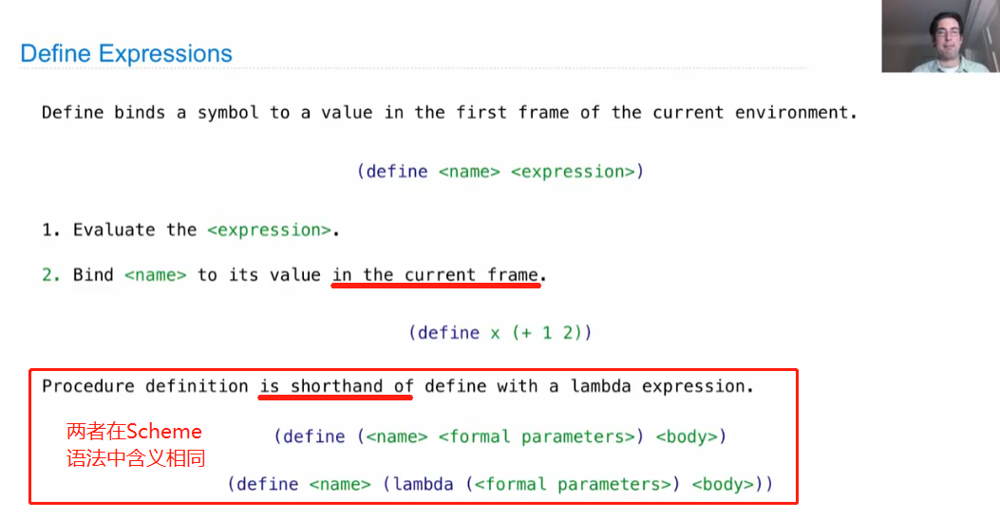

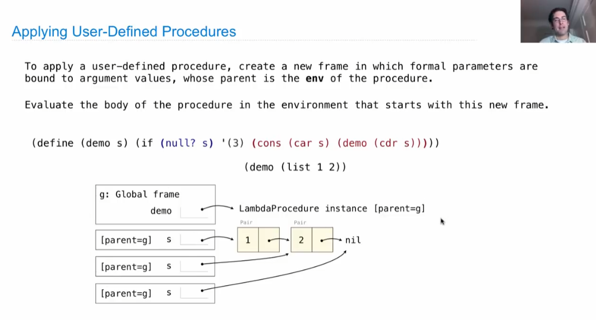
