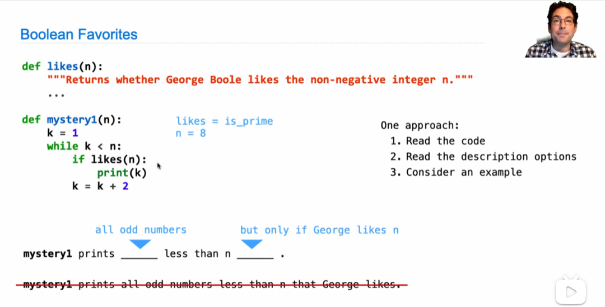
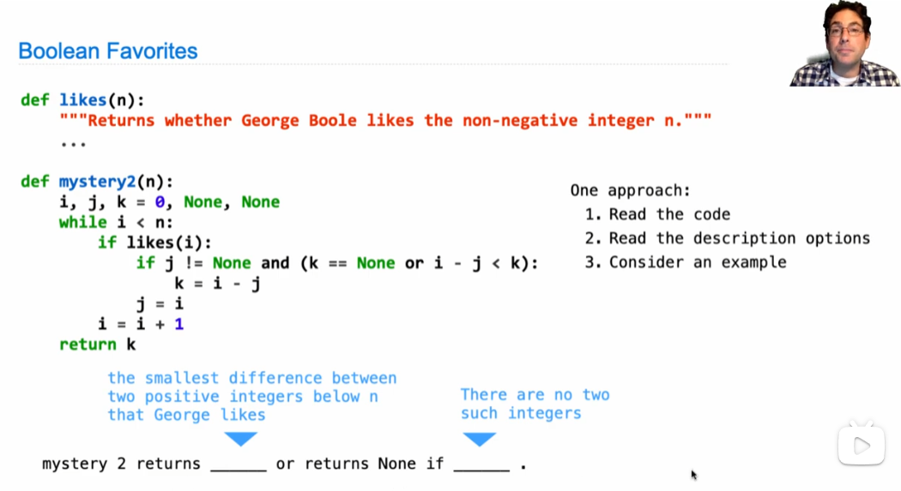
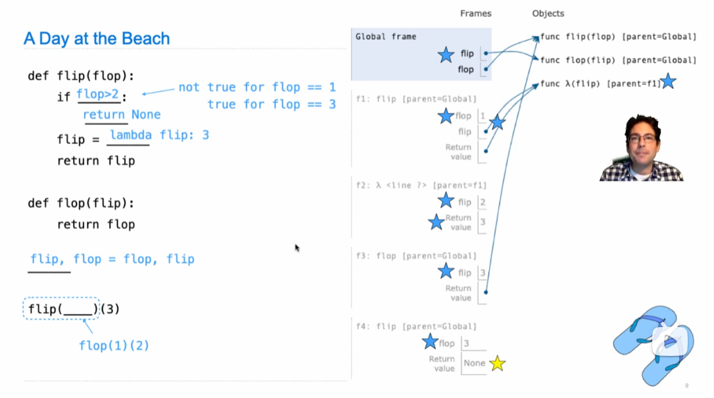
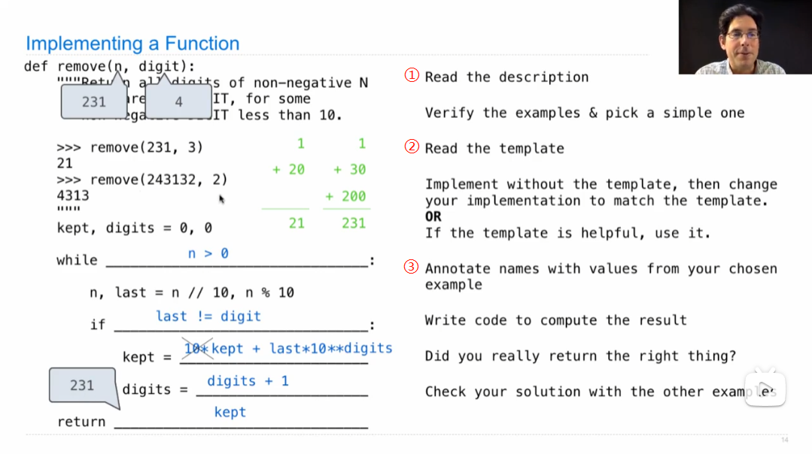
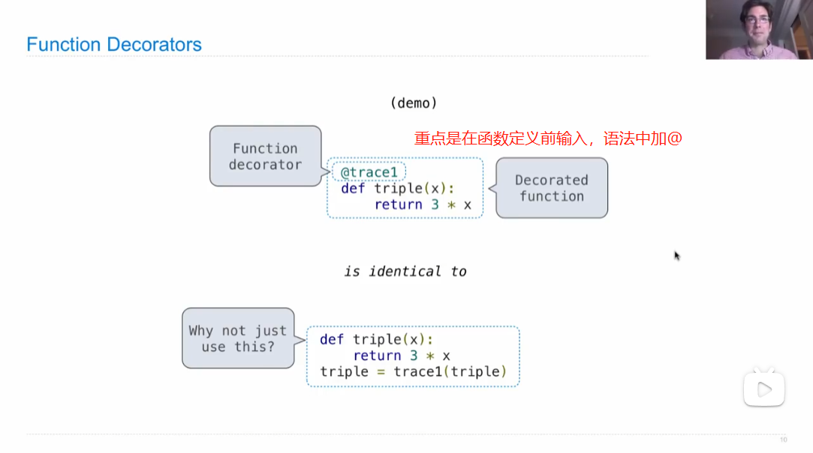
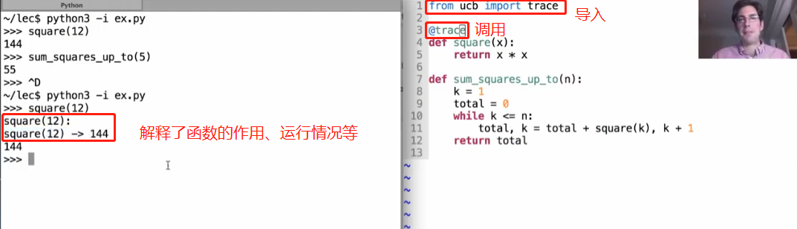
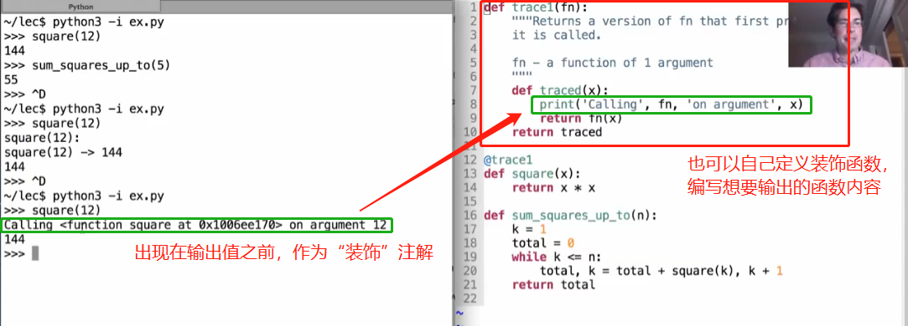
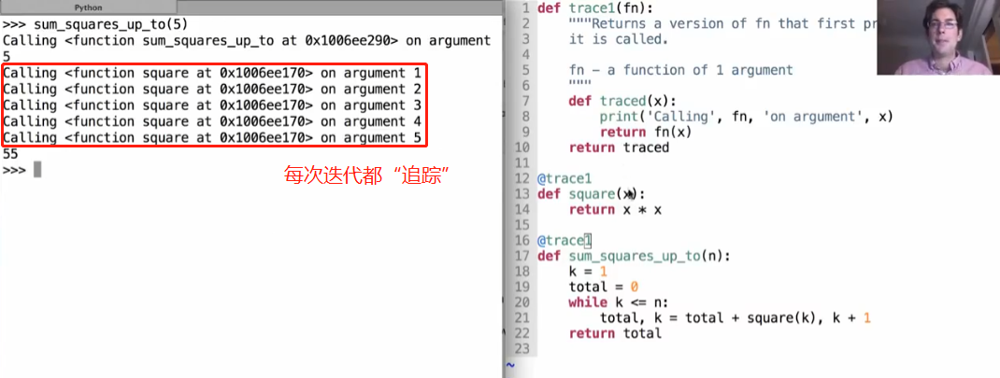

# Lecture 7. Function Examples

1.Describing Functions

2.Generating Environment Diagram

根据程序环境表补充代码

3.Implementing Functions

4.Decorators — 函数装饰器

装饰器（Decorators） 是一个接收一个函数作为参数(可能还有其他的参数)的函数, 它的返回值也是一个函数。个人理解为注释函数。

