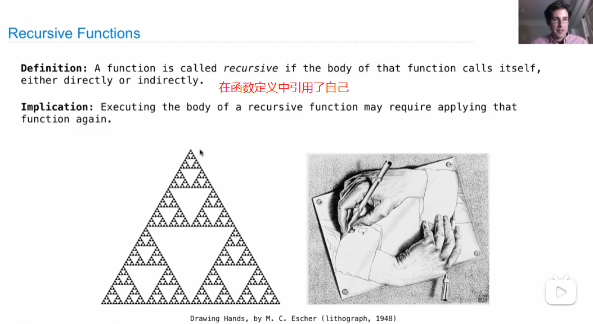
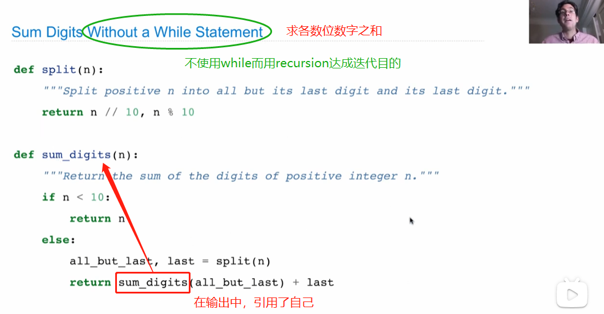
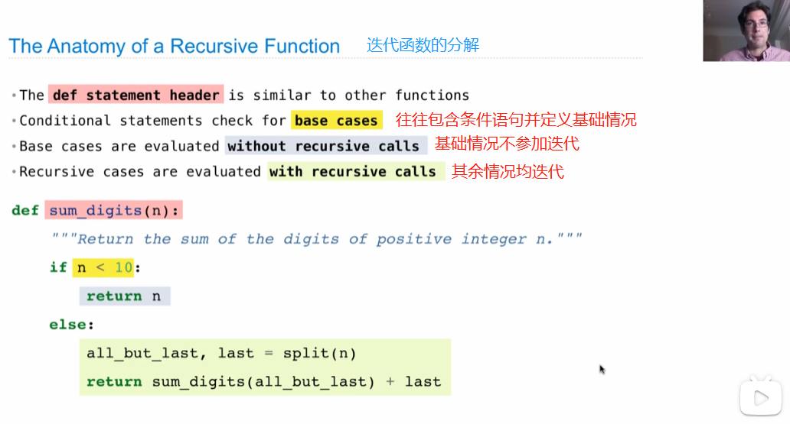
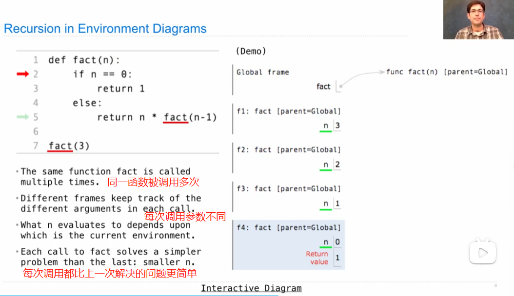
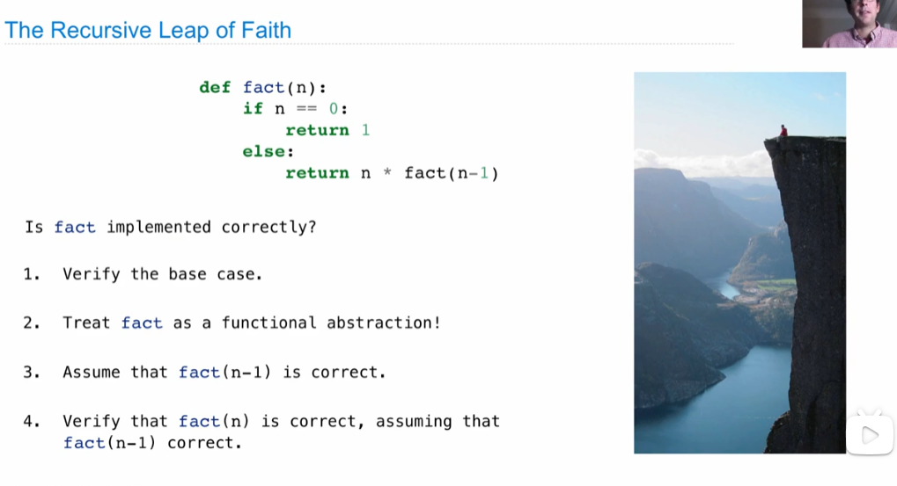
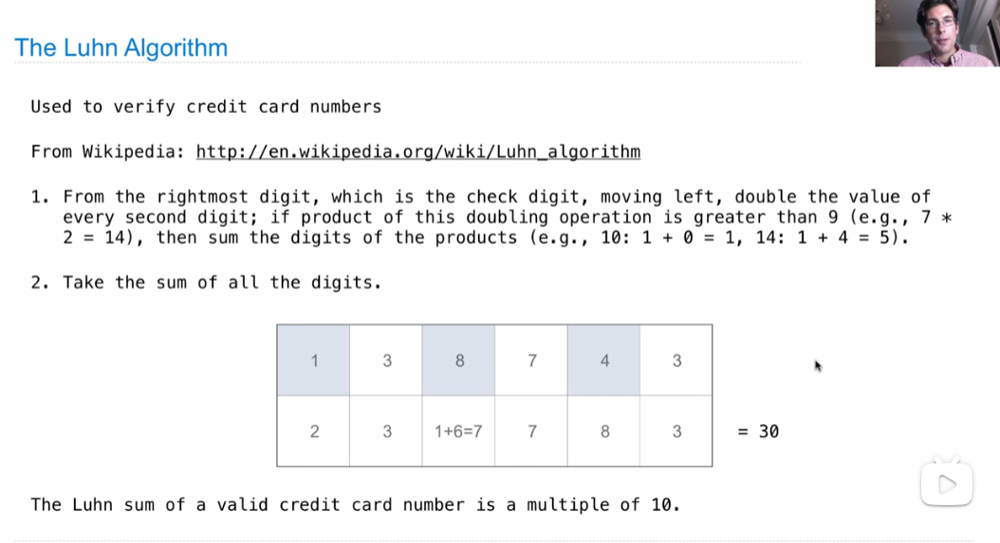
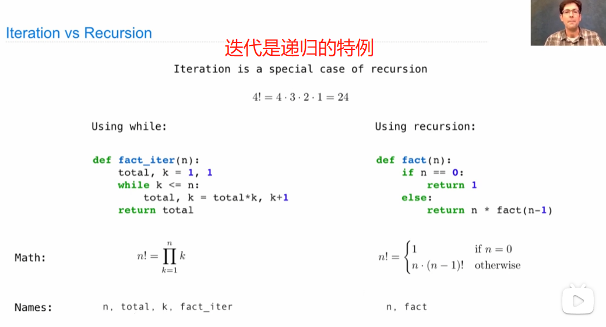
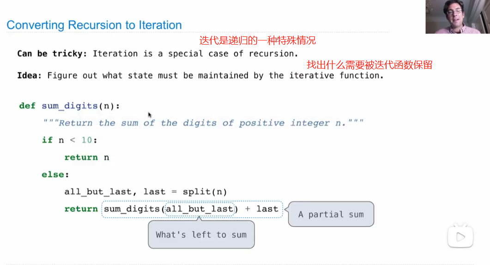
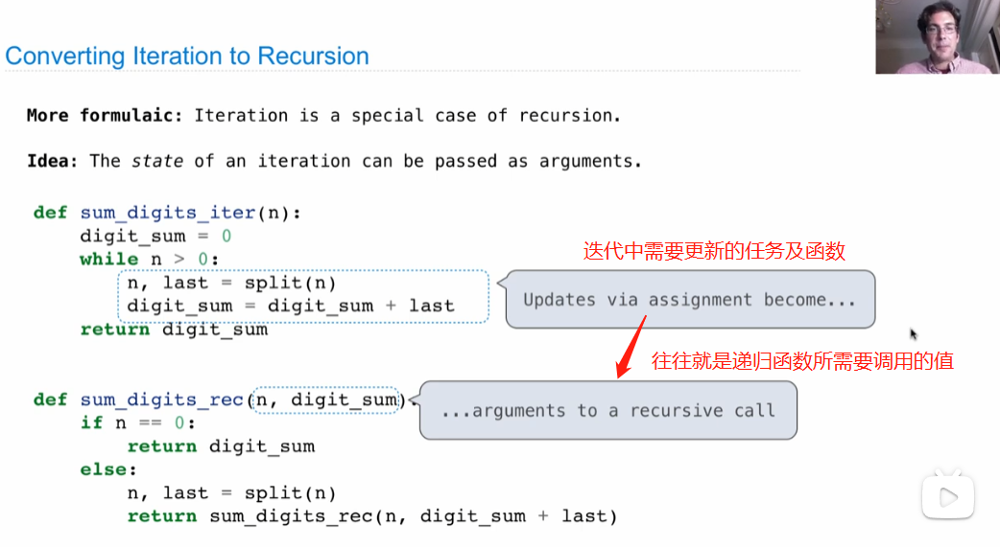

# Lecture 8. Recursion

Recursion 递归：用递归语句一特点是结果用return而无赋值语句

1.Recursive Functions

2.Recursion in Environment Diagrams

3.Verifying Recursive Functions递归の信念

(1)要有base case;

(2)递归的过程就是不断向base case靠拢的过程。

4.Mutual Recursion — 发生在两个不同的函数互相调用

5.Recursion and lteration

**Iteration vs Recursion** 迭代与递归的对比！

