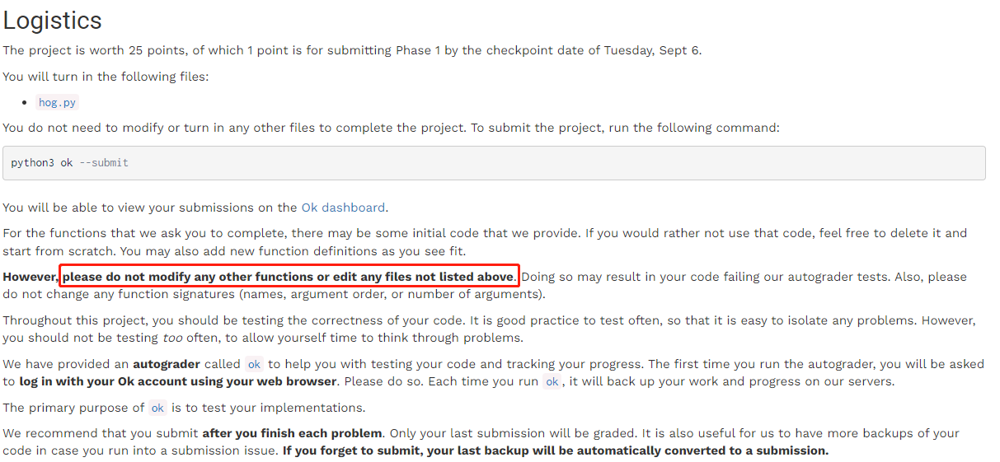
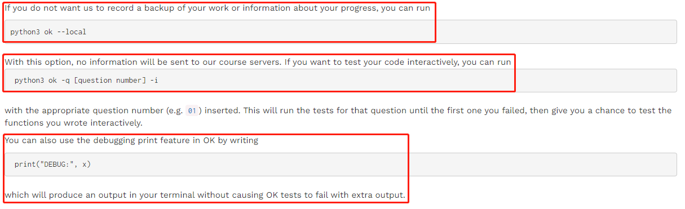
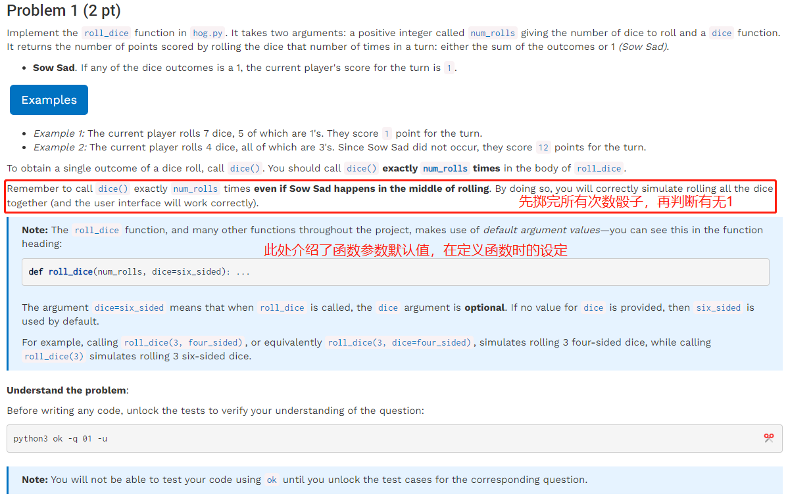
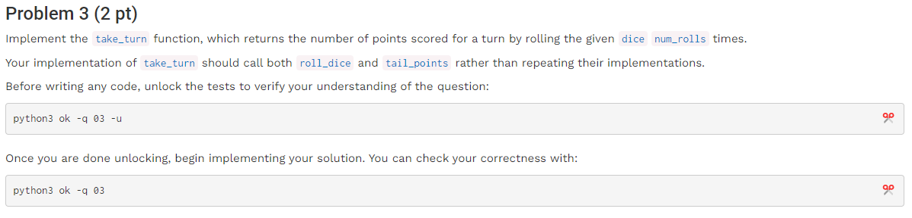
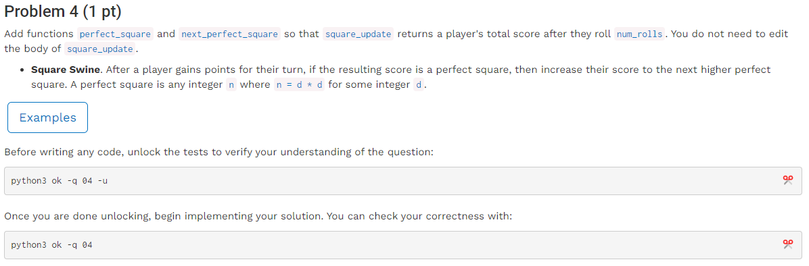
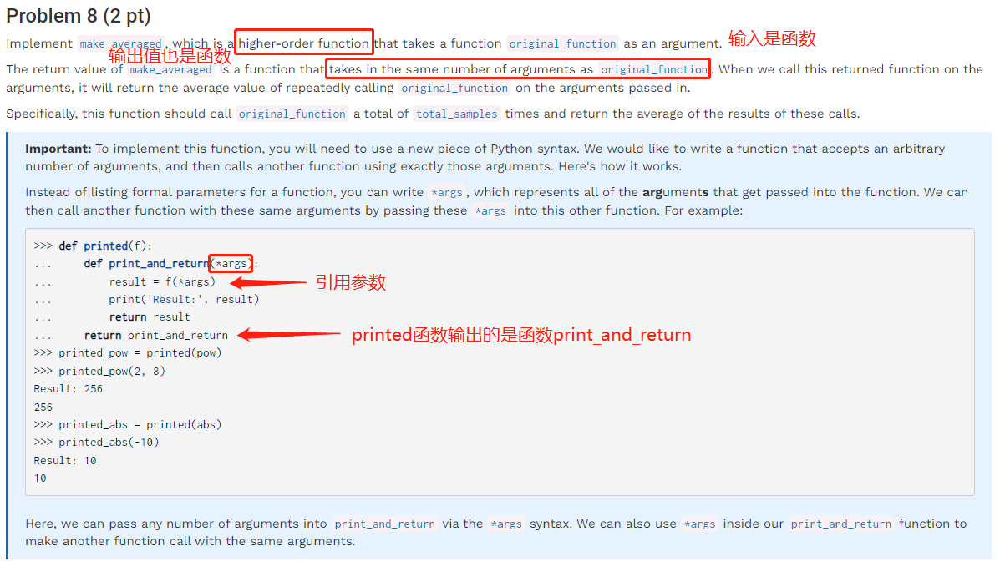
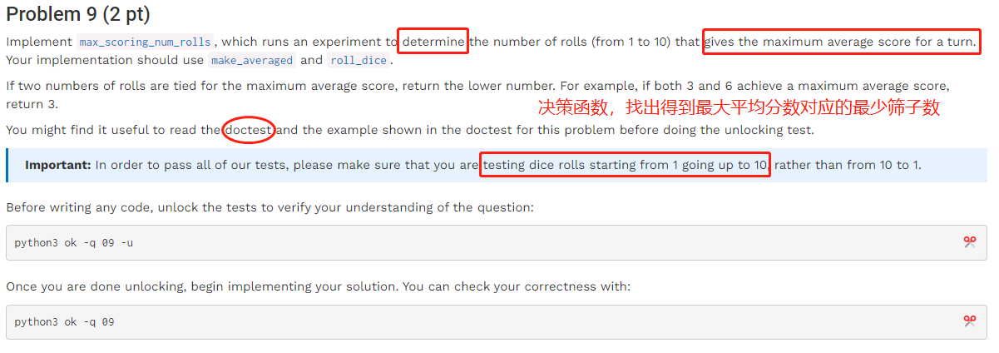
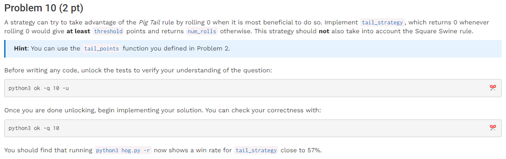
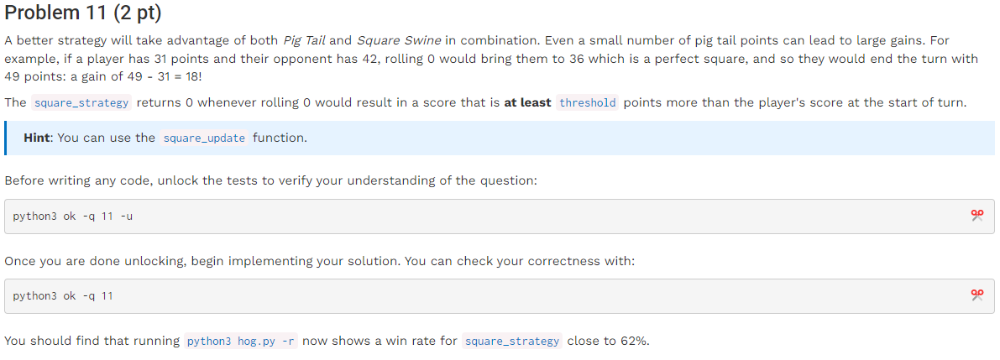
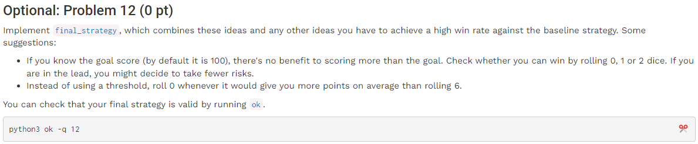

# Project 1: The Game of Hog（Spring 2023）

在所有命令行代码后加“**- - local**”就不会再出现提交邮箱问题。

两名玩家轮流掷骰子，优先达到100点的人获胜，每人每次可以选择掷最多10个骰子。

\-规则1：只要有任何一个骰子掷出1，则当轮计分为1；

\-规则2：玩家可以选择掷0个骰子，假设该玩家得分为x，此时计分规则是“2\*abs(x十位数 + x个位数)”

\-规则3：如果玩家通过轮次得分是完美平方数x=d\*d，则计分调整到x=(d+1)\*(d+1)

文件说明：不需修改除hog.py外的所有文件

✅

✅

✅重点是输入超过100的正整数也可以完成，即需要准确提取个位数和十位数

✅通过决策返还当前轮次的得分，使用到问题1和2中的函数，输入参数为掷骰子个数num\_rolls、对方分数opponent\_score和骰子类型dice。

✅完全平方数使用能否由1+3+5+…+（n+1）=（n+1）^2加得判断

✅注意函数返还值及命名

第二部分——均与策略相关

✅

✅根据提示写遍历函数

✅

✅

✅

✅

