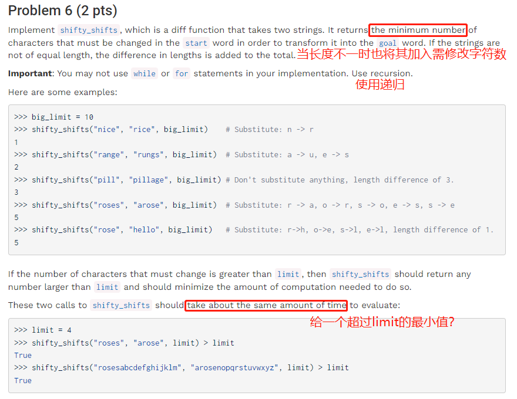

# Project 2: Cat

select函数是筛选段落的条件，choose函数再从符合条件的段落中选取第k段，注意此时段落序号可能因为select条件筛选而发生了变化。

助教给的想法是先将符合select条件的段落组成新的列表，但我遇到的问题是，如何将字符串加入到valid\_paragraphs之中。

GitHub上的解法是使用 for element in s判断语句，用于依次判断s序列中每个元素是否符合条件。

提示：可能会使用到utils.py中的字符串处理函数

lower：返还输入的小写版本

split: 以空格为间隙返还段落的单词组成列表

remove\_punctuation: 返还除去标点符号的相同版本

思考：该函数输入是包含关键词的列表，输出是布尔数，当判断段落中包含关键词列表中的词时‘True’否则为‘False’；如何导入判断段落→内置函数High-Order Function？about返回值是一个函数

✅ 注意高阶函数的定义和调用方法；注意各函数的输入

✅根据测试报错提示，注意保留两位小数。使用round（*数字*，*保留位数*）函数实现。

✅

✅

✅使用列表的递归！

……完全不知道怎么写

❎这也太顶级了。重点思维是不要管到底选择1)加、2)减、3)替代哪一种修改方法，优先选择改变次数最少的?

✅

输入相当于在打时间戳（打点计时器），对应不同的玩家有多个记录。本函数输出每个单词玩家用了多少时间，要对时间戳做减法，并记录在data abstraction型数据game中。

game中包括words和times两个属性。times则是由列表组成的列表，times\[i]\[j]表示第i个玩家打第j个词使用的时间。如\[\[2,3],\[1,2]]就表示有两个玩家两个词，其中0号玩家分别花了2秒和3秒输入第一和第二个词，1号玩家则分别花了1秒和2秒。

✅特别需要注意的是字符串的拼接直接使用加法，以及data abstraction的幅值。

✅
